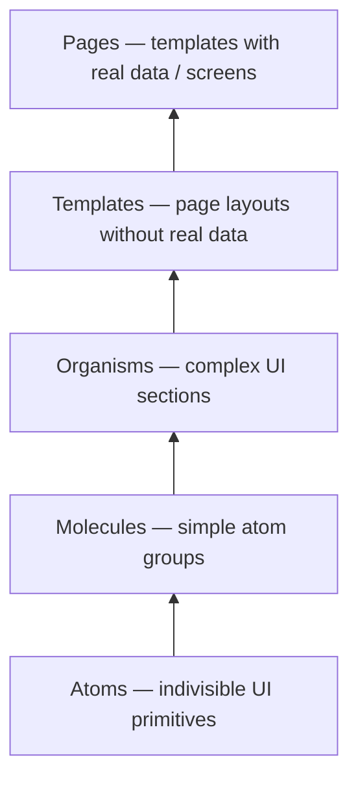

# Component Hierarchy

## Document Control

| Field | Value |
|-------|-------|
| Version | 2.0.0 |
| Status | Approved — Enterprise Specification |
| Last Updated | 2026-06-17 |
| Audience | Product Design, Frontend (React), Mobile (Flutter), QA |
| Parent Document | [UI_UX_MASTER_BLUEPRINT.md](./UI_UX_MASTER_BLUEPRINT.md) |
| Screen Reference | [SCREEN_HIERARCHY.md](./SCREEN_HIERARCHY.md) |
| Design Tokens | [DESIGN_SYSTEM.md](./DESIGN_SYSTEM.md) |

---

## 1. Purpose

This document defines the **complete component hierarchy** for the ERP design system using atomic design methodology. It specifies every component from atoms through templates, naming conventions, platform mappings (React/Electron vs Flutter/MD3), composition rules, and state requirements.

Components are the building blocks shared across all screens. No screen should implement bespoke UI that duplicates an existing component.

---

## 2. Atomic Design Methodology



| Tier | Definition | Examples | Ownership |
|------|------------|----------|-----------|
| **Atom** | Single-purpose, no further decomposition | Button, Input, Icon, Badge | Design System team |
| **Molecule** | 2–5 atoms with single function | SearchField, FormField, StatCard | Design System team |
| **Organism** | Complex, self-contained UI section | DataTable, Sidebar, CartPanel | Design System + Module teams |
| **Template** | Page layout skeleton with placeholders | DashboardLayout, POSLayout | Design System team |
| **Page** | Template + real data = Screen (SCR-NNN) | DashboardPage, POSPage | Module teams |

---

## 3. Naming Conventions

### 3.1 Component ID Format

```
CMP-{TIER}-{NNN}-{Name}

TIER = ATOM | MOL | ORG | TPL
NNN  = Three-digit sequential within tier
Name = PascalCase component name
```

### 3.2 Platform Implementation Names

| Tier | Desktop (React) | Mobile (Flutter) | Rule |
|------|-----------------|------------------|------|
| Atom | `Button` | `ErpButton` | Flutter: `Erp` prefix on all custom widgets |
| Molecule | `SearchField` | `ErpSearchField` | PascalCase |
| Organism | `DataTable` | `ErpDataTable` | Match semantic name |
| Template | `DashboardLayout` | `ErpDashboardLayout` | `Layout` suffix |
| Page | `DashboardPage` | `DashboardScreen` | Flutter: `Screen` suffix |

### 3.3 File Organization

**Desktop**:
```
apps/desktop/src/
├── design-system/atoms/Button/Button.tsx
├── design-system/molecules/SearchField/SearchField.tsx
├── design-system/organisms/DataTable/DataTable.tsx
├── design-system/templates/DashboardLayout/DashboardLayout.tsx
└── modules/dashboard/pages/DashboardPage.tsx
```

**Mobile**:
```
apps/mobile/lib/
├── shared/widgets/atoms/erp_button.dart
├── shared/widgets/molecules/erp_search_field.dart
├── shared/widgets/organisms/erp_data_table.dart
├── shared/widgets/templates/erp_dashboard_layout.dart
└── modules/dashboard/screens/dashboard_screen.dart
```

### 3.4 Props / Parameter Conventions

| Convention | Desktop (TypeScript) | Mobile (Dart) |
|------------|---------------------|---------------|
| Variant prop | `variant="primary"` | `ErpButtonVariant.primary` enum |
| Size prop | `size="md"` | `ErpButtonSize.medium` enum |
| Disabled | `disabled={true}` | `enabled: false` |
| Loading | `loading={true}` | `isLoading: true` |
| Test ID | `data-testid="cart-add"` | `Key('cart-add')` |
| Screen ID | `data-screen-id` on page root | `Key('SCR-NNN')` on Scaffold |

---

## 4. Complete Component Tree

```
ERP Component System
│
├── ATOMS [CMP-ATOM-001 – CMP-ATOM-099]
│   ├── CMP-ATOM-001 Button
│   ├── CMP-ATOM-002 Icon
│   ├── CMP-ATOM-003 Input
│   ├── CMP-ATOM-004 Label
│   ├── CMP-ATOM-005 Badge
│   ├── CMP-ATOM-006 Avatar
│   ├── CMP-ATOM-007 Checkbox
│   ├── CMP-ATOM-008 Radio
│   ├── CMP-ATOM-009 Switch
│   ├── CMP-ATOM-010 Select
│   ├── CMP-ATOM-011 Textarea
│   ├── CMP-ATOM-012 Spinner
│   ├── CMP-ATOM-013 Skeleton
│   ├── CMP-ATOM-014 Divider
│   ├── CMP-ATOM-015 Tooltip
│   ├── CMP-ATOM-016 Link
│   ├── CMP-ATOM-017 Kbd (keyboard key)
│   ├── CMP-ATOM-018 Progress
│   ├── CMP-ATOM-019 ScrollArea
│   ├── CMP-ATOM-020 Typography (Text)
│   ├── CMP-ATOM-021 CurrencyText
│   ├── CMP-ATOM-022 StatusDot
│   ├── CMP-ATOM-023 Logo
│   └── CMP-ATOM-024 VisuallyHidden
│
├── MOLECULES [CMP-MOL-001 – CMP-MOL-099]
│   ├── CMP-MOL-001 FormField
│   ├── CMP-MOL-002 SearchField
│   ├── CMP-MOL-003 SelectField
│   ├── CMP-MOL-004 DatePicker
│   ├── CMP-MOL-005 DateRangePicker
│   ├── CMP-MOL-006 CurrencyInput
│   ├── CMP-MOL-007 PhoneInput
│   ├── CMP-MOL-008 StatCard
│   ├── CMP-MOL-009 ListItem
│   ├── CMP-MOL-010 MenuItem
│   ├── CMP-MOL-011 Breadcrumb
│   ├── CMP-MOL-012 Toast
│   ├── CMP-MOL-013 Alert
│   ├── CMP-MOL-014 EmptyState
│   ├── CMP-MOL-015 Pagination
│   ├── CMP-MOL-016 TabTrigger
│   ├── CMP-MOL-017 DropdownMenu
│   ├── CMP-MOL-018 ContextMenu
│   ├── CMP-MOL-019 FileUpload
│   ├── CMP-MOL-020 BarcodeInput
│   ├── CMP-MOL-021 CurrencyDisplay
│   ├── CMP-MOL-022 StatusBadge
│   ├── CMP-MOL-023 ConnectionIndicator
│   ├── CMP-MOL-024 NotificationBadge
│   ├── CMP-MOL-025 UserMenuItem
│   ├── CMP-MOL-026 FilterChip
│   ├── CMP-MOL-027 SortHeader
│   ├── CMP-MOL-028 ConfirmDialog
│   ├── CMP-MOL-029 ExportMenu
│   └── CMP-MOL-030 LoadingOverlay
│
├── ORGANISMS [CMP-ORG-001 – CMP-ORG-099]
│   ├── CMP-ORG-001 DataTable
│   ├── CMP-ORG-002 Sidebar
│   ├── CMP-ORG-003 TopBar
│   ├── CMP-ORG-004 CommandPalette
│   ├── CMP-ORG-005 Dialog
│   ├── CMP-ORG-006 Sheet (side panel)
│   ├── CMP-ORG-007 Card
│   ├── CMP-ORG-008 Tabs
│   ├── CMP-ORG-009 Form
│   ├── CMP-ORG-010 CartTable
│   ├── CMP-ORG-011 ProductPicker
│   ├── CMP-ORG-012 CustomerPicker
│   ├── CMP-ORG-013 PaymentDialog
│   ├── CMP-ORG-014 SalesChart
│   ├── CMP-ORG-015 ActivityFeed
│   ├── CMP-ORG-016 TopProductsTable
│   ├── CMP-ORG-017 PeriodSelector
│   ├── CMP-ORG-018 CurrencyToggle
│   ├── CMP-ORG-019 CompanySwitcher
│   ├── CMP-ORG-020 BranchSwitcher
│   ├── CMP-ORG-021 NotificationPanel
│   ├── CMP-ORG-022 PermissionMatrix
│   ├── CMP-ORG-023 ModuleToggle
│   ├── CMP-ORG-024 DeviceCard
│   ├── CMP-ORG-025 SessionRow
│   ├── CMP-ORG-026 AuditLogTable
│   ├── CMP-ORG-027 AuthCard
│   ├── CMP-ORG-028 LoginForm
│   ├── CMP-ORG-029 FilterBar
│   ├── CMP-ORG-030 ExportButton
│   ├── CMP-ORG-031 BottomNav
│   ├── CMP-ORG-032 NavigationDrawer
│   ├── CMP-ORG-033 CartSheet
│   ├── CMP-ORG-034 BarcodeScanner
│   ├── CMP-ORG-035 DependencyTree
│   └── CMP-ORG-036 MonitoringDashboard
│
├── TEMPLATES [CMP-TPL-001 – CMP-TPL-019]
│   ├── CMP-TPL-001 AppShellLayout
│   ├── CMP-TPL-002 AuthLayout
│   ├── CMP-TPL-003 DashboardLayout
│   ├── CMP-TPL-004 ListDetailLayout
│   ├── CMP-TPL-005 POSLayout
│   ├── CMP-TPL-006 FormLayout
│   ├── CMP-TPL-007 AdminLayout
│   ├── CMP-TPL-008 ReportLayout
│   ├── CMP-TPL-009 PrintLayout
│   ├── CMP-TPL-010 MobileShellLayout
│   ├── CMP-TPL-011 SettingsLayout
│   └── CMP-TPL-012 ErrorLayout
│
└── PAGES (Screens — see SCREEN_HIERARCHY.md)
    ├── SCR-000 LoginPage → uses AuthLayout + AuthCard + LoginForm
    ├── SCR-010 DashboardPage → uses DashboardLayout + organisms
    ├── SCR-020 POSPage → uses POSLayout + CartTable + ProductPicker
    └── ... (52 screens total)
```

---

## 5. Atoms — Detailed Specification

### 5.1 Atom Registry

| ID | Name | React | Flutter | MD3 Base | States |
|----|------|-------|---------|----------|--------|
| CMP-ATOM-001 | Button | `Button` | `ErpButton` | FilledButton, OutlinedButton, TextButton | default, hover, focus, active, disabled, loading |
| CMP-ATOM-002 | Icon | `Icon` (Lucide) | `ErpIcon` (Material Symbols) | Icon | — |
| CMP-ATOM-003 | Input | `Input` | `ErpTextField` | TextField | default, focus, error, disabled, readonly |
| CMP-ATOM-004 | Label | `Label` | `ErpLabel` | — | default, required, error |
| CMP-ATOM-005 | Badge | `Badge` | `ErpBadge` | Badge | default, success, warning, error, info |
| CMP-ATOM-006 | Avatar | `Avatar` | `ErpAvatar` | CircleAvatar | image, initials, fallback |
| CMP-ATOM-007 | Checkbox | `Checkbox` | `ErpCheckbox` | Checkbox | checked, unchecked, indeterminate, disabled |
| CMP-ATOM-008 | Radio | `RadioGroup` | `ErpRadio` | Radio | selected, unselected, disabled |
| CMP-ATOM-009 | Switch | `Switch` | `ErpSwitch` | Switch | on, off, disabled |
| CMP-ATOM-010 | Select | `Select` | `ErpDropdown` | DropdownMenu | default, open, disabled |
| CMP-ATOM-011 | Textarea | `Textarea` | `ErpTextArea` | — | default, focus, error, disabled |
| CMP-ATOM-012 | Spinner | `Spinner` | `ErpCircularProgress` | CircularProgressIndicator | — |
| CMP-ATOM-013 | Skeleton | `Skeleton` | `ErpSkeleton` | — | text, circle, rect |
| CMP-ATOM-014 | Divider | `Separator` | `ErpDivider` | Divider | horizontal, vertical |
| CMP-ATOM-015 | Tooltip | `Tooltip` | `ErpTooltip` | Tooltip | — |
| CMP-ATOM-016 | Link | `Link` | `ErpLink` | — | default, hover, visited |
| CMP-ATOM-017 | Kbd | `Kbd` | — (desktop only) | — | — |
| CMP-ATOM-018 | Progress | `Progress` | `ErpLinearProgress` | LinearProgressIndicator | determinate, indeterminate |
| CMP-ATOM-019 | ScrollArea | `ScrollArea` | `ErpScrollView` | SingleChildScrollView | — |
| CMP-ATOM-020 | Typography | `Text` variants | `ErpText` | Text | h1–h4, body, caption, mono |
| CMP-ATOM-021 | CurrencyText | `CurrencyText` | `ErpCurrencyText` | — | uzs, usd, dual |
| CMP-ATOM-022 | StatusDot | `StatusDot` | `ErpStatusDot` | — | connected, reconnecting, disconnected |
| CMP-ATOM-023 | Logo | `Logo` | `ErpLogo` | — | light, dark |
| CMP-ATOM-024 | VisuallyHidden | `VisuallyHidden` | `ErpSemantics` | — | — |

### 5.2 CMP-ATOM-001 — Button

| Attribute | Desktop | Mobile |
|-----------|---------|--------|
| **Variants** | `primary`, `secondary`, `destructive`, `ghost`, `outline`, `link` | `filled`, `outlined`, `text`, `elevated`, `tonal` |
| **Sizes** | `sm` (36px), `md` (40px), `lg` (44px), `icon` (36×36) | `small`, `medium` (48px), `large` |
| **Loading** | Spinner replaces label; width preserved | Same |
| **Icon** | Leading or trailing icon slot | Icon + label or icon-only FAB |
| **Keyboard** | Focusable; Enter/Space activates | — |
| **Token refs** | `bg-primary`, `text-primary-foreground` | `colorScheme.primary` |

### 5.3 CMP-ATOM-021 — CurrencyText

| Attribute | Value |
|-----------|-------|
| **Purpose** | Formatted currency display with color coding |
| **UZS Format** | `1 250 000 so'm` (space-separated thousands, blue) |
| **USD Format** | `$1,250.00` (2 decimals, green) |
| **Dual Mode** | UZS primary, USD secondary in muted text |
| **Props** | `amount`, `currency`, `variant`, `size`, `showSign` |
| **Cross-ref** | [DESIGN_SYSTEM.md](./DESIGN_SYSTEM.md) § Currency Colors, [CURRENCY_UZS_USD.md](../08-modules/CURRENCY_UZS_USD.md) |

---

## 6. Molecules — Detailed Specification

### 6.1 Molecule Registry

| ID | Name | React | Flutter | Composed Of | Used In |
|----|------|-------|---------|-------------|---------|
| CMP-MOL-001 | FormField | `FormField` | `ErpFormField` | Label + Input + error text | All forms |
| CMP-MOL-002 | SearchField | `SearchField` | `ErpSearchBar` | Input + search icon + clear | Lists, POS, palette |
| CMP-MOL-003 | SelectField | `SelectField` | `ErpSelectField` | Label + Select + error | Forms |
| CMP-MOL-004 | DatePicker | `DatePicker` | `ErpDatePicker` | Input + calendar popover | Reports, filters |
| CMP-MOL-005 | DateRangePicker | `DateRangePicker` | `ErpDateRangePicker` | DatePicker × 2 + presets | Reports, history |
| CMP-MOL-006 | CurrencyInput | `CurrencyInput` | `ErpCurrencyInput` | Input + currency selector | POS, payments |
| CMP-MOL-007 | PhoneInput | `PhoneInput` | `ErpPhoneInput` | Country code + Input | Customer forms |
| CMP-MOL-008 | StatCard | `StatCard` | `ErpStatCard` | Card + Typography + CurrencyText + trend | Dashboard |
| CMP-MOL-009 | ListItem | `ListItem` | `ErpListTile` | Icon + text + trailing | Mobile lists |
| CMP-MOL-010 | MenuItem | `MenuItem` | `ErpMenuItem` | Icon + label + shortcut | Sidebar, menus |
| CMP-MOL-011 | Breadcrumb | `Breadcrumb` | — (desktop only) | Link × n + Separator | All desktop pages |
| CMP-MOL-012 | Toast | `Toast` | `ErpSnackbar` | Icon + message + action + close | Global |
| CMP-MOL-013 | Alert | `Alert` | `ErpAlert` | Icon + title + description | Inline warnings |
| CMP-MOL-014 | EmptyState | `EmptyState` | `ErpEmptyState` | Illustration + text + Button | Empty lists |
| CMP-MOL-015 | Pagination | `Pagination` | `ErpPagination` | Button × n + page info | DataTable |
| CMP-MOL-016 | TabTrigger | `TabsTrigger` | `ErpTab` | Button styled as tab | Tab navigation |
| CMP-MOL-017 | DropdownMenu | `DropdownMenu` | `ErpPopupMenu` | Trigger + menu items | Row actions |
| CMP-MOL-018 | ContextMenu | `ContextMenu` | — (desktop only) | Right-click menu | DataTable rows |
| CMP-MOL-019 | FileUpload | `FileUpload` | `ErpFilePicker` | Dropzone + Button | Company logo |
| CMP-MOL-020 | BarcodeInput | `BarcodeInput` | `ErpBarcodeField` | Input + scan icon + listener | POS, receive |
| CMP-MOL-021 | CurrencyDisplay | `CurrencyDisplay` | `ErpCurrencyText` | CurrencyText (dual) | Cart, detail pages |
| CMP-MOL-022 | StatusBadge | `StatusBadge` | `ErpStatusChip` | Badge + icon + label | Tables, cards |
| CMP-MOL-023 | ConnectionIndicator | `ConnectionIndicator` | `ErpConnectionBanner` | StatusDot + label | TopBar / banner |
| CMP-MOL-024 | NotificationBadge | `NotificationBadge` | `ErpNotificationBadge` | Icon + Badge count | TopBar |
| CMP-MOL-025 | UserMenuItem | `UserMenuItem` | `ErpUserMenuItem` | Avatar + name + role | User menu |
| CMP-MOL-026 | FilterChip | `FilterChip` | `ErpFilterChip` | Chip + remove icon | Filter bars |
| CMP-MOL-027 | SortHeader | `SortHeader` | `ErpSortHeader` | Label + sort icon | DataTable |
| CMP-MOL-028 | ConfirmDialog | `ConfirmDialog` | `ErpConfirmDialog` | Dialog + message + buttons | Destructive actions |
| CMP-MOL-029 | ExportMenu | `ExportMenu` | `ErpExportMenu` | DropdownMenu + format options | Reports |
| CMP-MOL-030 | LoadingOverlay | `LoadingOverlay` | `ErpLoadingOverlay` | Overlay + Spinner | Full-screen load |

### 6.2 CMP-MOL-008 — StatCard

| Attribute | Value |
|-----------|-------|
| **Purpose** | Dashboard KPI display with trend indicator |
| **Anatomy** | Label (top) → Value (large) → Secondary value (currency) → Trend arrow + percentage |
| **Props** | `label`, `value`, `currency`, `secondaryValue`, `trend`, `trendDirection`, `loading` |
| **States** | Loading (skeleton), populated, error |
| **Real-Time** | Value animates on WebSocket update (number pulse 300ms) |
| **Screens** | SCR-010 |
| **Cross-ref** | [DASHBOARD.md](../08-modules/DASHBOARD.md) |

### 6.3 CMP-MOL-020 — BarcodeInput

| Attribute | Value |
|-----------|-------|
| **Purpose** | Barcode scanner input with keyboard wedge support |
| **Behavior** | Auto-focus on mount; listens for rapid keystrokes (< 50ms inter-key = scan); Enter submits |
| **Desktop** | Text input with scan icon; USB scanner as keyboard |
| **Mobile** | Text input + camera scan button → `BarcodeScanner` |
| **Screens** | SCR-020, SCR-061 |
| **Cross-ref** | [SALES.md](../08-modules/SALES.md) |

---

## 7. Organisms — Detailed Specification

### 7.1 Organism Registry

| ID | Name | React | Flutter | Composed Of | Screens |
|----|------|-------|---------|-------------|---------|
| CMP-ORG-001 | DataTable | `DataTable` | `ErpDataTable` | Table + SortHeader + Pagination + FilterBar + EmptyState | All list screens |
| CMP-ORG-002 | Sidebar | `Sidebar` | — | MenuItem × n + Logo + collapse toggle | App shell |
| CMP-ORG-003 | TopBar | `TopBar` | `ErpAppBar` | CompanySwitcher + SearchField + ConnectionIndicator + NotificationBadge + UserMenu | App shell |
| CMP-ORG-004 | CommandPalette | `SearchCommand` | — | Dialog + SearchField + result list | Global (desktop) |
| CMP-ORG-005 | Dialog | `Dialog` | `ErpDialog` | Overlay + Card + actions | Modals |
| CMP-ORG-006 | Sheet | `Sheet` | `ErpBottomSheet` | Side/bottom panel + content | Filters, detail |
| CMP-ORG-007 | Card | `Card` | `ErpCard` | Container + header + content + footer | Universal |
| CMP-ORG-008 | Tabs | `Tabs` | `ErpTabBar` | TabTrigger × n + panel content | Detail pages |
| CMP-ORG-009 | Form | `Form` | `ErpForm` | FormField × n + submit actions | Create/edit |
| CMP-ORG-010 | CartTable | `CartTable` | `ErpCartList` | Table + CurrencyInput + qty editors | SCR-020 |
| CMP-ORG-011 | ProductPicker | `ProductPicker` | `ErpProductSearch` | SearchField + result list/grid | SCR-020, SCR-061 |
| CMP-ORG-012 | CustomerPicker | `CustomerPicker` | `ErpCustomerSearch` | PhoneInput + autocomplete results | SCR-020 |
| CMP-ORG-013 | PaymentDialog | `PaymentDialog` | `ErpPaymentDialog` | CurrencyInput + payment type + confirm | SCR-020, SCR-085 |
| CMP-ORG-014 | SalesChart | `SalesChart` | `ErpSalesChart` | Chart + PeriodSelector + legend | SCR-010, SCR-101 |
| CMP-ORG-015 | ActivityFeed | `ActivityFeed` | `ErpActivityFeed` | ListItem × n + timestamps | SCR-010 |
| CMP-ORG-016 | TopProductsTable | `TopProductsTable` | `ErpTopProducts` | DataTable (compact, 5 rows) | SCR-010 |
| CMP-ORG-017 | PeriodSelector | `PeriodSelector` | `ErpPeriodSelector` | Button group + DateRangePicker | SCR-010, reports |
| CMP-ORG-018 | CurrencyToggle | `CurrencyToggle` | `ErpCurrencyToggle` | Segmented control: UZS / USD / Both | Dashboard, reports |
| CMP-ORG-019 | CompanySwitcher | `CompanySwitcher` | `ErpCompanySwitcher` | Select + search + role badge | TopBar |
| CMP-ORG-020 | BranchSwitcher | `BranchSwitcher` | `ErpBranchSwitcher` | Select | TopBar |
| CMP-ORG-021 | NotificationPanel | `NotificationPanel` | `ErpNotificationList` | ListItem × n + mark read | SCR-170 |
| CMP-ORG-022 | PermissionMatrix | `PermissionMatrix` | — (desktop only) | Checkbox grid: modules × actions | SCR-138 |
| CMP-ORG-023 | ModuleToggle | `ModuleToggle` | `ErpModuleSwitch` | Switch + label + dependency warning | SCR-146 |
| CMP-ORG-024 | DeviceCard | `DeviceCard` | `ErpDeviceCard` | Card + platform icon + status + actions | SCR-140 |
| CMP-ORG-025 | SessionRow | `SessionRow` | `ErpSessionTile` | ListItem + force logout action | SCR-141 |
| CMP-ORG-026 | AuditLogTable | `AuditLogTable` | — (desktop only) | DataTable + expandable diff rows | SCR-149 |
| CMP-ORG-027 | AuthCard | `AuthCard` | `ErpAuthCard` | Card + Logo + centered content | SCR-000 |
| CMP-ORG-028 | LoginForm | `LoginForm` | `ErpLoginForm` | FormField × 2 + Button + error Alert | SCR-000 |
| CMP-ORG-029 | FilterBar | `FilterBar` | `ErpFilterBar` | FilterChip × n + SearchField + clear | List screens |
| CMP-ORG-030 | ExportButton | `ExportButton` | `ErpExportButton` | Button + ExportMenu | Reports |
| CMP-ORG-031 | BottomNav | — | `ErpBottomNav` | NavigationBar (5 tabs) | Mobile shell |
| CMP-ORG-032 | NavigationDrawer | — | `ErpNavigationDrawer` | Drawer + MenuItem × n | Mobile shell |
| CMP-ORG-033 | CartSheet | — | `ErpCartSheet` | BottomSheet + CartTable + PaymentDialog | SCR-020 mobile |
| CMP-ORG-034 | BarcodeScanner | — | `ErpBarcodeScanner` | Camera viewfinder + overlay | Mobile scan |
| CMP-ORG-035 | DependencyTree | `DependencyTree` | `ErpDependencyTree` | Tree diagram + status indicators | SCR-146 |
| CMP-ORG-036 | MonitoringDashboard | `MonitoringDashboard` | — | StatCard × n + charts + error list | SCR-151 |

### 7.2 CMP-ORG-001 — DataTable

| Attribute | Value |
|-----------|-------|
| **Purpose** | Enterprise data table with sorting, filtering, pagination, selection, row actions |
| **Anatomy** | FilterBar (optional) → Table (header + body) → Pagination |
| **Features** | Column sort, column resize (desktop), row selection (checkbox), row click → detail, inline actions, virtual scroll (> 100 rows), sticky header, column visibility toggle |
| **Density** | Compact (40px), Comfortable (48px), Spacious (56px) — desktop only |
| **Keyboard** | Arrow keys navigate rows; Enter opens detail; F2 edits; Space toggles selection |
| **Accessibility** | `<th scope="col">`; `aria-sort`; row count announced on filter |
| **States** | Loading (skeleton rows), empty (EmptyState), populated, error |
| **Mobile** | Replaced by card list (`ErpRefreshList` + `ErpListTile`) — no horizontal table scroll on phone |
| **Screens** | SCR-021, SCR-040, SCR-060, SCR-080, SCR-131, SCR-139, SCR-141, SCR-149 |

### 7.3 CMP-ORG-002 — Sidebar

| Attribute | Value |
|-----------|-------|
| **Purpose** | Primary module navigation |
| **Anatomy** | Logo → nav groups (MenuItem) → collapse toggle → version |
| **States** | Expanded (240px), collapsed (64px), hidden (< 768px) |
| **Behavior** | Active item highlight; expandable groups; disabled modules hidden; tooltips in collapsed mode |
| **Data Source** | Module registry `navigationItems` filtered by permissions + enabled modules |
| **Cross-ref** | [NAVIGATION_ARCHITECTURE.md](./NAVIGATION_ARCHITECTURE.md) § Sidebar |

### 7.4 CMP-ORG-010 — CartTable

| Attribute | Value |
|-----------|-------|
| **Purpose** | POS shopping cart with editable quantities and line totals |
| **Columns** | Product name, SKU, Qty (editable), Unit Price, Line Total, Remove |
| **Features** | Qty increment/decrement, direct qty input, line delete, subtotal, tax (future), currency display |
| **Real-Time** | Stock validation on qty change; warning if insufficient |
| **Keyboard** | Tab between qty fields; Delete removes line |
| **Screens** | SCR-020 |
| **Cross-ref** | [SALES.md](../08-modules/SALES.md) |

### 7.5 CMP-ORG-022 — PermissionMatrix

| Attribute | Value |
|-----------|-------|
| **Purpose** | Admin role permission editor — checkbox grid |
| **Anatomy** | Module groups (rows) × actions (columns) with select-all per row/column |
| **Features** | Select all module, select all action, indeterminate state, search filter, system role read-only |
| **Density** | Ultra-compact (32px rows) |
| **Desktop Only** | Yes — mobile shows read-only summary with "Edit on desktop" banner |
| **Screens** | SCR-138 |
| **Cross-ref** | [RBAC_DESIGN.md](../07-security/RBAC_DESIGN.md), [PERMISSIONS_MODEL.md](../07-security/PERMISSIONS_MODEL.md) |

---

## 8. Templates — Detailed Specification

### 8.1 Template Registry

| ID | Name | React | Flutter | Regions | Used By |
|----|------|-------|---------|---------|---------|
| CMP-TPL-001 | AppShellLayout | `AppShellLayout` | `ErpAppShell` | TopBar + Sidebar + Breadcrumb + Content + Toast | All authenticated desktop |
| CMP-TPL-002 | AuthLayout | `AuthLayout` | `ErpAuthLayout` | Centered card on neutral background | SCR-000–003 |
| CMP-TPL-003 | DashboardLayout | `DashboardLayout` | `ErpDashboardLayout` | Period selector + KPI grid + 2-column content | SCR-010 |
| CMP-TPL-004 | ListDetailLayout | `ListDetailLayout` | `ErpListDetailLayout` | FilterBar + DataTable (or list) + optional Sheet | List screens |
| CMP-TPL-005 | POSLayout | `POSLayout` | `ErpPosLayout` | Product area (60%) + Cart panel (40%) | SCR-020 desktop |
| CMP-TPL-006 | FormLayout | `FormLayout` | `ErpFormLayout` | Breadcrumb + form card + action bar | Create/edit screens |
| CMP-TPL-007 | AdminLayout | `AdminLayout` | `ErpAdminLayout` | AppShell with admin sidebar section | SCR-130–151 |
| CMP-TPL-008 | ReportLayout | `ReportLayout` | `ErpReportLayout` | Filters + chart + table + export | SCR-101–104 |
| CMP-TPL-009 | PrintLayout | `PrintLayout` | `ErpPrintLayout` | Minimal chrome, print-optimized | SCR-025 |
| CMP-TPL-010 | MobileShellLayout | — | `ErpMobileShell` | AppBar + Content + BottomNav + Drawer | All mobile authenticated |
| CMP-TPL-011 | SettingsLayout | `SettingsLayout` | `ErpSettingsLayout` | Side nav (settings sections) + content | SCR-120–124 |
| CMP-TPL-012 | ErrorLayout | `ErrorLayout` | `ErpErrorLayout` | Centered error message + CTA | SCR-190–192 |

### 8.2 CMP-TPL-001 — AppShellLayout

```
┌──────────────────────────────────────────────────────────┐
│  TopBar                                                   │
├──────────┬───────────────────────────────────────────────┤
│          │  Breadcrumb                                    │
│ Sidebar  ├───────────────────────────────────────────────┤
│          │                                               │
│          │  {children} — route outlet                    │
│          │                                               │
└──────────┴───────────────────────────────────────────────┘
│  Toast Layer (portal)                                    │
│  Dialog Layer (portal)                                   │
│  CommandPalette (portal, desktop)                        │
```

| Slot | Type | Required |
|------|------|----------|
| `sidebar` | Sidebar organism | Yes (desktop) |
| `topbar` | TopBar organism | Yes |
| `breadcrumb` | Breadcrumb molecule | Desktop only |
| `children` | Page content | Yes |
| `toasts` | Toast container | Yes (portal) |

### 8.3 CMP-TPL-005 — POSLayout

| Region | Desktop | Mobile |
|--------|---------|--------|
| Product search | Top, full width of left pane | Top, full width |
| Product grid | Left 60%, scrollable | Full width, 2-column grid |
| Cart | Right 40%, sticky, full height | Bottom sheet (`CartSheet`) |
| Payment | Bottom of cart panel | Bottom sheet footer |
| Currency toggle | Top of cart panel | Top of bottom sheet |

### 8.4 CMP-TPL-010 — MobileShellLayout

```
┌─────────────────────────┐
│  AppBar (TopBar)        │
├─────────────────────────┤
│                         │
│  {children}             │
│                         │
├─────────────────────────┤
│  BottomNav (5 tabs)     │
└─────────────────────────┘
Drawer (overlay, triggered by More tab)
ConnectionBanner (conditional, below AppBar)
```

---

## 9. Page Composition Map

Mapping of screens to template + organism composition:

| Screen ID | Page Component | Template | Key Organisms |
|-----------|----------------|----------|---------------|
| SCR-000 | `LoginPage` | AuthLayout | AuthCard, LoginForm |
| SCR-010 | `DashboardPage` | DashboardLayout | StatCard × 8, SalesChart, TopProductsTable, ActivityFeed, PeriodSelector, CurrencyToggle |
| SCR-020 | `POSPage` | POSLayout | ProductPicker, CartTable, CustomerPicker, PaymentDialog, BarcodeInput |
| SCR-021 | `SalesHistoryPage` | ListDetailLayout | DataTable, FilterBar, DateRangePicker |
| SCR-022 | `SaleDetailPage` | AppShellLayout | Card, Tabs, CurrencyDisplay, DataTable (line items) |
| SCR-040 | `ProductListPage` | ListDetailLayout | DataTable, FilterBar, SearchField |
| SCR-042 | `ProductDetailPage` | AppShellLayout | Card × 3, Tabs, CurrencyDisplay, DataTable |
| SCR-060 | `StockOverviewPage` | ListDetailLayout | DataTable, FilterBar, StatusBadge |
| SCR-061 | `ReceiveStockPage` | FormLayout | ProductPicker, BarcodeInput, Form |
| SCR-080 | `CustomerListPage` | ListDetailLayout | DataTable, SearchField (phone) |
| SCR-082 | `CustomerDetailPage` | AppShellLayout | Card, Tabs, CurrencyDisplay, DataTable |
| SCR-085 | `RecordPaymentPage` | FormLayout | PaymentDialog, CurrencyInput |
| SCR-100 | `ReportsHubPage` | AppShellLayout | Card × 4 (category links) |
| SCR-101 | `SalesReportsPage` | ReportLayout | SalesChart, DataTable, ExportButton, DateRangePicker |
| SCR-130 | `AdminHomePage` | AdminLayout | Card × 10 (nav tiles), StatCard × 4 |
| SCR-131 | `UsersListPage` | AdminLayout | DataTable, FilterBar |
| SCR-138 | `RoleEditorPage` | AdminLayout | PermissionMatrix |
| SCR-146 | `ModuleConfigPage` | AdminLayout | ModuleToggle × n, DependencyTree |
| SCR-149 | `AuditLogsPage` | AdminLayout | AuditLogTable, FilterBar, DateRangePicker |
| SCR-170 | `NotificationCenterPage` | AppShellLayout | NotificationPanel |

---

## 10. Platform Mapping Matrix

### 10.1 Component Availability

| Component | Desktop | Mobile | Notes |
|-----------|---------|--------|-------|
| Sidebar | ✓ | — | Replaced by BottomNav + Drawer |
| CommandPalette | ✓ | — | Replaced by SearchBar |
| DataTable | ✓ | — | Mobile uses card list |
| ContextMenu | ✓ | — | Mobile uses long-press menu |
| PermissionMatrix | ✓ | — | Mobile: read-only |
| AuditLogTable | ✓ | — | Mobile: simplified list |
| Kbd | ✓ | — | Desktop only |
| Breadcrumb | ✓ | — | Mobile: AppBar back |
| BottomNav | — | ✓ | Mobile only |
| NavigationDrawer | — | ✓ | Mobile only |
| CartSheet | — | ✓ | Mobile only |
| BarcodeScanner | — | ✓ | Mobile only |
| All atoms (except Kbd) | ✓ | ✓ | |
| All form molecules | ✓ | ✓ | |
| StatCard, StatusBadge | ✓ | ✓ | |
| PaymentDialog | ✓ | ✓ | Desktop: dialog; Mobile: full-screen |
| CompanySwitcher | ✓ | ✓ | |

### 10.2 shadcn/ui → MD3 Mapping

| shadcn/ui (Desktop) | MD3 (Flutter) | Notes |
|---------------------|---------------|-------|
| `Button` | `FilledButton` / `OutlinedButton` | Variant mapping in design tokens |
| `Input` | `TextField` | MD3 outlined style |
| `Dialog` | `AlertDialog` / `Dialog` | |
| `Sheet` | `BottomSheet` / `Drawer` | Side sheet → Drawer on tablet |
| `Select` | `DropdownMenu` | |
| `Tabs` | `TabBar` + `TabBarView` | |
| `Card` | `Card` | MD3 elevated card |
| `Badge` | `Badge` / `Chip` | |
| `Avatar` | `CircleAvatar` | |
| `Checkbox` | `Checkbox` | |
| `Switch` | `Switch` | |
| `Toast` (sonner) | `SnackBar` | |
| `Tooltip` | `Tooltip` | |
| `Popover` | `MenuAnchor` | |
| `Command` (cmdk) | — | No mobile equivalent |
| `ScrollArea` | `Scrollbar` + `SingleChildScrollView` | |
| `Separator` | `Divider` | |
| `Skeleton` | Custom shimmer | |

### 10.3 Lucide → Material Symbols Mapping

| Lucide Icon | Material Symbol | Usage |
|-------------|-----------------|-------|
| `layout-dashboard` | `dashboard` | Dashboard nav |
| `shopping-cart` | `point_of_sale` | Sales/POS nav |
| `package` | `inventory_2` | Products nav |
| `warehouse` | `warehouse` | Inventory nav |
| `users` | `people` | Customers nav |
| `bar-chart-3` | `bar_chart` | Reports nav |
| `settings` | `settings` | Settings nav |
| `shield` | `admin_panel_settings` | Admin nav |
| `bell` | `notifications` | Notifications |
| `building-2` | `business` | Company |
| `git-branch` | `account_tree` | Branches |
| `scroll-text` | `history` | Audit logs |
| `heart-pulse` | `monitoring` | Monitoring |
| `search` | `search` | Search |
| `plus` | `add` | Create actions |
| `pencil` | `edit` | Edit actions |
| `trash-2` | `delete` | Delete actions |
| `x` | `close` | Close/dismiss |
| `check` | `check` | Confirm/success |
| `chevron-down` | `expand_more` | Dropdowns |
| `menu` | `menu` | Hamburger/drawer |

---

## 11. Component State Requirements

Every component MUST implement applicable states:

| State | Visual Treatment | Behavior |
|-------|------------------|----------|
| **Default** | Standard token colors | Interactive |
| **Hover** | Subtle background shift | Desktop only |
| **Focus** | 2px focus ring, primary color | Keyboard navigable |
| **Active/Pressed** | Darker background | Momentary |
| **Disabled** | 50% opacity, no pointer events | `aria-disabled` |
| **Loading** | Spinner or skeleton | Actions blocked |
| **Error** | Destructive border + error message | Validation feedback |
| **Empty** | EmptyState molecule | For containers with no data |
| **Selected** | Primary background tint | Tables, nav items |

---

## 12. Composition Rules

| Rule ID | Rule |
|---------|------|
| COMP-01 | Atoms never import organisms |
| COMP-02 | Molecules may import atoms only |
| COMP-03 | Organisms may import atoms and molecules |
| COMP-04 | Templates may import organisms, molecules, atoms |
| COMP-05 | Pages may import any tier |
| COMP-06 | Module-specific components live in module folder; promote to shared when used by 2+ modules |
| COMP-07 | All components use design tokens — no hardcoded colors |
| COMP-08 | All interactive components have focus states |
| COMP-09 | Destructive variants use `destructive` token |
| COMP-10 | Currency components always use currency color tokens |
| COMP-11 | Permission-gated components accept `permission` prop and self-hide |
| COMP-12 | Module-gated components accept `moduleCode` prop and self-hide |

---

## 13. Module-Specific Component Extensions

Modules may extend the shared hierarchy with module-local organisms:

| Module | Component | Tier | Description |
|--------|-----------|------|-------------|
| sales | `ReceiptPreview` | Organism | Print-formatted receipt |
| sales | `ReturnLineSelector` | Organism | Select lines for return |
| products | `PriceGrid` | Organism | 4-tier pricing editor |
| products | `CategoryTree` | Organism | Hierarchical category manager |
| inventory | `BatchTimeline` | Organism | FIFO batch history visualization |
| inventory | `StockLevelGauge` | Molecule | Visual stock level indicator |
| customers | `DebtSummaryCard` | Molecule | UZS + USD debt chips |
| customers | `PaymentHistoryList` | Organism | Payment timeline |
| dashboard | `KPIGrid` | Organism | Responsive KPI card grid |
| admin | `UserCompanyAssignment` | Organism | Multi-company role editor |
| admin | `SessionForceLogout` | Molecule | Session row with revoke action |
| reports | `ReportParameterForm` | Organism | Dynamic report filter form |

Module components follow the same naming, state, and token conventions as shared components.

---

## 14. Figma Component Structure

Figma components mirror this hierarchy:

```
🎨 ERP Design System
├── Atoms (Figma components with variants)
├── Molecules (auto-layout frames)
├── Organisms (composite frames)
├── Templates (layout frames with placeholders)
└── Pages (full screens with SCR-ID)
```

| Figma Property | Maps To |
|----------------|---------|
| Component variant | React `variant` prop / Flutter enum |
| Boolean property | React boolean prop |
| Text property | React children / Flutter label param |
| Instance swap | React `icon` slot / Flutter `Widget?` param |

Cross-reference: [UI_UX_MASTER_BLUEPRINT.md](./UI_UX_MASTER_BLUEPRINT.md) § Figma Handoff Guidelines

---

## 15. Testing Requirements

| Tier | Unit Test | Visual Regression | A11y Audit |
|------|-----------|-------------------|------------|
| Atom | ✓ All variants | ✓ | ✓ |
| Molecule | ✓ Composition | ✓ | ✓ |
| Organism | ✓ Key interactions | ✓ | ✓ |
| Template | Layout snapshot | ✓ | — |
| Page | E2E smoke | ✓ | ✓ |

---

## 16. Related Documents

| Document | Relationship |
|----------|--------------|
| [UI_UX_MASTER_BLUEPRINT.md](./UI_UX_MASTER_BLUEPRINT.md) | Master blueprint |
| [SCREEN_HIERARCHY.md](./SCREEN_HIERARCHY.md) | Screen → component mapping |
| [COMPONENT_LIBRARY.md](./COMPONENT_LIBRARY.md) | Component catalog (v1.0 summary) |
| [DESIGN_SYSTEM.md](./DESIGN_SYSTEM.md) | Design tokens |
| [DESKTOP_UI_SPEC.md](./DESKTOP_UI_SPEC.md) | Desktop layouts |
| [MOBILE_UI_SPEC.md](./MOBILE_UI_SPEC.md) | Mobile layouts |
| [ACCESSIBILITY.md](./ACCESSIBILITY.md) | A11y requirements |
| [NAVIGATION_ARCHITECTURE.md](./NAVIGATION_ARCHITECTURE.md) | Navigation organisms |

---

*Component hierarchy v2.0.0 — 24 atoms, 30 molecules, 36 organisms, 12 templates, 52 pages.*
