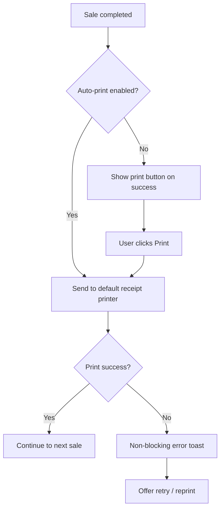

# Desktop UX Specification (Windows Electron)

## Document Control

| Field | Value |
|-------|-------|
| Version | 2.0.0 |
| Platform | Windows 10/11 (primary), future macOS |
| Stack | Electron + React + TypeScript + Tailwind + shadcn/ui |
| Last Updated | 2026-06-17 |
| Audience | Desktop engineers, UX designers, QA |

---

## Purpose

This document specifies **user experience behavior** for the Windows Electron desktop client. It complements [DESKTOP_UI_SPEC.md](./DESKTOP_UI_SPEC.md) (screen layouts) and [../11-platforms/DESKTOP_ELECTRON.md](../11-platforms/DESKTOP_ELECTRON.md) (technical platform). Focus areas: window chrome, system tray, keyboard-driven workflows, POS optimization, data table interactions, multi-panel layouts, printing, and theme behavior.

**Design principles**: Speed for Cashier, density for Manager/Admin, keyboard-first for power users, native Windows feel where Electron allows.

---

## 1. Window Chrome

### 1.1 Frame Model

The desktop client uses a **custom frameless title bar** integrated with the application TopBar. Native Windows window controls are rendered in the top-right corner.

```
┌──────────────────────────────────────────────────────────────────────┐
│ [App Icon] ERP — Market          [Company ▼] ... [─] [□] [×]        │
│ ◄── drag region ──────────────────────────►   ◄── window controls  │
├────────┬─────────────────────────────────────────────────────────────┤
│Sidebar │ Main Content                                                │
└────────┴─────────────────────────────────────────────────────────────┘
```

### 1.2 Title Bar Behavior

| Element | Behavior |
|---------|----------|
| **Drag region** | Left portion of TopBar (excluding interactive controls) initiates window move |
| **Double-click drag region** | Toggle maximize / restore |
| **App title** | Shows "ERP — {Company Name}" when company selected; "ERP" when logged out |
| **Minimize** | Standard minimize to taskbar |
| **Maximize** | Fill work area; remember pre-maximize dimensions on restore |
| **Close** | If "Minimize to tray" enabled → hide to tray; else → quit with unsaved-change check |

### 1.3 Window Dimensions

| Setting | Value | Rationale |
|---------|-------|-----------|
| Default size | 1280 × 800 | Fits 1366×768 laptops with room for taskbar |
| Minimum size | 1024 × 600 | POS usable at minimum; sidebar may auto-collapse |
| Maximum size | Unbounded | Multi-monitor support |
| Remember position | Yes | Per-display last bounds stored |
| DPI scaling | Per-monitor aware | Electron `enableHighDpiScaling` |

### 1.4 Multi-Window Policy (Phase 1)

| Rule | Detail |
|------|--------|
| Single main window | One BrowserWindow instance |
| Modal dialogs | In-window overlays; no separate OS windows except print |
| Print preview | System print dialog (native) |
| Future | Detached POS window (Phase 2) |

### 1.5 Focus and Activation

| Scenario | Behavior |
|----------|----------|
| App launched | Main window focused; barcode field focused if POS route |
| Restored from tray | Restore prior size/position; refocus last field |
| Alt+Tab return | No full reload; WebSocket may trigger cache refresh |
| Second instance launched | Focus existing window (single-instance lock) |

---

## 2. System Tray

### 2.1 Tray Icon States

| State | Icon | Tooltip |
|-------|------|---------|
| Connected | Green dot overlay | "ERP — Connected — {Company}" |
| Reconnecting | Amber dot overlay | "ERP — Reconnecting..." |
| Disconnected | Red dot overlay | "ERP — Disconnected" |
| Logged out | Neutral gray | "ERP — Not signed in" |

### 2.2 Tray Context Menu

| Menu Item | Action |
|-----------|--------|
| Open ERP | Restore/focus main window |
| Company: {name} | Display only (disabled) |
| Connection: Connected / Reconnecting / Offline | Display only |
| — separator — | |
| New Sale | Navigate to POS (if permitted) |
| — separator — | |
| Settings | Open Settings |
| — separator — | |
| Quit ERP | Full quit with session cleanup |

### 2.3 Minimize-to-Tray Behavior

| Setting | Default | Behavior |
|---------|---------|----------|
| Minimize to tray on close | Off (configurable in Settings) | User choice persisted |
| Minimize to tray on minimize button | Off | Standard taskbar minimize by default |
| Background WebSocket | Active when tray hidden | Real-time sync continues |
| Notification badge | Tray icon overlay for unread count | Phase 2 |

### 2.4 Tray Interaction Patterns

| User Intent | Path |
|-------------|------|
| Quick check without opening | Hover tooltip shows connection + company |
| Return to POS after interruption | Tray click → restore → POS state preserved |
| Silent background operation | Close to tray; dashboard still receives WebSocket updates |
| Full exit | Tray menu → Quit, or close with tray disabled |

---

## 3. Keyboard Shortcuts — Master List

### 3.1 Global Shortcuts (All Screens)

| Shortcut | Action | Context |
|----------|--------|---------|
| `Ctrl+K` | Open command palette / global search | Everywhere except text inputs |
| `Ctrl+Shift+F` | Focus global search bar in TopBar | Alternative to palette |
| `Ctrl+,` | Open Settings | Logged in |
| `Ctrl+Shift+D` | Toggle dark/light mode | Logged in |
| `Ctrl+Shift+C` | Open company switcher | Multi-company users |
| `Escape` | Close topmost dialog / sheet / palette | Modal stack order |
| `F1` | Open contextual help (Phase 2) | — |
| `Alt+F4` | Quit application (Windows standard) | With unsaved check |

### 3.2 Navigation Shortcuts

| Shortcut | Action |
|----------|--------|
| `Ctrl+1` | Navigate to Dashboard |
| `Ctrl+2` | Navigate to POS / Sales |
| `Ctrl+3` | Navigate to Products |
| `Ctrl+4` | Navigate to Inventory |
| `Ctrl+5` | Navigate to Customers |
| `Ctrl+6` | Navigate to Reports |
| `Ctrl+7` | Navigate to Admin |
| `Ctrl+B` | Toggle sidebar collapse |
| `Ctrl+[` | Navigate back (history) |
| `Ctrl+]` | Navigate forward (history) |

*Module numbers skip disabled modules; shortcuts bound to visible nav order.*

### 3.3 POS Shortcuts (Cashier-Critical)

| Shortcut | Action | Priority |
|----------|--------|----------|
| `F2` | Focus barcode / product search | P0 |
| `F3` | Focus customer phone search | P0 |
| `F4` | Toggle currency UZS ↔ USD | P0 |
| `F5` | Clear cart (with confirm) | P0 |
| `F8` | Select Cash payment | P0 |
| `F9` | Complete sale / open payment dialog | P0 |
| `F10` | Select Credit payment | P0 |
| `+` / `=` | Increment selected cart line quantity | P0 |
| `-` | Decrement selected cart line quantity | P0 |
| `Delete` | Remove selected cart line | P0 |
| `↑` / `↓` | Navigate cart lines | P0 |
| `Enter` | Add highlighted product from search results | P0 |
| `Ctrl+N` | New sale (clear cart) | P1 |
| `Ctrl+P` | Reprint last receipt | P1 |

### 3.4 Form and Table Shortcuts

| Shortcut | Action |
|----------|--------|
| `Ctrl+S` | Save current form |
| `Ctrl+Enter` | Submit current form |
| `Tab` / `Shift+Tab` | Next / previous field |
| `F2` | Edit selected table row (non-POS contexts) |
| `Space` | Toggle row selection checkbox |
| `Ctrl+A` | Select all rows (when table focused) |
| `Ctrl+Shift+E` | Export visible table data (quick CSV) |

### 3.5 Admin Shortcuts

| Shortcut | Action |
|----------|--------|
| `Ctrl+Shift+U` | Jump to Users |
| `Ctrl+Shift+S` | Jump to Sessions |
| `Ctrl+Shift+B` | Block selected user/device (with confirm) |
| `Ctrl+Shift+L` | Force logout selected session |

### 3.6 Shortcut Conflict Resolution

| Rule | Detail |
|------|--------|
| Text input focus | POS product keys (F2–F10) suppressed when typing in text fields except barcode field |
| Barcode field | F-keys active even while barcode field focused |
| Customization | Phase 2: user-remappable shortcuts in Settings |
| Discovery | `?` key or Help menu shows shortcut overlay |

### 3.7 Accessibility

All shortcuts have equivalent menu paths. Screen readers announce shortcut hints on focused buttons via `aria-keyshortcuts`.

---

## 4. POS Optimized Layout

### 4.1 Layout Structure

```
┌─────────────────────────────────────────────────────────────────────────┐
│ POS — Branch Name          Rate: 12,750 UZS/USD      [UZS | USD]  [●]  │
├──────────────────────────────┬──────────────────────────────────────────┤
│  🔍 Barcode / Search (F2)    │  CUSTOMER  📞 Phone search (F3)          │
├──────────────────────────────┼──────────────────────────────────────────┤
│                              │                                          │
│  CART (40% width)            │  PRODUCT AREA (60% width)                │
│  ─────────────────────────   │  ┌────┐ ┌────┐ ┌────┐ ┌────┐            │
│  Line items scrollable       │  │    │ │    │ │    │ │    │  grid       │
│  Qty controls per line       │  └────┘ └────┘ └────┘ └────┘            │
│  ─────────────────────────   │  or search results table               │
│  Subtotal                    │                                          │
│  Discount                    │                                          │
│  TOTAL (large typography)    │                                          │
│                              │                                          │
│  [CASH F8] [CREDIT F10]      │                                          │
│  [CLEAR F5]  [COMPLETE F9]   │                                          │
└──────────────────────────────┴──────────────────────────────────────────┘
```

### 4.2 POS UX Rules

| Rule | Specification |
|------|---------------|
| **Search always ready** | Barcode input focused on POS load and after every completed sale |
| **Scan-first** | Barcode scanner sends Enter after code; treated as submit |
| **Minimum clicks** | Cash sale completable with zero mouse interaction |
| **Cart persistence** | Cart survives accidental navigation with confirm dialog |
| **Currency lock** | Changing currency recalculates display; in-cart prices use rate at add time |
| **Stock visibility** | Stock badge on product cards; red when zero |
| **Sound feedback** | Optional beep on successful scan (configurable) |
| **Large touch targets** | Payment buttons minimum 48px height for touch screens |

### 4.3 Cart Line Interaction

| Action | Method |
|--------|--------|
| Select line | Click or ↑/↓ keys |
| Change quantity | +/- buttons, direct numeric entry, or keyboard |
| Remove line | Delete key or swipe gesture on touch |
| Line total | Auto-calculated; read-only |
| Undo remove | Phase 2: brief toast with Undo |

### 4.4 Payment Panel States

| State | UI |
|-------|-----|
| Cash selected | "Amount received" field auto-focused on F9 |
| Credit selected | Customer search required; partial payment field visible |
| Insufficient stock | Complete button disabled with tooltip reason |
| Offline | Complete button disabled; red connection banner |

### 4.5 POS Performance Targets

| Metric | Target |
|--------|--------|
| Barcode to cart | ≤ 200ms perceived |
| Complete sale API | ≤ 800ms p95 |
| Cart re-render on scan | ≤ 16ms (60fps) |
| Search debounce | 150ms |

---

## 5. Data Table Interactions

### 5.1 Table Anatomy

```
┌─────────────────────────────────────────────────────────────────┐
│ [🔍 Filter...] [Status ▼] [Role ▼]        [Columns] [Export]   │
├──────┬──────────┬──────────┬──────────┬──────────┬──────────────┤
│ ☐    │ Name ↑   │ Email    │ Role     │ Status   │ Actions      │
├──────┼──────────┼──────────┼──────────┼──────────┼──────────────┤
│ ☐    │ Alisher  │ a@...    │ Manager  │ Active   │ ⋮            │
│ ☐    │ Dilshod  │ d@...    │ Cashier  │ Blocked  │ ⋮            │
├──────┴──────────┴──────────┴──────────┴──────────┴──────────────┤
│ Showing 1-25 of 142          [◄ Prev] [1][2][3] [Next ►]        │
└─────────────────────────────────────────────────────────────────┘
```

### 5.2 Interaction Catalog

| Interaction | Behavior |
|-------------|----------|
| **Column sort** | Click header toggles asc/desc; multi-sort with Ctrl+click (Phase 2) |
| **Column resize** | Drag header border; min width 80px; widths persisted per table |
| **Column reorder** | Drag header to reorder (Phase 2) |
| **Column visibility** | Columns dropdown with checkboxes; persist per user |
| **Row click** | Single click selects row; double-click opens detail |
| **Row checkbox** | Multi-select for bulk actions |
| **Right-click row** | Context menu: View, Edit, Block, Export row |
| **Inline edit** | F2 on editable row opens inline fields (Products, Rates) |
| **Pagination** | Server-side; page size 25/50/100 |
| **Virtual scroll** | Tables > 500 rows use virtualized rendering |
| **Empty state** | Illustration + primary action ("Create first user") |
| **Loading** | Skeleton rows; preserve header and filters |

### 5.3 Filter and Search

| Pattern | Usage |
|---------|-------|
| **Toolbar search** | Debounced 300ms; searches visible columns |
| **Facet filters** | Dropdown chips; multiple active filters AND-combined |
| **Date range** | Presets: Today, Week, Month, Custom |
| **Clear filters** | "Clear all" link when any filter active |
| **URL sync** | Filters encoded in route query for shareable admin links |

### 5.4 Bulk Actions

| Step | UX |
|------|-----|
| 1 | Select rows via checkbox |
| 2 | Bulk action bar slides in above table |
| 3 | Available actions based on selection count and permissions |
| 4 | Destructive actions require confirmation dialog with count |
| 5 | Progress indicator for async bulk operations |
| 6 | Result summary toast: "Blocked 3 users" |

### 5.5 Real-Time Table Updates

| Event | Table Behavior |
|-------|----------------|
| Row updated elsewhere | Highlight row briefly (yellow flash 2s) |
| Row added | Insert at top if sorted by created desc; subtle animation |
| Row deleted | Remove with fade; adjust pagination count |
| User viewing sorted page | No auto-reorder mid-view; show "New data available — Refresh" banner |

---

## 6. Multi-Panel Layouts

### 6.1 Master-Detail Pattern

Used for: Customers, Sales, Products, Devices, Sessions

```
┌────────────────┬───────────────────────────────────────┐
│  List Panel    │  Detail Panel                         │
│  (35% width)   │  (65% width)                          │
│                │                                       │
│  Searchable    │  Header: name + actions                │
│  list with     │  Tabs: Overview | History | Related   │
│  selection     │  Content area                         │
│                │                                       │
│  Resizable ──► │                                       │
└────────────────┴───────────────────────────────────────┘
```

| Behavior | Detail |
|----------|--------|
| Divider drag | Resize between 25%–50% list width; persist per module |
| Selection | Click list item loads detail without full page navigation |
| Empty detail | "Select an item" placeholder when nothing selected |
| Keyboard | ↑/↓ in list changes selection and detail |
| Deep link | URL includes selected ID; list auto-selects on load |

### 6.2 Split Workspace (Admin)

```
┌─────────────────────────────────────────────────────────────┐
│ Admin — Sessions                                            │
├──────────────────────────────┬──────────────────────────────┤
│ Active Sessions (top)        │ Session Detail (top-right)   │
├──────────────────────────────┼──────────────────────────────┤
│ Recent Audit Events (bottom) │ Device Info (bottom-right)   │
└──────────────────────────────┴──────────────────────────────┘
```

### 6.3 Collapsible Sidebar

| State | Width | Content |
|-------|-------|---------|
| Expanded | 240px | Icon + label per nav item |
| Collapsed | 64px | Icon only; tooltip on hover |
| Hidden | 0px | POS fullscreen mode (F11) |
| Transition | 200ms ease | Content area reflows smoothly |

### 6.4 Tabbed Sub-Sections

| Rule | Detail |
|------|--------|
| Tab persistence | Active tab remembered per module in session |
| Unsaved warning | Tab switch with dirty form → confirm dialog |
| Badge counts | Tabs show counts: "Payments (12)" |
| Keyboard | Ctrl+Tab cycles subtabs |

### 6.5 Responsive Breakpoints (Desktop)

| Width | Layout Adaptation |
|-------|-------------------|
| ≥ 1280px | Full sidebar + master-detail side by side |
| 1024–1279px | Collapsed sidebar default; master-detail stacks on narrow modules |
| 1024px min | Master-detail becomes stacked list → detail navigation |

---

## 7. Print and Receipt Considerations

### 7.1 Receipt Printer Support

| Aspect | Specification |
|--------|---------------|
| Paper width | 80mm thermal (primary); 58mm (secondary config) |
| Protocol | ESC/POS via Electron native bridge or OS print driver |
| Charset | UTF-8 with Uzbek Cyrillic/Latin support |
| Logo | Optional company logo bitmap in header |
| QR code | Sale number QR for returns (Phase 2) |

### 7.2 Receipt Content Layout

```
        [Company Logo]
        Company Name
        Branch: Tashkent Main
        ────────────────────────
        Sale #S-2026-00142
        Date: 17.06.2026 14:32
        Cashier: Dilshod
        Rate: 1 USD = 12,750 UZS
        ────────────────────────
        Cement 50kg    x10   450,000
        Brick Std      x500   250,000
        ────────────────────────
        TOTAL:               700,000 UZS
        Received:            700,000 UZS
        Change:                    0
        ────────────────────────
        [Credit sales only:]
        Debt added:          1,500,000 UZS
        ────────────────────────
        Thank you!
```

### 7.3 Print Workflow



### 7.4 Print UX Rules

| Rule | Detail |
|------|--------|
| Non-blocking | Print failure never blocks sale completion |
| Reprint | Ctrl+P reprints last receipt from session |
| Print dialog | Report PDF uses system print dialog with preview |
| Printer selection | Settings → Printers → default receipt printer |
| Test print | Settings button sends test page |
| Duplicate copy | Optional "Print customer copy" checkbox on confirm |

### 7.5 Report Printing

| Type | Method |
|------|--------|
| PDF reports | Open in system PDF viewer; print from viewer |
| Table export | Print-friendly CSS view before system dialog |
| Page breaks | Tables paginate with repeated headers |

---

## 8. Dark and Light Mode Behavior

### 8.1 Theme Modes

| Mode | Setting |
|------|---------|
| Light | Default for well-lit retail environments |
| Dark | Reduced eye strain for extended admin sessions |
| System | Follow Windows `prefers-color-scheme` (default for new installs) |

### 8.2 Theme Switching

| Method | Behavior |
|--------|----------|
| Settings → Appearance | Radio: Light / Dark / System |
| Quick toggle | Ctrl+Shift+D cycles Light → Dark → System |
| Transition | 200ms color transition on `--background`, `--foreground`, surfaces |
| No flash | Theme read from storage before first paint (Electron `nativeTheme`) |

### 8.3 Token Application

| Surface | Light | Dark |
|---------|-------|------|
| App background | `slate-50` | `slate-950` |
| Sidebar | `slate-100` | `slate-900` |
| Cards | `white` | `slate-900` |
| Borders | `slate-200` | `slate-800` |
| Primary action | Brand blue 600 | Brand blue 500 |
| Destructive | Red 600 | Red 500 |
| POS total | High contrast always | High contrast always |

### 8.4 Mode-Specific UX Rules

| Rule | Detail |
|------|--------|
| POS readability | Total amount and cart lines maintain WCAG AAA contrast in both modes |
| Charts | Chart.js palette swaps per theme; grid lines adjust |
| Images | Product images: subtle border in dark mode |
| Shadows | Reduced in dark mode; elevation via border brightness |
| Receipt printing | Always prints black on white regardless of UI theme |
| Status colors | Green/amber/red semantic colors adjusted for dark legibility |
| Focus rings | Visible in both modes; 2px offset ring |

### 8.5 Electron Native Integration

| Feature | Behavior |
|---------|----------|
| `nativeTheme.themeSource` | Synced with user setting |
| Title bar | Matches theme (dark title bar in dark mode on Windows 11) |
| Scrollbars | Overlay style per platform; themed thumb color |
| System tray icon | Separate light/dark tray icon assets |

---

## 9. Connection and Status UX

### 9.1 Connection Indicator (TopBar)

| State | Visual | Banner |
|-------|--------|--------|
| Connected | Green dot | None |
| Reconnecting | Amber pulsing dot | Slim amber bar: "Reconnecting..." |
| Disconnected | Red dot | Red bar: "Offline — sales disabled" with Retry |
| Session expiring | — | Amber bar with countdown (Phase 2) |

### 9.2 Degraded Mode

When offline (Phase 1): all mutation buttons disabled; read-only browsing allowed; POS blocked.

---

## 10. Notifications (Desktop)

| Type | Delivery |
|------|----------|
| In-app toast | Bottom-right; 5s auto-dismiss; action buttons |
| Notification center | Bell icon with unread count; slide-over panel |
| OS notification | Electron Notification API for report ready (when minimized to tray) |
| Sound | Optional chime for critical alerts (admin) |

---

## 11. Onboarding and Empty States

| Screen | Empty State Action |
|--------|-------------------|
| Dashboard (new company) | "Receive first stock" and "Create first product" CTAs |
| POS | Product grid shows quick-add favorites |
| Customers | "Register first customer" |
| Reports | Sample report preview with blurred data |

---

## Related Documents

- [DESKTOP_UI_SPEC.md](./DESKTOP_UI_SPEC.md) — Screen layouts and dimensions
- [THEMING_DARK_LIGHT.md](./THEMING_DARK_LIGHT.md) — Design tokens and theme architecture
- [ACCESSIBILITY.md](./ACCESSIBILITY.md) — WCAG requirements and keyboard access
- [NAVIGATION_PATTERNS.md](./NAVIGATION_PATTERNS.md) — Sidebar, tabs, command palette
- [USER_FLOWS.md](./USER_FLOWS.md) — Detailed interaction flows
- [../11-platforms/DESKTOP_ELECTRON.md](../11-platforms/DESKTOP_ELECTRON.md) — Electron technical spec
