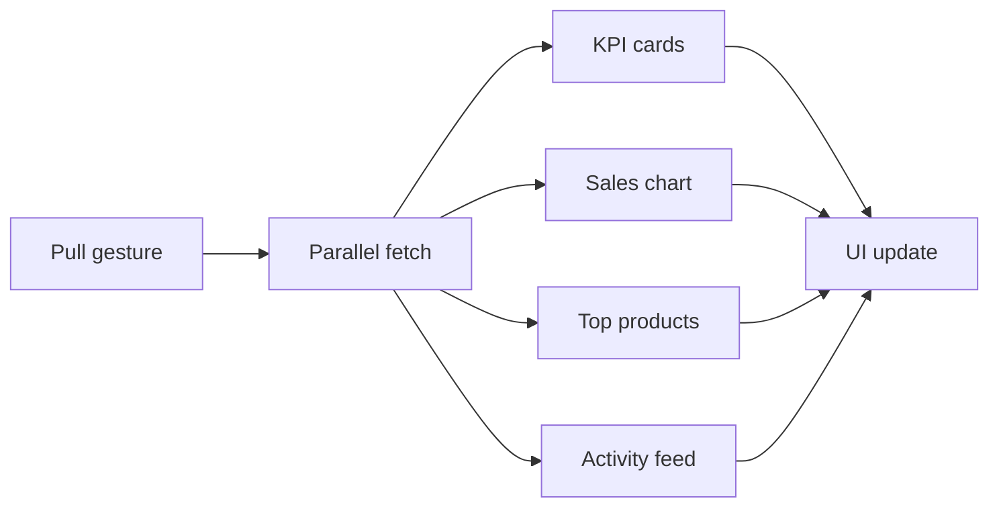

# Mobile UX Specification (Flutter Material Design 3)

## Document Control

| Field | Value |
|-------|-------|
| Version | 2.0.0 |
| Platform | Android 10+, iOS 15+ |
| Stack | Flutter 3.x + Material Design 3 + Cupertino adaptations |
| Last Updated | 2026-06-17 |
| Audience | Mobile engineers, UX designers, QA |

---

## Purpose

This document specifies **user experience behavior** for the Flutter mobile client. It complements [MOBILE_UI_SPEC.md](./MOBILE_UI_SPEC.md) (screen layouts) and [../11-platforms/MOBILE_FLUTTER.md](../11-platforms/MOBILE_FLUTTER.md) (technical platform). Focus areas: bottom navigation, FAB usage, bottom sheets, barcode scanner, pull-to-refresh, haptic feedback, safe areas, and platform-specific differences per Material Design 3 and Apple Human Interface Guidelines.

**Design north star**: Thumb-reachable primary actions, glanceable KPIs for owners, fast floor workflows for warehouse, usable POS backup for cashiers.

---

## 1. Navigation Architecture

### 1.1 Bottom Navigation Bar

#### Structure

```
┌─────────────────────────────┐
│ AppBar                      │
├─────────────────────────────┤
│                             │
│     Main Content            │
│     (scrollable)            │
│                             │
├─────────────────────────────┤
│ 🏠    🛒    📦    👥    ≡  │
│ Home  POS  Inv.  Cust. More │
└─────────────────────────────┘
```

#### Tab Assignment by Role

| Tab | Label | Icon | Owner | Manager | Cashier | Warehouse |
|-----|-------|------|-------|---------|---------|-----------|
| 1 | Home | `home` | Dashboard | Dashboard | POS | Inventory |
| 2 | POS | `point_of_sale` | — | — | POS | — |
| 3 | Inventory | `inventory_2` | — | View | — | Primary |
| 4 | Customers | `people` | View | Primary | Primary | — |
| 5 | More | `menu` | Settings, Reports, Admin | Reports, Products | Sales History | Products |

*Tabs hidden when module disabled or role lacks permission.*

#### Bottom Nav Behavior

| Rule | Specification |
|------|---------------|
| Tab count | Maximum 5 destinations per MD3 guidelines |
| Re-tap active tab | Scroll to top of current list |
| State preservation | Each tab maintains own navigation stack |
| Badge | Dot badge on More for admin alerts; count on Customers for overdue debt (Phase 2) |
| Elevation | 3dp with `surfaceContainer` color per MD3 |
| Label | Always show labels (not icons-only) for clarity |
| Animation | MD3 indicator slide animation on tab change (200ms) |
| Disabled module | Tab not rendered (not grayed out) |

### 1.2 Stack Navigation Within Tabs

| Pattern | Usage |
|---------|-------|
| Push route | List → Detail → Sub-detail |
| Replace | Login → Home (no back to login) |
| Modal route | Full-screen scanner, payment flow |
| Bottom sheet | Cart, filters, quick actions |

### 1.3 AppBar Conventions

| Element | Position | Content |
|---------|----------|---------|
| Leading | Left | Back arrow (when stack depth > 0) or menu (on More) |
| Title | Center | Screen title or company name on Dashboard |
| Actions | Right | Search, notifications (bell), profile avatar |
| Company chip | Below title (optional) | Tappable company switcher on multi-company accounts |

### 1.4 More Drawer (Fifth Tab)

The More tab opens a **navigation drawer** (not a screen) with secondary destinations:

| Item | Destination |
|------|-------------|
| Products | Products list |
| Reports | Reports catalog |
| Currency | Exchange rate management |
| Admin | Admin panel (admin role only) |
| Settings | App settings |
| Help | Support info (Phase 2) |
| Logout | Confirm dialog → Login |

---

## 2. Floating Action Button (FAB)

### 2.1 FAB Hierarchy (MD3)

| FAB Type | Usage in ERP |
|----------|--------------|
| **Primary FAB** | Single dominant action per screen |
| **Extended FAB** | When label clarity needed (e.g., "Receive Stock") |
| **Small FAB** | Secondary action on crowded screens (Phase 2) |
| **No FAB** | When bottom nav or AppBar action suffices |

### 2.2 FAB Placement by Screen

| Screen | FAB | Action | Extended Label |
|--------|-----|--------|----------------|
| Inventory Home | Yes | Receive Stock | "Receive" |
| Customers List | Yes | Add Customer | "Add" |
| Customer Detail | Yes | Record Payment | "Pay" |
| Products List | Yes | Add Product | "Add" |
| POS Product Grid | No | Cart access via bottom bar | — |
| Dashboard | No | Pull-to-refresh instead | — |
| Sales History | No | Search in AppBar | — |
| Admin Users | No | Add via AppBar button | — |

### 2.3 FAB Position Rules

| Rule | Value |
|------|-------|
| Default position | Bottom-right, 16dp from edges |
| Bottom nav offset | FAB sits 16dp above bottom nav (80dp total from bottom) |
| Bottom sheet open | FAB hides with scale-out animation |
| Scroll behavior | FAB hides on scroll down, reappears on scroll up (MD3 behavior) |
| Keyboard open | FAB hides to avoid overlap |
| Safe area | Respect `SafeArea` bottom inset on notched devices |

### 2.4 FAB Interaction

| Action | Feedback |
|--------|----------|
| Tap | Medium haptic impact |
| Long press | Show tooltip with action name (Phase 2) |
| Morph transition | FAB morphs into bottom sheet anchor for Receive Stock flow |

---

## 3. Bottom Sheets

### 3.1 Sheet Types

| Type | Height | Usage |
|------|--------|-------|
| **Standard** | 50% screen | Cart review, filters |
| **Expanded** | 90% screen | Payment flow, return item selection |
| **Modal** | Variable | Destructive confirmations |
| **Drag handle** | Always visible | MD3 drag pill at top center |

### 3.2 POS Cart Bottom Sheet

```
┌─────────────────────────────┐
│         ─── drag ───        │
│  Cart (4 items)        [×]  │
├─────────────────────────────┤
│  Cement 50kg   ×10   450,000│
│  Brick Std    ×500   250,000│
│  ... scrollable ...         │
├─────────────────────────────┤
│  [UZS | USD]  currency      │
│  TOTAL:          700,000    │
├─────────────────────────────┤
│  [Cash]  [Credit]           │
│  [    Complete Sale    ]    │
└─────────────────────────────┘
```

#### Cart Sheet Behavior

| Rule | Detail |
|------|--------|
| Open trigger | Tap "View Cart (N items)" sticky bar or swipe up on bar |
| Partial height | Collapsed shows total + item count; expanded shows line items |
| Swipe to dismiss | Downward swipe dismisses if no payment in progress |
| Quantity edit | Stepper controls per line; swipe-to-delete with confirm |
| Payment transition | Cash/Credit expands sheet to full payment view in-place |
| Complete | Sheet closes; success snackbar; haptic success |

### 3.3 Payment Bottom Sheet

| Step | Sheet Content |
|------|---------------|
| 1 | Payment type selector (segmented button) |
| 2a Cash | Amount received numpad; change display |
| 2b Credit | Customer search; partial payment field |
| 3 | Confirm summary |
| 4 | Processing spinner |
| 5 | Success with print/share actions |

### 3.4 Filter Bottom Sheet

Used on: Customers, Sales History, Products, Audit Logs

| Element | Behavior |
|---------|----------|
| Filter chips | Multi-select facets |
| Date range | MD3 date range picker |
| Apply button | Sticky bottom; applies and closes |
| Reset link | Clears all filters |
| Active filter count | Badge on filter icon in AppBar |

### 3.5 Bottom Sheet UX Rules

| Rule | Detail |
|------|--------|
| Back gesture | Android back dismisses sheet before popping route |
| iOS swipe | Sheet dismissible by drag; background scrim tap dismisses |
| Keyboard | Sheet resizes with `resizeToAvoidBottomInset` |
| Nested sheets | Not permitted; replace content within single sheet |
| Unsaved changes | Dismiss with dirty form → confirm dialog |

---

## 4. Barcode Scanner UX

### 4.1 Scanner Entry Points

| Entry | Context |
|-------|---------|
| POS search bar scan icon | Add product to cart |
| Receive Stock form | Identify product for receipt |
| Product list AppBar | Quick product lookup |
| Future: inventory count | Phase 2 |

### 4.2 Scanner Screen Layout

```
┌─────────────────────────────┐
│ [×] Close     Scan Product  │
├─────────────────────────────┤
│                             │
│    ┌─────────────────┐      │
│    │                 │      │
│    │   Camera View   │      │
│    │   with overlay  │      │
│    │                 │      │
│    └─────────────────┘      │
│    Align barcode in frame   │
│                             │
├─────────────────────────────┤
│  🔦 Torch   [Manual Entry]  │
└─────────────────────────────┘
```

### 4.3 Scanner Behavior

| Aspect | Specification |
|--------|---------------|
| Camera permission | Request on first scan; rationale dialog before system prompt |
| Scan region | Centered viewfinder rectangle with corner brackets |
| Auto-detect | Continuous scan mode; 500ms debounce between duplicate reads |
| Success | Short haptic + green flash overlay + auto-close (300ms delay) |
| Not found | Red flash + snackbar "Product not found" + remain scanning |
| Torch toggle | Flashlight icon; persist during session |
| Manual entry | Fallback link opens numeric/text keyboard dialog |
| Orientation | Portrait locked during scan |
| Multiple barcodes | Select from list if multiple detected (rare) |

### 4.4 Platform Camera Differences

| Aspect | Android (CameraX) | iOS (AVFoundation) |
|--------|-------------------|---------------------|
| Permission text | "ERP needs camera to scan product barcodes" | Same; Info.plist `NSCameraUsageDescription` |
| Torch | Standard API | Standard API |
| Focus | Continuous autofocus | Continuous autofocus |
| Scan formats | EAN-13, EAN-8, Code 128, QR | Same |
| Background | Camera pauses on app background | Same |
| Low light | Auto torch suggestion banner | Same |

### 4.5 Scanner Accessibility

| Feature | Implementation |
|---------|----------------|
| VoiceOver / TalkBack | "Point camera at barcode" on open |
| Manual entry | Always available without camera |
| High contrast viewfinder | White brackets on semi-transparent scrim |

---

## 5. Pull to Refresh

### 5.1 Applicable Screens

| Screen | Refresh Data |
|--------|--------------|
| Dashboard | KPIs, charts, activity feed |
| Customers List | Customer list + debt totals |
| Products List | Product catalog |
| Inventory Home | Stock levels |
| Sales History | Recent sales |
| Notifications | Notification list |
| Admin Sessions | Active sessions (admin) |

### 5.2 Refresh Behavior

| Rule | Detail |
|------|--------|
| Trigger | Overscroll pull gesture at list top |
| Indicator | MD3 `RefreshIndicator` with brand color |
| Minimum duration | 400ms visible even if data instant (perceived feedback) |
| Concurrent | Cancel prior refresh if new pull starts |
| Offline | Pull shows "Cannot refresh while offline" snackbar |
| WebSocket active | Pull still valid as explicit user sync |
| Success | Indicator completes; optional subtle haptic light |
| Failure | Red snackbar with retry action |

### 5.3 Dashboard Refresh Scope



### 5.4 iOS vs Android Refresh

| Platform | Behavior |
|----------|----------|
| Android | MD3 RefreshIndicator (material) |
| iOS | `CupertinoSliverRefreshControl` styling via adaptive widget; rubber-band bounce |
| Overscroll | iOS bounce always; Android glow effect |

---

## 6. Haptic Feedback

### 6.1 Haptic Catalog

| Event | Haptic Type | Platform API |
|-------|-------------|--------------|
| Successful sale | Medium impact | `HapticFeedback.mediumImpact()` |
| Successful payment recorded | Medium impact | Same |
| Successful stock receipt | Medium impact | Same |
| Barcode scan success | Light impact | `lightImpact()` |
| Error / validation fail | Heavy impact | `heavyImpact()` |
| Toggle switch | Selection click | `selectionClick()` |
| Delete swipe confirm | Warning pattern | Medium impact |
| Tab change | None | Visual only |
| Pull refresh complete | Light impact | Optional |

### 6.2 Haptic Rules

| Rule | Detail |
|------|--------|
| User setting | Settings → Haptic Feedback toggle (default ON) |
| Respect system | Honor Android system haptic disable; iOS `AudioServices` respects silent |
| Not overused | No haptic on every keystroke or scroll |
| POS scan | Light impact on every successful scan (configurable) |
| Error distinction | Errors use distinct heavy pattern vs success medium |

### 6.3 Platform Notes

| Platform | Consideration |
|----------|---------------|
| Android | Works on most devices; no-op on devices without vibrator |
| iOS | Taptic Engine on iPhone 7+; reduced on iPad (no Taptic) |
| iPad | Haptics limited; rely more on visual feedback |

---

## 7. Safe Areas and Layout Insets

### 7.1 Safe Area Application

| Region | Handling |
|--------|----------|
| Top notch / status bar | AppBar extends into status bar with `SafeArea` top:false on AppBar |
| Bottom home indicator | Bottom nav sits above home indicator inset |
| Bottom sheet | Sheet content padded with `MediaQuery.padding.bottom` |
| FAB | Positioned above bottom nav + safe inset |
| Landscape | Increased horizontal safe areas on notched iPhones |
| Keyboard | `viewInsets.bottom` pushes content and hides FAB |

### 7.2 Device Categories

| Category | Layout Adjustments |
|----------|-------------------|
| iPhone SE (small) | Compact stat cards 2-column; reduced chart height |
| iPhone 14/15 (standard) | Default layouts |
| iPhone Pro Max (large) | Optional 3-column stat cards in landscape |
| iPad | Phase 2: adaptive two-pane layouts; Phase 1: phone layout centered |
| Android small (360dp) | Minimum supported width; horizontal scroll on wide tables |
| Android tablet | Same as iPad approach |

### 7.3 Keyboard Avoidance

| Screen | Behavior |
|--------|----------|
| Login | Form scrolls up above keyboard |
| POS customer search | Search field remains visible |
| Payment numpad | Sheet expands; total always visible above keyboard |
| Product create form | `SingleChildScrollView` with bottom padding |

---

## 8. iOS vs Android Platform Differences

### 8.1 Navigation and Back

| Aspect | Android (MD3) | iOS (HIG) |
|--------|---------------|-----------|
| System back | Predictive back gesture (Android 14+) | Edge swipe from left |
| AppBar back | `←` icon leading | `‹` chevron (Cupertino) |
| Back action | Pop route or dismiss sheet | Same; swipe-back native feel |
| Exit app | Double-tap back on root (optional toast) | Home gesture |
| Deep link | `erp://` intent filter | Universal Links (Phase 2) |

### 8.2 Visual Design

| Element | Android | iOS |
|---------|---------|-----|
| Primary font | Roboto (system) | San Francisco (system) |
| AppBar style | MD3 `Surface` with shadow | Large title (collapsible) on list screens |
| Buttons | Filled tonal MD3 | Same MD3 (not Cupertino buttons in body) |
| Dialogs | MD3 `AlertDialog` | Slightly rounded; iOS uses `CupertinoAlertDialog` for destructive |
| Segmented control | MD3 `SegmentedButton` | Same |
| Lists | MD3 `ListTile` | Higher row height (56dp min) per HIG touch targets |
| Icons | Material Symbols | Material Symbols (consistent cross-platform) |
| Ripple | Material ink splash | iOS: subtle highlight without ripple (platform adaptive) |

### 8.3 Authentication

| Feature | Android | iOS |
|---------|---------|-----|
| Biometric login | Fingerprint / face (Phase 2) | Face ID / Touch ID (Phase 2) |
| Credential storage | EncryptedSharedPreferences | Keychain |
| Auto-fill | Google autofill framework | iCloud Keychain |

### 8.4 Notifications

| Feature | Android | iOS |
|---------|---------|-----|
| Push provider | FCM | APNs (Phase 2) |
| In-app | Snackbar + notification center | Same |
| Channels | Debt alerts, Reports, Admin | iOS categories |
| Permission | Android 13+ runtime permission | Prompt on first use |

### 8.5 Sharing and Files

| Action | Android | iOS |
|--------|---------|-----|
| Report download | Downloads folder; share sheet | Files app; share sheet |
| Share receipt | `ACTION_SEND` intent | `UIActivityViewController` |
| Print | Android print framework | AirPrint |

### 8.6 Status Bar and Theme

| Aspect | Android | iOS |
|--------|---------|-----|
| Status bar icons | Light icons on dark bg; dark on light | `statusBarBrightness` matched |
| Navigation bar | Themed `navigationBarColor` | Home indicator area matches bottom nav |
| Edge-to-edge | Android 15 edge-to-edge default | Standard safe areas |

### 8.7 Platform-Adaptive Widget Strategy

| Widget | Strategy |
|--------|----------|
| Back button | `PlatformAdaptive` leading icon |
| Refresh | Material vs Cupertino sliver |
| Date picker | `showDatePicker` vs `CupertinoDatePicker` in bottom sheet on iOS |
| Action sheet | MD3 bottom sheet (Android); iOS uses bottom sheet (not action sheet) for consistency |
| Switch | MD3 Switch on both; iOS styling via theme overlay |

---

## 9. POS Mobile UX (Cashier Backup)

### 9.1 Layout

| Zone | Content |
|------|---------|
| Top | Search + scan icon |
| Middle | Product grid (2 columns) or search results |
| Bottom sticky | "View Cart (N) — TOTAL" bar |
| Sheet | Full cart + payment on tap |

### 9.2 Mobile POS Rules

| Rule | Detail |
|------|--------|
| Primary use | Backup when desktop unavailable |
| Speed target | ≤ 60 seconds per cash sale (mobile overhead) |
| Landscape | Supported; cart panel on right (50/50 split) |
| Scanner | Prominent; reduces typing on mobile |
| Receipt | Share PDF receipt; no thermal print on phone |

---

## 10. Dashboard Mobile UX (Owner / Manager)

### 10.1 Layout

| Zone | Content |
|------|---------|
| Top | Company chip + period selector chips (Day/Week/Month) |
| Stats | 2×2 grid of KPI cards |
| Chart | Compact line chart (swipeable periods) |
| Lists | Top products; recent activity |

### 10.2 KPI Card Interaction

| Gesture | Action |
|---------|--------|
| Tap card | Expand detail bottom sheet with breakdown |
| Long press | Copy value to clipboard |
| Currency toggle | AppBar chip: UZS / USD / Both |

---

## 11. Forms and Input (Mobile)

### 11.1 Numeric Entry

| Context | Input Type |
|---------|------------|
| Payment amount | Custom numpad bottom sheet (large buttons) |
| Quantity | Stepper + numpad option |
| Phone search | `phone` keyboard with country code prefix |
| Cost entry | Decimal numpad with dual currency fields |

### 11.2 Form Patterns

| Pattern | Usage |
|---------|-------|
| Single column | All forms |
| Sticky submit | Primary button fixed at bottom |
| Field validation | Inline error below field on blur |
| Auto-save draft | Phase 2 for long product forms |

---

## 12. Snackbar, Dialog, and Feedback

### 12.1 Snackbar Rules (MD3)

| Type | Duration | Action |
|------|----------|--------|
| Info | 4s | None |
| Success | 3s | Optional "View" |
| Error | 6s | "Retry" |
| Offline | Persistent until dismissed | "Retry connection" |

### 12.2 Dialog Rules

| Type | Style |
|------|-------|
| Confirm destructive | Title + body + Cancel/Confirm (red) |
| Info | Single OK button |
| Loading | Non-dismissible with spinner |

---

## 13. Dark and Light Mode (Mobile)

| Aspect | Behavior |
|--------|----------|
| Default | Follow system (`ThemeMode.system`) |
| Override | Settings → Light / Dark / System |
| MD3 dynamic color | Android 12+ Material You dynamic color from wallpaper (optional toggle) |
| iOS | Static brand color scheme (no dynamic color) |
| Charts | Theme-aware palette |
| Bottom nav | `surfaceContainer` per MD3 |
| OLED dark | True black option in Settings (Phase 2) |

---

## 14. Performance and Motion

| Guideline | Target |
|-----------|--------|
| Page transition | 300ms MD3 shared axis |
| Bottom sheet open | 250ms easeOutCubic |
| List scroll | 60fps; `ListView.builder` for long lists |
| Image loading | Cached network images with placeholder |
| Shimmer | Skeleton loading on Dashboard and lists |

---

## 15. Accessibility (Mobile)

| Requirement | Implementation |
|-------------|----------------|
| Touch target | Minimum 48×48dp per MD3/HIG |
| Screen reader | Semantic labels on all icons |
| Dynamic type | Support up to 1.3× text scale |
| Color contrast | WCAG AA minimum |
| Reduce motion | Honor `reduceMotion` — disable sheet animations |

---

## Related Documents

- [MOBILE_UI_SPEC.md](./MOBILE_UI_SPEC.md) — Screen layouts
- [NAVIGATION_PATTERNS.md](./NAVIGATION_PATTERNS.md) — Cross-platform navigation rules
- [RESPONSIVE_DESIGN.md](./RESPONSIVE_DESIGN.md) — Breakpoints and adaptations
- [THEMING_DARK_LIGHT.md](./THEMING_DARK_LIGHT.md) — Theme tokens
- [ACCESSIBILITY.md](./ACCESSIBILITY.md) — WCAG requirements
- [USER_FLOWS.md](./USER_FLOWS.md) — Detailed interaction flows
- [USER_JOURNEYS.md](./USER_JOURNEYS.md) — Persona journey maps
- [../11-platforms/MOBILE_FLUTTER.md](../11-platforms/MOBILE_FLUTTER.md) — Flutter technical spec
