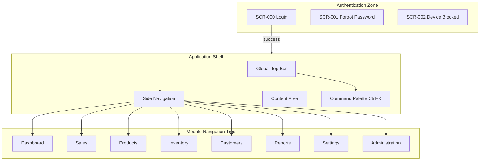
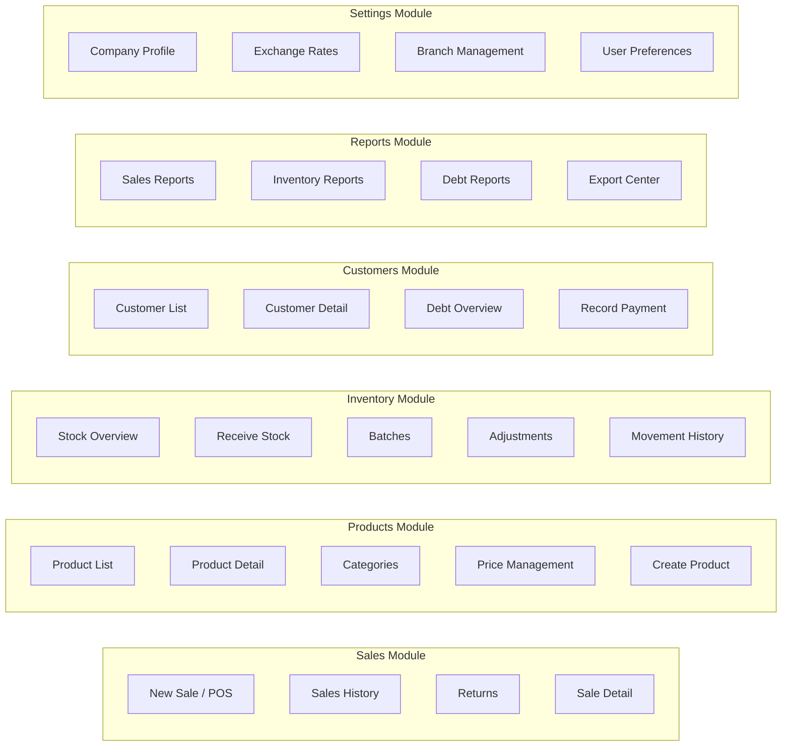
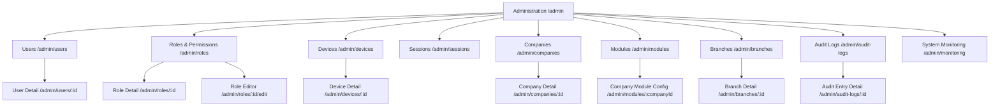
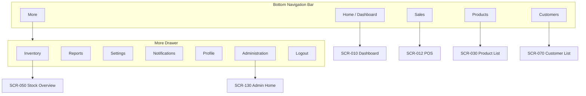
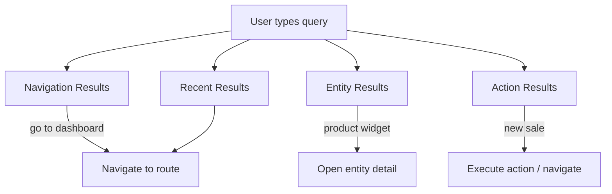
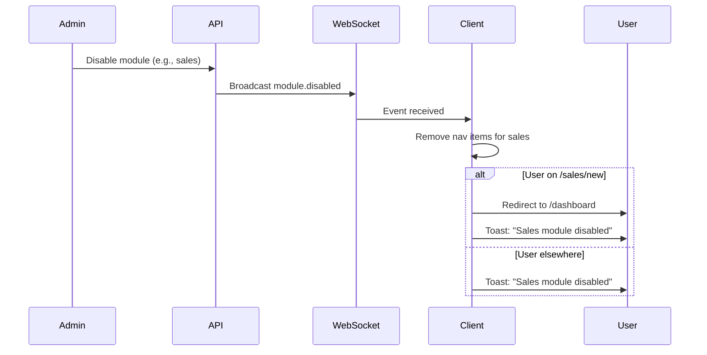
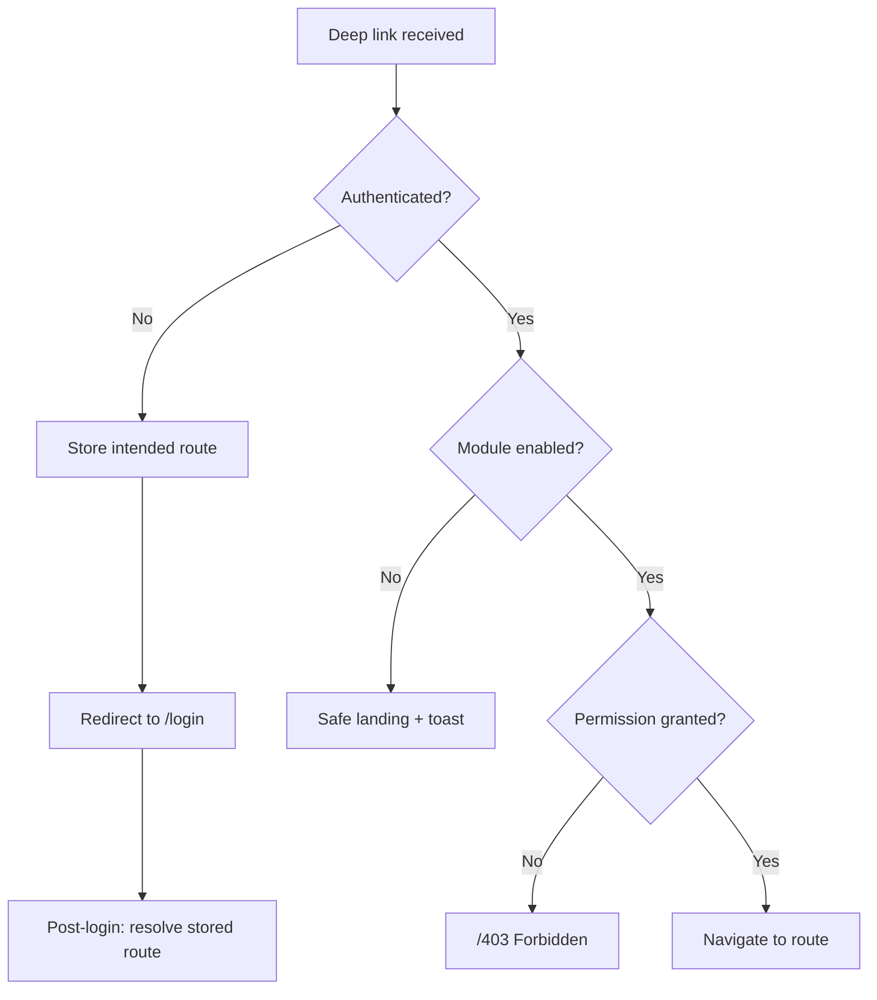
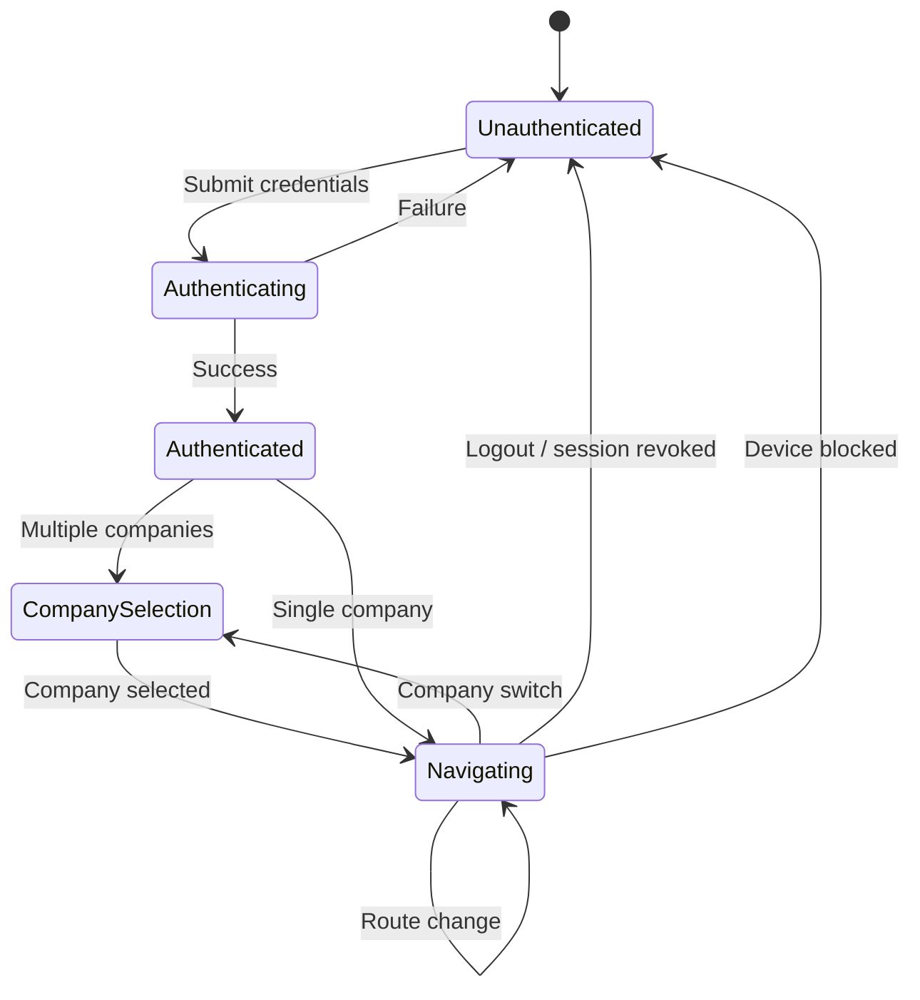

# Navigation Architecture

## Document Control

| Field | Value |
|-------|-------|
| Version | 2.0.0 |
| Status | Approved — Enterprise Specification |
| Last Updated | 2026-06-17 |
| Audience | Product Design, Frontend, Mobile, QA, Information Architecture |
| Parent Document | [UI_UX_MASTER_BLUEPRINT.md](./UI_UX_MASTER_BLUEPRINT.md) |
| Related Screen IDs | [SCREEN_HIERARCHY.md](./SCREEN_HIERARCHY.md) |

---

## 1. Purpose & Scope

This document defines the **complete navigation system** for the ERP platform across desktop (Electron/React) and mobile (Flutter/MD3). It specifies global navigation maps, screen hierarchy, route definitions, role-based access matrices, breadcrumb rules, command palette behavior, mobile navigation patterns, admin subtree structure, module-disabled behavior, and deep linking schemes.

Navigation is not merely wayfinding — it is the **primary enforcement layer** for role-based access control (RBAC) and module enablement alongside API authorization guards.

---

## 2. Navigation Design Principles

| Principle | Rule |
|-----------|------|
| **Permission-first** | Nav items render only when user has required permission AND module is enabled |
| **Hide, don't disable** | Unauthorized or disabled items are removed — never shown grayed out |
| **Role-aware landing** | Post-login redirect goes to role-appropriate default screen |
| **Context preservation** | Back navigation, breadcrumbs, and browser history preserve user context |
| **Company-scoped** | Navigation rebuilds on company switch |
| **Deep-linkable** | Every screen has a canonical URL / URI scheme |
| **Keyboard-efficient** | Desktop: sidebar numbers, command palette, shortcut chords |
| **Mobile thumb-zone** | Primary actions in bottom 40% of screen; bottom nav for top modules |

Cross-reference: [RBAC_DESIGN.md](../07-security/RBAC_DESIGN.md), [MODULE_MANAGEMENT.md](../08-modules/MODULE_MANAGEMENT.md)

---

## 3. Global Navigation Map — Desktop

### 3.1 Primary Navigation Topology



### 3.2 Module Sub-Navigation Map



### 3.3 Administration Subtree



Cross-reference: [ADMIN_PANEL.md](../08-modules/ADMIN_PANEL.md)

---

## 4. Global Navigation Map — Mobile

### 4.1 Mobile Navigation Topology



### 4.2 Mobile Stack Navigation per Tab

Each bottom tab maintains its own navigation stack (Navigator 2.0 / GoRouter shell routes):

| Tab | Stack Root | Typical Drill-Down |
|-----|------------|-------------------|
| Home | Dashboard | — |
| Sales | POS | History → Sale Detail → Return |
| Products | Product List | Product Detail → Edit |
| Customers | Customer List | Customer Detail → Record Payment |
| More | Drawer (modal) | Module screens pushed on global stack |

**Rule**: Switching bottom tabs preserves each tab's stack state. Switching company resets all stacks.

---

## 5. Screen Hierarchy Tree

Complete screen registry with IDs: [SCREEN_HIERARCHY.md](./SCREEN_HIERARCHY.md)

### 5.1 Condensed Hierarchy

```
ERP Application
├── Authentication [SCR-000 – SCR-003]
│   ├── Login
│   ├── Forgot Password
│   ├── Device Blocked
│   └── Session Expired
├── Dashboard [SCR-010 – SCR-019]
│   └── Dashboard Home
├── Sales [SCR-020 – SCR-039]
│   ├── New Sale (POS)
│   ├── Sales History
│   ├── Sale Detail
│   ├── Returns
│   └── Return Detail
├── Products [SCR-040 – SCR-059]
│   ├── Product List
│   ├── Product Detail
│   ├── Create/Edit Product
│   ├── Categories
│   └── Price Management
├── Inventory [SCR-060 – SCR-079]
│   ├── Stock Overview
│   ├── Receive Stock
│   ├── Batches
│   ├── Batch Detail
│   ├── Adjustments
│   └── Movement History
├── Customers [SCR-080 – SCR-099]
│   ├── Customer List
│   ├── Customer Detail
│   ├── Create/Edit Customer
│   ├── Debt Overview
│   └── Record Payment
├── Reports [SCR-100 – SCR-119]
│   ├── Sales Reports
│   ├── Inventory Reports
│   ├── Debt Reports
│   └── Export Center
├── Settings [SCR-120 – SCR-129]
│   ├── Company Profile
│   ├── Exchange Rates
│   ├── Branch Management
│   └── User Preferences
├── Administration [SCR-130 – SCR-169]
│   ├── Admin Home
│   ├── Users (+ detail, create, edit)
│   ├── Roles (+ detail, editor)
│   ├── Devices (+ detail)
│   ├── Sessions
│   ├── Companies (+ detail)
│   ├── Modules (+ company config)
│   ├── Branches (+ detail)
│   ├── Audit Logs (+ detail)
│   └── System Monitoring
├── Notifications [SCR-170 – SCR-179]
│   ├── Notification Center
│   └── Notification Detail
├── Profile [SCR-180 – SCR-189]
│   ├── User Profile
│   └── Change Password
└── System [SCR-190 – SCR-199]
    ├── 404 Not Found
    ├── 403 Forbidden
    ├── Module Disabled
    └── Print/Receipt View
```

---

## 6. Complete Route Map

### 6.1 Route Naming Convention

```
/{module}/{action}/{id}?/{subaction}?

Rules:
- Lowercase, kebab-case segments
- Module prefix matches backend module code
- :id = UUID path parameter
- Query params for filters, tabs, pagination
```

### 6.2 Authentication Routes

| Route | SCR-ID | Permission | Module | Platform |
|-------|--------|------------|--------|----------|
| `/login` | SCR-000 | Public | auth | All |
| `/forgot-password` | SCR-001 | Public | auth | All |
| `/device-blocked` | SCR-002 | Public | auth | All |
| `/session-expired` | SCR-003 | Public | auth | All |

### 6.3 Dashboard Routes

| Route | SCR-ID | Permission | Module | Default Tab |
|-------|--------|------------|--------|-------------|
| `/dashboard` | SCR-010 | `dashboard.view` | dashboard | — |

### 6.4 Sales Routes

| Route | SCR-ID | Permission | Module |
|-------|--------|------------|--------|
| `/sales/new` | SCR-020 | `sales.create` | sales |
| `/sales/history` | SCR-021 | `sales.view` | sales |
| `/sales/history/:id` | SCR-022 | `sales.view` | sales |
| `/sales/returns` | SCR-023 | `sales.return` | sales |
| `/sales/returns/:id` | SCR-024 | `sales.return` | sales |
| `/sales/receipt/:id` | SCR-025 | `sales.view` | sales |

### 6.5 Products Routes

| Route | SCR-ID | Permission | Module |
|-------|--------|------------|--------|
| `/products` | SCR-040 | `products.view` | products |
| `/products/new` | SCR-041 | `products.create` | products |
| `/products/:id` | SCR-042 | `products.view` | products |
| `/products/:id/edit` | SCR-043 | `products.update` | products |
| `/products/categories` | SCR-044 | `products.view` | products |
| `/products/prices` | SCR-045 | `products.update` | products |

### 6.6 Inventory Routes

| Route | SCR-ID | Permission | Module |
|-------|--------|------------|--------|
| `/inventory` | SCR-060 | `inventory.view` | inventory |
| `/inventory/receive` | SCR-061 | `inventory.receive` | inventory |
| `/inventory/batches` | SCR-062 | `inventory.view` | inventory |
| `/inventory/batches/:id` | SCR-063 | `inventory.view` | inventory |
| `/inventory/adjustments` | SCR-064 | `inventory.adjust` | inventory |
| `/inventory/movements` | SCR-065 | `inventory.view` | inventory |

### 6.7 Customers Routes

| Route | SCR-ID | Permission | Module |
|-------|--------|------------|--------|
| `/customers` | SCR-080 | `customers.view` | customers |
| `/customers/new` | SCR-081 | `customers.create` | customers |
| `/customers/:id` | SCR-082 | `customers.view` | customers |
| `/customers/:id/edit` | SCR-083 | `customers.update` | customers |
| `/customers/debt` | SCR-084 | `debt.view` | debt |
| `/customers/:id/payment` | SCR-085 | `debt.payment` | debt |

### 6.8 Reports Routes

| Route | SCR-ID | Permission | Module |
|-------|--------|------------|--------|
| `/reports` | SCR-100 | `reports.view` | reports |
| `/reports/sales` | SCR-101 | `reports.view` | reports |
| `/reports/inventory` | SCR-102 | `reports.view` | reports |
| `/reports/debt` | SCR-103 | `reports.view` | reports |
| `/reports/exports` | SCR-104 | `reports.generate` | reports |

### 6.9 Settings Routes

| Route | SCR-ID | Permission | Module |
|-------|--------|------------|--------|
| `/settings` | SCR-120 | `settings.view` | company |
| `/settings/company` | SCR-121 | `settings.company` | company |
| `/settings/exchange-rates` | SCR-122 | `currency.manage` | currency |
| `/settings/branches` | SCR-123 | `settings.branches` | company |
| `/settings/preferences` | SCR-124 | Authenticated | core |

### 6.10 Administration Routes

| Route | SCR-ID | Permission | Module |
|-------|--------|------------|--------|
| `/admin` | SCR-130 | `admin.access` | admin |
| `/admin/users` | SCR-131 | `admin.users.view` | admin |
| `/admin/users/new` | SCR-132 | `admin.users.create` | admin |
| `/admin/users/:id` | SCR-133 | `admin.users.view` | admin |
| `/admin/users/:id/edit` | SCR-134 | `admin.users.update` | admin |
| `/admin/roles` | SCR-135 | `admin.roles.view` | admin |
| `/admin/roles/new` | SCR-136 | `admin.roles.create` | admin |
| `/admin/roles/:id` | SCR-137 | `admin.roles.view` | admin |
| `/admin/roles/:id/edit` | SCR-138 | `admin.roles.manage` | admin |
| `/admin/devices` | SCR-139 | `admin.devices.view` | admin |
| `/admin/devices/:id` | SCR-140 | `admin.devices.view` | admin |
| `/admin/sessions` | SCR-141 | `admin.sessions.view` | admin |
| `/admin/companies` | SCR-142 | `admin.companies.view` | admin |
| `/admin/companies/new` | SCR-143 | `admin.companies.create` | admin |
| `/admin/companies/:id` | SCR-144 | `admin.companies.view` | admin |
| `/admin/modules` | SCR-145 | `admin.modules.view` | admin |
| `/admin/modules/:companyId` | SCR-146 | `admin.modules.manage` | admin |
| `/admin/branches` | SCR-147 | `admin.branches.view` | admin |
| `/admin/branches/:id` | SCR-148 | `admin.branches.view` | admin |
| `/admin/audit-logs` | SCR-149 | `admin.audit.view` | audit |
| `/admin/audit-logs/:id` | SCR-150 | `admin.audit.view` | audit |
| `/admin/monitoring` | SCR-151 | `admin.monitoring.view` | admin |

### 6.11 Utility Routes

| Route | SCR-ID | Permission | Module |
|-------|--------|------------|--------|
| `/notifications` | SCR-170 | Authenticated | notifications |
| `/notifications/:id` | SCR-171 | Authenticated | notifications |
| `/profile` | SCR-180 | Authenticated | core |
| `/profile/password` | SCR-181 | Authenticated | core |
| `/403` | SCR-190 | Public | core |
| `/404` | SCR-191 | Public | core |
| `/module-disabled` | SCR-192 | Authenticated | core |
| `/print/receipt/:id` | SCR-025 | `sales.view` | sales |

### 6.12 Query Parameter Conventions

| Parameter | Usage | Example |
|-----------|-------|---------|
| `?tab=` | Sub-section within detail page | `/customers/:id?tab=payments` |
| `?page=` | Pagination | `/products?page=2` |
| `?sort=` | Table sort | `/products?sort=name&order=asc` |
| `?filter=` | Encoded filter state | `/sales/history?filter=status:completed` |
| `?period=` | Dashboard/report period | `/dashboard?period=week` |
| `?currency=` | Display currency preference | `/dashboard?currency=both` |
| `?branch=` | Branch filter override | `/inventory?branch=uuid` |

---

## 7. Role-Based Navigation Matrices

### 7.1 Sidebar Visibility Matrix

| Navigation Item | Admin | Manager | Cashier | Warehouse | Required Permission | Required Module |
|-----------------|-------|---------|---------|-----------|---------------------|-----------------|
| Dashboard | ✓ | ✓ | — | — | `dashboard.view` | dashboard |
| Sales → New Sale | ✓ | ✓ | ✓ | — | `sales.create` | sales |
| Sales → History | ✓ | ✓ | ✓ (own)* | — | `sales.view` | sales |
| Sales → Returns | ✓ | ✓ | — | — | `sales.return` | sales |
| Products → List | ✓ | ✓ | ✓ (view) | ✓ | `products.view` | products |
| Products → Categories | ✓ | ✓ | — | ✓ | `products.view` | products |
| Products → Prices | ✓ | ✓ | — | — | `products.update` | products |
| Inventory → Overview | ✓ | ✓ | — | ✓ | `inventory.view` | inventory |
| Inventory → Receive | ✓ | ✓ | — | ✓ | `inventory.receive` | inventory |
| Inventory → Batches | ✓ | ✓ | — | ✓ | `inventory.view` | inventory |
| Inventory → Adjustments | ✓ | ✓ | — | ✓ | `inventory.adjust` | inventory |
| Customers → List | ✓ | ✓ | ✓ | — | `customers.view` | customers |
| Customers → Debt | ✓ | ✓ | ✓ | — | `debt.view` | debt |
| Reports → All | ✓ | ✓ | — | — | `reports.view` | reports |
| Settings → All | ✓ | ✓ | — | — | `settings.view` | company |
| Administration | ✓ | —** | — | — | `admin.access` | admin |

\* Cashier sees own sales only unless granted `sales.view_all`
\** Manager with `admin.access` permission sees Administration (custom role scenario)

Cross-reference: [RBAC_DESIGN.md](../07-security/RBAC_DESIGN.md)

### 7.2 Default Landing Page Matrix

| Role | Primary Company Context | Default Route | Fallback |
|------|-------------------------|---------------|----------|
| `admin` | Any | `/dashboard` | `/admin` |
| `manager` | Any | `/dashboard` | `/sales/history` |
| `cashier` | Any | `/sales/new` | `/customers` |
| `warehouse` | Any | `/inventory` | `/products` |
| Multi-role | Switches company | Re-evaluate role for new company | `/dashboard` |

**Post-login flow**:
1. Authenticate → load user companies + roles + enabled modules
2. Restore last company (if still valid) or prompt company selection
3. Resolve role for active company
4. Navigate to default landing for role
5. If default route unavailable (module disabled / no permission) → next available in priority list

### 7.3 Mobile Bottom Tab Visibility Matrix

| Tab | Admin | Manager | Cashier | Warehouse |
|-----|-------|---------|---------|-----------|
| Home (Dashboard) | ✓ | ✓ | — | — |
| Sales | ✓ | ✓ | ✓ | — |
| Products | ✓ | ✓ | ✓ (view) | ✓ |
| Customers | ✓ | ✓ | ✓ | — |
| More | ✓ | ✓ | ✓ | ✓ |

When Dashboard tab hidden (cashier), Sales becomes leftmost tab and default.

### 7.4 Action-Level Navigation Guards

| Action | Guard Type | Redirect on Fail |
|--------|------------|------------------|
| View screen | Permission + Module | `/403` or default landing |
| Create button | `*.create` permission | Button hidden |
| Edit route | `*.update` permission | `/403` |
| Delete action | `*.delete` permission | Action hidden |
| Admin section | `admin.*` permission | Nav item hidden |
| Export report | `reports.generate` | Button hidden |

Cross-reference: [AUTHORIZATION.md](../07-security/AUTHORIZATION.md)

---

## 8. Breadcrumb Rules

### 8.1 Breadcrumb Anatomy

```
[Module Root] > [Section] > [Entity Name] > [Action]
```

Examples:
- `Dashboard`
- `Sales > New Sale`
- `Sales > History > Sale #1042`
- `Products > Widget Pro 3000`
- `Products > Widget Pro 3000 > Edit`
- `Administration > Users > Sarvar Rahimov`
- `Administration > Modules > Market O'zbekiston`

### 8.2 Breadcrumb Rules

| Rule ID | Rule |
|---------|------|
| BC-01 | Breadcrumbs display on desktop only (≥ 768px); hidden on mobile |
| BC-02 | First segment always links to module root |
| BC-03 | Current (last) segment is plain text, not a link |
| BC-04 | Entity names truncate at 40 characters with ellipsis |
| BC-05 | UUIDs never shown — always display name |
| BC-06 | POS screen shows `Sales > New Sale` (not "POS") |
| BC-07 | Admin screens prefix with `Administration` |
| BC-08 | Settings screens prefix with `Settings` |
| BC-09 | Create screens show `> New [Entity]` |
| BC-10 | Edit screens show `> Edit` (not duplicate entity name) |
| BC-11 | Tab selection does NOT add breadcrumb segment (tabs are query param) |
| BC-12 | Breadcrumb updates synchronously with route change |

### 8.3 Breadcrumb Component Mapping

| Segment Type | Source | Link Target |
|--------------|--------|-------------|
| Module root | Nav item label | Module index route |
| Section | Sub-nav label | Section route |
| Entity | API `display_name` | Entity detail route |
| Action | Static string | — (current page) |

### 8.4 Mobile Back Navigation Equivalence

Mobile AppBar back button follows breadcrumb hierarchy:
- Detail → List
- Edit → Detail
- Create → List
- Admin child → Admin home

---

## 9. Command Palette (Ctrl+K / Cmd+K)

### 9.1 Overview

The command palette is the **power-user navigation hub** for desktop. It provides fuzzy search across navigation, entities, and actions.

**Trigger**: `Ctrl+K` (Windows/Linux), `Cmd+K` (macOS)
**Component**: `SearchCommand` (see [COMPONENT_HIERARCHY.md](./COMPONENT_HIERARCHY.md))

### 9.2 Command Palette Architecture



### 9.3 Result Categories

| Category | Priority | Source | Example Query → Result |
|----------|----------|--------|--------------------------|
| **Navigation** | 1 | Registered nav items | "inv" → Inventory → Stock Overview |
| **Actions** | 2 | Registered quick actions | "new sale" → Go to POS |
| **Products** | 3 | API search (debounced 300ms) | "SKU-1234" → Product detail |
| **Customers** | 3 | API phone/name search | "998901234567" → Customer detail |
| **Sales** | 4 | API receipt search | "#1042" → Sale detail |
| **Admin** | 5 | Admin nav items (if permitted) | "block user" → Users list filtered |
| **Recent** | 0 (top) | Local history (last 10) | Previously visited screens |

### 9.4 Registered Quick Actions

| Action Label | Shortcut Hint | Permission | Route/Behavior |
|--------------|---------------|------------|----------------|
| New Sale | Ctrl+N | `sales.create` | `/sales/new` |
| New Product | — | `products.create` | `/products/new` |
| New Customer | — | `customers.create` | `/customers/new` |
| Receive Stock | — | `inventory.receive` | `/inventory/receive` |
| Record Payment | — | `debt.payment` | `/customers` (with payment dialog) |
| Go to Dashboard | — | `dashboard.view` | `/dashboard` |
| Open Reports | — | `reports.view` | `/reports` |
| Switch Company | — | Authenticated | Open company switcher |
| Toggle Theme | — | Authenticated | Cycle light/dark/system |
| View Notifications | — | Authenticated | `/notifications` |

### 9.5 Command Palette UX Rules

| Rule | Description |
|------|-------------|
| CP-01 | Opens as modal overlay; `Escape` closes |
| CP-02 | Arrow keys navigate results; `Enter` executes |
| CP-03 | Results filter by permission — no forbidden results shown |
| CP-04 | Module-disabled items excluded from navigation results |
| CP-05 | Empty state: "No results. Try a different search." |
| CP-06 | Loading state for entity search: skeleton rows |
| CP-07 | Recent history stored locally; cleared on logout |
| CP-08 | Admin actions prefixed with "Admin:" in results |
| CP-09 | Keyboard shortcut shown right-aligned in result row |
| CP-10 | Palette accessible: `role="combobox"`, `aria-activedescendant` |

### 9.6 Mobile Equivalent

Mobile does not use command palette. Equivalent functionality:
- **Global search** in AppBar (products + customers)
- **FAB** on list screens for create actions
- **Drawer quick links** in More menu

---

## 10. Mobile Bottom Navigation & Drawer

### 10.1 Bottom Navigation Specification

| Property | Value |
|----------|-------|
| Tab count | 5 maximum |
| Height | 80px (includes safe area) |
| Icon size | 24px |
| Active indicator | Pill behind icon (MD3 NavigationBar) |
| Labels | Always visible (no icon-only) |
| Haptic | Light selection feedback |

### 10.2 Tab Definitions

| Tab Index | Label (UZ) | Label (EN) | Icon | Root Route | SCR-ID |
|-----------|------------|------------|------|------------|--------|
| 0 | Bosh sahifa | Home | `home` | `/dashboard` | SCR-010 |
| 1 | Sotuv | Sales | `point_of_sale` | `/sales/new` | SCR-020 |
| 2 | Mahsulotlar | Products | `inventory_2` | `/products` | SCR-040 |
| 3 | Mijozlar | Customers | `people` | `/customers` | SCR-080 |
| 4 | Ko'proq | More | `menu` | Opens drawer | — |

### 10.3 Drawer (More Menu) Structure

```
┌─────────────────────────────────┐
│  [Avatar] User Name             │
│  Role · Company Name            │
├─────────────────────────────────┤
│  📦 Inventarizatsiya            │
│  📊 Hisobotlar                  │
│  ⚙️ Sozlamalar                  │
│  🔔 Bildirishnomalar       (3)  │
│  👤 Profil                      │
├─────────────────────────────────┤
│  🔧 Boshqaruv (admin only)      │
│     ├── Foydalanuvchilar        │
│     ├── Qurilmalar              │
│     ├── Sessiyalar              │
│     └── Modullar                │
├─────────────────────────────────┤
│  🌙 Mavzu: Tizim                │
│  🏢 Kompaniya almashtirish      │
│  🚪 Chiqish                     │
└─────────────────────────────────┘
```

### 10.4 Drawer Behavior Rules

| Rule | Description |
|------|-------------|
| DR-01 | Drawer opens as modal side sheet (85% width on phone) |
| DR-02 | Tapping outside closes drawer |
| DR-03 | Admin section visible only with `admin.access` |
| DR-04 | Admin subsection shows 4 most-used items; "View all" → `/admin` |
| DR-05 | Notification badge on drawer item mirrors top bar bell |
| DR-06 | Company switcher in drawer duplicates top bar (for thumb reach) |
| DR-07 | Logout requires confirmation dialog |
| DR-08 | Module-disabled items omitted from drawer |

### 10.5 iPad / Tablet Adaptation

| Breakpoint | Navigation Pattern |
|------------|-------------------|
| < 600dp | Bottom nav + drawer |
| 600–840dp | Navigation rail (MD3) + drawer |
| > 840dp | Permanent navigation drawer (desktop-like) |

Cross-reference: [RESPONSIVE_DESIGN.md](./RESPONSIVE_DESIGN.md), [MOBILE_UI_SPEC.md](./MOBILE_UI_SPEC.md)

---

## 11. Admin Navigation Subtree

### 11.1 Admin Entry Points

| Entry Point | Platform | Target |
|-------------|----------|--------|
| Sidebar → Administration | Desktop | `/admin` |
| Drawer → Boshqaruv | Mobile | `/admin` |
| Command palette → "admin" | Desktop | `/admin` |
| Notification → admin action | All | Deep link to specific admin screen |

### 11.2 Admin Sidebar Order

| Order | Item | Icon | Route | Permission |
|-------|------|------|-------|------------|
| 1 | Overview | `layout-dashboard` | `/admin` | `admin.access` |
| 2 | Users | `users` | `/admin/users` | `admin.users.view` |
| 3 | Roles & Permissions | `shield` | `/admin/roles` | `admin.roles.view` |
| 4 | Devices | `smartphone` | `/admin/devices` | `admin.devices.view` |
| 5 | Sessions | `activity` | `/admin/sessions` | `admin.sessions.view` |
| 6 | Companies | `building-2` | `/admin/companies` | `admin.companies.view` |
| 7 | Modules | `puzzle` | `/admin/modules` | `admin.modules.view` |
| 8 | Branches | `git-branch` | `/admin/branches` | `admin.branches.view` |
| 9 | Audit Logs | `scroll-text` | `/admin/audit-logs` | `admin.audit.view` |
| 10 | Monitoring | `heart-pulse` | `/admin/monitoring` | `admin.monitoring.view` |

### 11.3 Admin Breadcrumb Namespace

All admin screens use `Administration` as root breadcrumb segment. Sub-breadcrumbs follow standard entity rules.

### 11.4 Admin Mobile Adaptation

Mobile admin uses card-based hub (SCR-130) with large tappable tiles for each section. List screens use standard mobile list patterns. Complex editors (role permission matrix) redirect to desktop with informational banner on mobile.

Cross-reference: [ADMIN_PANEL.md](../08-modules/ADMIN_PANEL.md), [AUDIT_LOGS.md](../08-modules/AUDIT_LOGS.md)

---

## 12. Module-Disabled Navigation Behavior

### 12.1 Module State Impact on Navigation

| State | Sidebar/Drawer | Routes | Command Palette | Deep Links |
|-------|----------------|--------|-----------------|------------|
| **Enabled** | Item visible (if permitted) | Accessible | Searchable | Resolved |
| **Disabled** | Item removed | Redirect to safe landing | Excluded | Redirect + toast |
| **Dependency missing** | Item removed | Redirect | Excluded | Redirect + toast |

Cross-reference: [MODULE_MANAGEMENT.md](../08-modules/MODULE_MANAGEMENT.md) § Client Propagation

### 12.2 Real-Time Module Disable Flow



### 12.3 Safe Landing Priority

When redirecting from disabled module route:

| Priority | Route | Condition |
|----------|-------|-----------|
| 1 | `/dashboard` | `dashboard.view` + module enabled |
| 2 | `/sales/new` | `sales.create` + module enabled |
| 3 | `/products` | `products.view` + module enabled |
| 4 | `/inventory` | `inventory.view` + module enabled |
| 5 | `/customers` | `customers.view` + module enabled |
| 6 | `/admin` | `admin.access` |
| 7 | `/profile` | Always available |

### 12.4 Module Enable Flow

When module enabled:
1. WebSocket `module.enabled` received
2. Navigation items added (if user has permissions)
3. Toast: "[Module] is now available"
4. No automatic navigation — user continues current task

### 12.5 Platform Module Exception

Modules `core`, `auth`, `admin`, `company`, `audit` cannot be disabled. Navigation items for Settings and Profile always remain.

---

## 13. Deep Linking Scheme

### 13.1 URL Scheme (Production)

| Scheme | Usage |
|--------|-------|
| `erp://` | Custom URI scheme (mobile + desktop) |
| `https://app.erp.uz/` | Web fallback (future) |

### 13.2 Deep Link Route Table

| Deep Link | Maps To | Permission |
|-----------|---------|------------|
| `erp://dashboard` | `/dashboard` | `dashboard.view` |
| `erp://sales/new` | `/sales/new` | `sales.create` |
| `erp://sales/:id` | `/sales/history/:id` | `sales.view` |
| `erp://products/:id` | `/products/:id` | `products.view` |
| `erp://customers/:id` | `/customers/:id` | `customers.view` |
| `erp://inventory` | `/inventory` | `inventory.view` |
| `erp://notifications/:id` | `/notifications/:id` | Authenticated |
| `erp://admin/users/:id` | `/admin/users/:id` | `admin.users.view` |
| `erp://login` | `/login` | Public |

### 13.3 Deep Link Resolution Flow



### 13.4 Push Notification Deep Links

| Notification Type | Deep Link Target |
|-------------------|------------------|
| `SALE_COMPLETED` | `erp://sales/:id` |
| `LOW_STOCK` | `erp://products/:id` |
| `DEBT_OVERDUE` | `erp://customers/:id?tab=debt` |
| `NEW_DEVICE_LOGIN` | `erp://admin/devices/:id` |
| `MODULE_DISABLED` | `erp://dashboard` |
| `SESSION_REVOKED` | `erp://login` |

Cross-reference: [NOTIFICATIONS.md](../08-modules/NOTIFICATIONS.md)

### 13.5 Universal Link Configuration

| Platform | Config File |
|----------|-------------|
| iOS | `apple-app-site-association` |
| Android | `assetlinks.json` |
| Desktop | OS-level protocol handler registration |

---

## 14. Sidebar Behavior Specification (Desktop)

### 14.1 Sidebar States

| State | Width | Content |
|-------|-------|---------|
| Expanded | 240px | Icon + label + badge |
| Collapsed | 64px | Icon only + tooltip on hover |
| Hidden | 0px | Mobile/tablet < 768px (hamburger toggle) |

### 14.2 Sidebar Interaction Rules

| Rule | Description |
|------|-------------|
| SB-01 | Toggle via chevron button at sidebar bottom or `Ctrl+B` |
| SB-02 | Active item: `bg-primary/10` background, primary color icon |
| SB-03 | Parent item with active child: bold label |
| SB-04 | Expandable groups: Products, Inventory, Sales, Admin |
| SB-05 | Collapsed mode: hover tooltip shows full label |
| SB-06 | Collapsed mode: click expandable → flyout submenu |
| SB-07 | Sidebar scrolls independently from content |
| SB-08 | Sidebar state persisted per user |
| SB-09 | Keyboard: `Alt+1` through `Alt+9` for top-level items |
| SB-10 | Footer: version number + collapse toggle |

### 14.3 Sidebar Group Definitions

| Group | Children | Default Expanded |
|-------|----------|------------------|
| Sales | New Sale, History, Returns | Yes (if active) |
| Products | List, Categories, Prices | No |
| Inventory | Overview, Receive, Batches, Adjustments | No |
| Customers | List, Debt Overview | No |
| Reports | Sales, Inventory, Debt, Exports | No |
| Settings | Company, Exchange Rates, Branches, Preferences | No |
| Administration | (10 admin items) | No |

---

## 15. Navigation State Machine

### 15.1 Application Navigation States



### 15.2 Route Guard Evaluation Order

1. Authentication guard (JWT valid?)
2. Device trust guard (device blocked?)
3. Company context guard (company selected?)
4. Module enablement guard (module active for company?)
5. Permission guard (user role permits action?)
6. Branch scope guard (entity in user's branch scope?)

Cross-reference: [AUTHORIZATION.md](../07-security/AUTHORIZATION.md), [DEVICE_MANAGEMENT.md](../07-security/DEVICE_MANAGEMENT.md)

---

## 16. Navigation Analytics Events

| Event | Payload | Purpose |
|-------|---------|---------|
| `nav.route_change` | `{ from, to, scr_id }` | Usage analytics |
| `nav.sidebar_toggle` | `{ collapsed }` | UX preference |
| `nav.command_palette.open` | `{ trigger }` | Feature adoption |
| `nav.command_palette.select` | `{ query, result_type }` | Search quality |
| `nav.company_switch` | `{ from_company, to_company }` | Multi-company usage |
| `nav.module_redirect` | `{ module, reason }` | Module disable impact |
| `nav.deep_link` | `{ uri, resolved, success }` | Deep link reliability |

---

## 17. Related Documents

| Document | Relationship |
|----------|--------------|
| [UI_UX_MASTER_BLUEPRINT.md](./UI_UX_MASTER_BLUEPRINT.md) | Parent blueprint |
| [SCREEN_HIERARCHY.md](./SCREEN_HIERARCHY.md) | Screen IDs and parent-child tree |
| [COMPONENT_HIERARCHY.md](./COMPONENT_HIERARCHY.md) | Navigation components |
| [INFORMATION_ARCHITECTURE.md](./INFORMATION_ARCHITECTURE.md) | IA summary (v1.0) |
| [NAVIGATION_PATTERNS.md](./NAVIGATION_PATTERNS.md) | Pattern summary (v1.0) |
| [USER_FLOWS.md](./USER_FLOWS.md) | Interaction flows |
| [RBAC_DESIGN.md](../07-security/RBAC_DESIGN.md) | Role definitions |
| [PERMISSIONS_MODEL.md](../07-security/PERMISSIONS_MODEL.md) | Permission catalog |
| [MODULE_MANAGEMENT.md](../08-modules/MODULE_MANAGEMENT.md) | Module enable/disable |
| [ADMIN_PANEL.md](../08-modules/ADMIN_PANEL.md) | Admin screens |

---

*Navigation architecture v2.0.0 — all routes, guards, and patterns must be implemented exactly as specified.*
