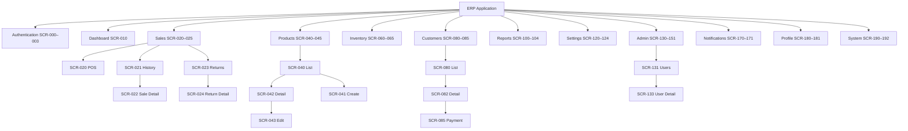

# Screen Hierarchy

## Document Control

| Field | Value |
|-------|-------|
| Version | 2.0.0 |
| Status | Approved — Enterprise Specification |
| Last Updated | 2026-06-17 |
| Audience | Product Design, Frontend, Mobile, QA, Automation |
| Parent Document | [UI_UX_MASTER_BLUEPRINT.md](./UI_UX_MASTER_BLUEPRINT.md) |
| Route Reference | [NAVIGATION_ARCHITECTURE.md](./NAVIGATION_ARCHITECTURE.md) |
| Permission Reference | [PERMISSIONS_MODEL.md](../07-security/PERMISSIONS_MODEL.md) |

---

## 1. Purpose

This document is the **authoritative registry** of every screen in the ERP application. Each screen has a unique ID (`SCR-NNN`), defined parent-child relationships, access permissions, module association, and platform availability.

Screen IDs are used in:
- Figma frame naming
- QA test plans and E2E automation (`data-screen-id`)
- Analytics event tracking
- Bug reports and change requests
- Cross-team communication

---

## 2. Screen ID Convention

### 2.1 Format

```
SCR-{NNN}

NNN = Three-digit zero-padded sequential number
Range allocation by domain (gaps reserved for expansion)
```

### 2.2 ID Range Allocation

| Range | Domain | Module Code |
|-------|--------|-------------|
| SCR-000 – SCR-009 | Authentication & Session | auth |
| SCR-010 – SCR-019 | Dashboard | dashboard |
| SCR-020 – SCR-039 | Sales & POS | sales |
| SCR-040 – SCR-059 | Products | products |
| SCR-060 – SCR-079 | Inventory | inventory |
| SCR-080 – SCR-099 | Customers & Debt | customers, debt |
| SCR-100 – SCR-119 | Reports | reports |
| SCR-120 – SCR-129 | Settings | company, currency |
| SCR-130 – SCR-169 | Administration | admin, audit |
| SCR-170 – SCR-179 | Notifications | notifications |
| SCR-180 – SCR-189 | User Profile | core |
| SCR-190 – SCR-199 | System & Error States | core |
| SCR-200 – SCR-299 | Reserved — Phase 2 modules | — |
| SCR-300 – SCR-399 | Reserved — Future expansion | — |

### 2.3 Screen Record Schema

| Field | Description |
|-------|-------------|
| **ID** | Unique screen identifier |
| **Name** | Human-readable screen name |
| **Parent** | Parent screen ID (null for roots) |
| **Route** | Canonical route path |
| **Permission** | Minimum permission(s) required |
| **Module** | Owning module code |
| **Platform** | D=Desktop, M=Mobile, B=Both |
| **Roles** | Typical roles with access |
| **Shell** | Auth / App / Minimal |

---

## 3. Screen Hierarchy Tree



---

## 4. Authentication Screens (SCR-000 – SCR-009)

| ID | Name | Parent | Route | Permission | Module | Platform | Shell |
|----|------|--------|-------|------------|--------|----------|-------|
| SCR-000 | Login | — | `/login` | Public | auth | B | Auth |
| SCR-001 | Forgot Password | SCR-000 | `/forgot-password` | Public | auth | B | Auth |
| SCR-002 | Device Blocked | — | `/device-blocked` | Public | auth | B | Auth |
| SCR-003 | Session Expired | — | `/session-expired` | Public | auth | B | Auth |

### SCR-000 — Login

| Attribute | Value |
|-----------|-------|
| **Description** | Primary authentication screen. Email + password entry, company selector (if multi-company), remember device checkbox |
| **Entry Points** | App launch (unauthenticated), logout, session revoked, deep link (redirect) |
| **Exit Points** | Role-based default landing, company selection modal |
| **Key Components** | `AuthCard`, `LoginForm`, `CompanyPreSelector` |
| **States** | Default, loading, error (invalid credentials), error (account blocked) |
| **Mobile Adaptation** | Full-screen form; biometric prompt Phase 2 |
| **Cross-ref** | [AUTHENTICATION.md](../07-security/AUTHENTICATION.md) |

### SCR-001 — Forgot Password

| Attribute | Value |
|-----------|-------|
| **Description** | Password reset request. Email input → confirmation message |
| **Parent Actions** | Back to Login |
| **States** | Default, submitted (check email), error |

### SCR-002 — Device Blocked

| Attribute | Value |
|-----------|-------|
| **Description** | Informational screen when device is admin-blocked. Shows reason, contact admin CTA |
| **Entry Points** | Login rejection, WebSocket `device.blocked` event |
| **Cross-ref** | [DEVICE_MANAGEMENT.md](../07-security/DEVICE_MANAGEMENT.md) |

### SCR-003 — Session Expired

| Attribute | Value |
|-----------|-------|
| **Description** | Modal-like full screen. "Session expired" message, re-login CTA, preserve return URL |
| **Cross-ref** | [SESSION_MANAGEMENT.md](../07-security/SESSION_MANAGEMENT.md) |

---

## 5. Dashboard Screens (SCR-010 – SCR-019)

| ID | Name | Parent | Route | Permission | Module | Platform | Roles |
|----|------|--------|-------|------------|--------|----------|-------|
| SCR-010 | Dashboard Home | — | `/dashboard` | `dashboard.view` | dashboard | B | admin, manager |

### SCR-010 — Dashboard Home

| Attribute | Value |
|-----------|-------|
| **Description** | Real-time KPI dashboard with dual-currency metrics, sales chart, top products, recent activity |
| **Sections** | Period selector, KPI stat cards (4×2 grid desktop, 2×2 mobile), sales chart, top products table, activity feed |
| **Real-Time** | WebSocket updates for KPIs on `sale.completed`, `debt.payment_recorded`, `inventory.updated` |
| **Key Components** | `StatCard`, `SalesChart`, `TopProductsTable`, `ActivityFeed`, `PeriodSelector`, `CurrencyToggle` |
| **States** | Loading (skeleton), populated, empty (new company), error |
| **Mobile Adaptation** | Pull-to-refresh; compact chart; top 5 products only |
| **Cross-ref** | [DASHBOARD.md](../08-modules/DASHBOARD.md) |

**Reserved**: SCR-011–SCR-019 for future dashboard widgets (custom layouts, branch comparison, Phase 2).

---

## 6. Sales Screens (SCR-020 – SCR-039)

| ID | Name | Parent | Route | Permission | Module | Platform | Roles |
|----|------|--------|-------|------------|--------|----------|-------|
| SCR-020 | POS — New Sale | — | `/sales/new` | `sales.create` | sales | B | admin, manager, cashier |
| SCR-021 | Sales History | — | `/sales/history` | `sales.view` | sales | B | admin, manager, cashier* |
| SCR-022 | Sale Detail | SCR-021 | `/sales/history/:id` | `sales.view` | sales | B | admin, manager, cashier* |
| SCR-023 | Returns List | — | `/sales/returns` | `sales.return` | sales | D** | admin, manager |
| SCR-024 | Return Detail | SCR-023 | `/sales/returns/:id` | `sales.return` | sales | D** | admin, manager |
| SCR-025 | Receipt View | SCR-022 | `/sales/receipt/:id` | `sales.view` | sales | B | all sales roles |

\* Cashier: own sales only unless `sales.view_all`
\** Mobile: Phase 1 view-only; create return desktop-preferred

### SCR-020 — POS — New Sale

| Attribute | Value |
|-----------|-------|
| **Description** | Primary point-of-sale interface. Product search/scan, cart management, customer association, payment processing |
| **Layout Desktop** | 60/40 split: product search grid (left), cart panel (right, sticky) |
| **Layout Mobile** | Product search + grid; cart via bottom sheet |
| **Sub-States** | Empty cart, items in cart, customer selected, payment dialog open, processing, success |
| **Keyboard** | Barcode auto-focus; Enter add; F9 complete; Ctrl+N new cart |
| **Key Components** | `BarcodeInput`, `ProductPicker`, `CartTable`, `CustomerPicker`, `PaymentDialog`, `CurrencySelector` |
| **Business Rules** | FIFO allocation on complete; frozen exchange rate; oversell blocked |
| **Cross-ref** | [SALES.md](../08-modules/SALES.md), [FIFO.md](../08-modules/FIFO.md), [CURRENCY_UZS_USD.md](../08-modules/CURRENCY_UZS_USD.md) |

### SCR-021 — Sales History

| Attribute | Value |
|-----------|-------|
| **Description** | Filterable, sortable table of completed/cancelled sales |
| **Columns** | Receipt #, Date, Cashier, Customer, Total (UZS), Total (USD), Payment Type, Status |
| **Filters** | Date range, status, payment type, cashier, customer, currency |
| **Row Actions** | View detail, print receipt, cancel (if permitted), return |
| **Key Components** | `DataTable`, `DateRangePicker`, `StatusBadge`, `ExportButton` |

### SCR-022 — Sale Detail

| Attribute | Value |
|-----------|-------|
| **Description** | Read-only sale record with line items, FIFO batch allocation, payment info, audit trail |
| **Tabs** | Details, Line Items, Payments, Audit (admin) |
| **Actions** | Print receipt, cancel sale, initiate return |
| **Parent** | SCR-021 (history), SCR-020 (post-completion redirect) |

### SCR-023 — Returns List

| Attribute | Value |
|-----------|-------|
| **Description** | List of return transactions linked to original sales |
| **Columns** | Return #, Original Sale, Date, Customer, Amount, Status |

### SCR-024 — Return Detail

| Attribute | Value |
|-----------|-------|
| **Description** | Return transaction detail with line items, inventory restoration, debt adjustment |
| **Parent** | SCR-023 |

### SCR-025 — Receipt View

| Attribute | Value |
|-----------|-------|
| **Description** | Print-optimized receipt layout. Minimal shell (no sidebar) |
| **Shell** | Minimal |
| **Actions** | Print, close |

**Reserved**: SCR-026–SCR-039 for POS variants (wholesale mode, multi-cart, Phase 2).

---

## 7. Products Screens (SCR-040 – SCR-059)

| ID | Name | Parent | Route | Permission | Module | Platform | Roles |
|----|------|--------|-------|------------|--------|----------|-------|
| SCR-040 | Product List | — | `/products` | `products.view` | products | B | all except cashier (view) |
| SCR-041 | Create Product | SCR-040 | `/products/new` | `products.create` | products | D* | admin, manager, warehouse |
| SCR-042 | Product Detail | SCR-040 | `/products/:id` | `products.view` | products | B | all |
| SCR-043 | Edit Product | SCR-042 | `/products/:id/edit` | `products.update` | products | D* | admin, manager, warehouse |
| SCR-044 | Categories | — | `/products/categories` | `products.view` | products | D* | admin, manager, warehouse |
| SCR-045 | Price Management | — | `/products/prices` | `products.update` | products | D | admin, manager |

\* Mobile: simplified create/edit (essential fields only)

### SCR-040 — Product List

| Attribute | Value |
|-----------|-------|
| **Description** | Searchable, filterable product catalog |
| **Columns** | SKU, Name, Barcode, Category, Stock, Price (UZS), Price (USD), Status |
| **Filters** | Category, status, stock level (low/normal), search (SKU/barcode/name) |
| **Actions** | Create, bulk export, row → detail |
| **Key Components** | `DataTable`, `ProductPicker`, `StatusBadge`, `BarcodeInput` |
| **Cross-ref** | [PRODUCTS.md](../08-modules/PRODUCTS.md) |

### SCR-042 — Product Detail

| Attribute | Value |
|-----------|-------|
| **Description** | Product record with pricing, stock, batches, sales history |
| **Sections** | Header (name, SKU, barcode, status), pricing card (4 price tiers), stock card, tabs |
| **Tabs** | Overview, Stock/Batches, Sales History, Audit |
| **Actions** | Edit, delete (with confirmation), print label |
| **Real-Time** | Stock updates via WebSocket |

### SCR-044 — Categories

| Attribute | Value |
|-----------|-------|
| **Description** | Hierarchical category tree with drag-drop reorder |
| **Actions** | Create, edit, delete category, assign products |

### SCR-045 — Price Management

| Attribute | Value |
|-----------|-------|
| **Description** | Bulk price editing grid. Filter by category; inline edit UZS/USD prices |
| **Business Rules** | Dual currency pricing per [CURRENCY_UZS_USD.md](../08-modules/CURRENCY_UZS_USD.md) |

**Reserved**: SCR-046–SCR-059 for barcode management, import wizard, label printing.

---

## 8. Inventory Screens (SCR-060 – SCR-079)

| ID | Name | Parent | Route | Permission | Module | Platform | Roles |
|----|------|--------|-------|------------|--------|----------|-------|
| SCR-060 | Stock Overview | — | `/inventory` | `inventory.view` | inventory | B | admin, manager, warehouse |
| SCR-061 | Receive Stock | — | `/inventory/receive` | `inventory.receive` | inventory | B | admin, manager, warehouse |
| SCR-062 | Batches List | — | `/inventory/batches` | `inventory.view` | inventory | B | admin, manager, warehouse |
| SCR-063 | Batch Detail | SCR-062 | `/inventory/batches/:id` | `inventory.view` | inventory | B | admin, manager, warehouse |
| SCR-064 | Adjustments | — | `/inventory/adjustments` | `inventory.adjust` | inventory | D* | admin, manager, warehouse |
| SCR-065 | Movement History | — | `/inventory/movements` | `inventory.view` | inventory | D* | admin, manager, warehouse |

\* Mobile: view-only Phase 1

### SCR-060 — Stock Overview

| Attribute | Value |
|-----------|-------|
| **Description** | Current stock levels across products with low-stock indicators |
| **Columns** | Product, SKU, Branch, Quantity, Reserved, Available, Last Movement |
| **Filters** | Branch, category, low stock only, search |
| **Key Components** | `DataTable`, `StatusBadge` (low stock warning) |
| **Cross-ref** | [INVENTORY.md](../08-modules/INVENTORY.md) |

### SCR-061 — Receive Stock

| Attribute | Value |
|-----------|-------|
| **Description** | Stock receiving workflow. Product scan/search, quantity, cost, batch creation |
| **Flow** | Select product → enter quantity + unit cost → batch auto-created → confirm |
| **Mobile** | Barcode scanner integration |
| **Business Rules** | FIFO batch creation, dual currency cost |
| **Cross-ref** | [FIFO.md](../08-modules/FIFO.md) |

### SCR-063 — Batch Detail

| Attribute | Value |
|-----------|-------|
| **Description** | Batch record: product, quantity remaining, unit cost, received date, allocation history |
| **Sections** | Batch info, remaining quantity, COGS, linked sales |

**Reserved**: SCR-066–SCR-079 for transfer between branches, stocktake, warehouse map.

---

## 9. Customers & Debt Screens (SCR-080 – SCR-099)

| ID | Name | Parent | Route | Permission | Module | Platform | Roles |
|----|------|--------|-------|------------|--------|----------|-------|
| SCR-080 | Customer List | — | `/customers` | `customers.view` | customers | B | admin, manager, cashier |
| SCR-081 | Create Customer | SCR-080 | `/customers/new` | `customers.create` | customers | B | admin, manager, cashier |
| SCR-082 | Customer Detail | SCR-080 | `/customers/:id` | `customers.view` | customers | B | admin, manager, cashier |
| SCR-083 | Edit Customer | SCR-082 | `/customers/:id/edit` | `customers.update` | customers | B | admin, manager |
| SCR-084 | Debt Overview | — | `/customers/debt` | `debt.view` | debt | B | admin, manager, cashier |
| SCR-085 | Record Payment | SCR-082 | `/customers/:id/payment` | `debt.payment` | debt | B | admin, manager, cashier |

### SCR-080 — Customer List

| Attribute | Value |
|-----------|-------|
| **Description** | Searchable customer directory. Phone search primary |
| **Columns** | Name, Phone, Address, Debt (UZS), Debt (USD), Last Purchase, Status |
| **Search** | Phone number (primary), name (secondary) |
| **Key Components** | `DataTable`, `CustomerPicker`, `CurrencyDisplay` |
| **Cross-ref** | [CUSTOMERS.md](../08-modules/CUSTOMERS.md) |

### SCR-082 — Customer Detail

| Attribute | Value |
|-----------|-------|
| **Description** | Customer record with debt summary, purchase history, payment history |
| **Sections** | Header card, debt summary (UZS + USD chips), partnership info |
| **Tabs** | Purchases, Payments, Debt History |
| **Actions** | Edit, record payment, view in POS |
| **Real-Time** | Debt balance updates via WebSocket |
| **Cross-ref** | [DEBT_MANAGEMENT.md](../08-modules/DEBT_MANAGEMENT.md) |

### SCR-084 — Debt Overview

| Attribute | Value |
|-----------|-------|
| **Description** | Cross-customer debt summary. Sortable by amount, overdue status |
| **Columns** | Customer, Phone, Debt UZS, Debt USD, Overdue Days, Last Payment |
| **Filters** | Overdue only, minimum amount, branch |
| **Actions** | Row → customer detail, bulk export |

### SCR-085 — Record Payment

| Attribute | Value |
|-----------|-------|
| **Description** | Payment entry form. Amount, currency, payment method, notes |
| **Validation** | Cannot exceed outstanding debt per currency |
| **Parent** | SCR-082 or SCR-084 |
| **Mobile** | Full-screen dialog |

**Reserved**: SCR-086–SCR-099 for credit limits, customer statements, SMS reminders.

---

## 10. Reports Screens (SCR-100 – SCR-119)

| ID | Name | Parent | Route | Permission | Module | Platform | Roles |
|----|------|--------|-------|------------|--------|----------|-------|
| SCR-100 | Reports Hub | — | `/reports` | `reports.view` | reports | B | admin, manager |
| SCR-101 | Sales Reports | SCR-100 | `/reports/sales` | `reports.view` | reports | B | admin, manager |
| SCR-102 | Inventory Reports | SCR-100 | `/reports/inventory` | `reports.view` | reports | D* | admin, manager |
| SCR-103 | Debt Reports | SCR-100 | `/reports/debt` | `reports.view` | reports | B | admin, manager |
| SCR-104 | Export Center | SCR-100 | `/reports/exports` | `reports.generate` | reports | D* | admin, manager |

\* Mobile: view reports; export desktop-preferred

### SCR-100 — Reports Hub

| Attribute | Value |
|-----------|-------|
| **Description** | Card grid of available report categories with recent exports |
| **Sections** | Report category cards, recent exports list, scheduled reports (Phase 2) |

### SCR-101 — Sales Reports

| Attribute | Value |
|-----------|-------|
| **Description** | Sales analytics: by period, by product, by cashier, by payment type |
| **Filters** | Date range, branch, currency, cashier, product category |
| **Output** | On-screen tables + charts; export PDF/Excel/CSV |
| **Key Components** | `DateRangePicker`, `ExportButton`, `SalesChart`, `DataTable` |
| **Cross-ref** | [REPORTS.md](../08-modules/REPORTS.md) |

### SCR-102 — Inventory Reports

| Attribute | Value |
|-----------|-------|
| **Description** | Stock valuation, movement summary, batch aging, low stock |
| **Cross-ref** | [INVENTORY.md](../08-modules/INVENTORY.md), [FIFO.md](../08-modules/FIFO.md) |

### SCR-103 — Debt Reports

| Attribute | Value |
|-----------|-------|
| **Description** | Outstanding debt, aging analysis, payment collection, overdue customers |
| **Cross-ref** | [DEBT_MANAGEMENT.md](../08-modules/DEBT_MANAGEMENT.md) |

### SCR-104 — Export Center

| Attribute | Value |
|-----------|-------|
| **Description** | History of generated exports with download links and regeneration |
| **Columns** | Report name, generated date, format, size, status, download |

**Reserved**: SCR-105–SCR-119 for custom report builder, scheduled reports.

---

## 11. Settings Screens (SCR-120 – SCR-129)

| ID | Name | Parent | Route | Permission | Module | Platform | Roles |
|----|------|--------|-------|------------|--------|----------|-------|
| SCR-120 | Settings Hub | — | `/settings` | `settings.view` | company | D* | admin, manager |
| SCR-121 | Company Profile | SCR-120 | `/settings/company` | `settings.company` | company | D* | admin, manager |
| SCR-122 | Exchange Rates | SCR-120 | `/settings/exchange-rates` | `currency.manage` | currency | D* | admin, manager |
| SCR-123 | Branch Management | SCR-120 | `/settings/branches` | `settings.branches` | company | D* | admin, manager |
| SCR-124 | User Preferences | SCR-120 | `/settings/preferences` | Authenticated | core | B | all |

\* Mobile: accessible via drawer → Settings

### SCR-121 — Company Profile

| Attribute | Value |
|-----------|-------|
| **Description** | Company name, legal info, address, tax ID, logo upload |
| **Cross-ref** | [MULTI_COMPANY.md](../08-modules/MULTI_COMPANY.md) |

### SCR-122 — Exchange Rates

| Attribute | Value |
|-----------|-------|
| **Description** | Current UZS/USD rate, rate history, set new rate |
| **Business Rules** | Rate frozen at sale time; historical rates preserved |
| **Cross-ref** | [CURRENCY_UZS_USD.md](../08-modules/CURRENCY_UZS_USD.md) |

### SCR-123 — Branch Management

| Attribute | Value |
|-----------|-------|
| **Description** | Branch list, create/edit branches, assign users |
| **Cross-ref** | [BRANCH_MANAGEMENT.md](../08-modules/BRANCH_MANAGEMENT.md) |

### SCR-124 — User Preferences

| Attribute | Value |
|-----------|-------|
| **Description** | Theme, language, default currency display, notification preferences, sidebar state |
| **Sections** | Appearance, Language, Display, Notifications |

**Reserved**: SCR-125–SCR-129 for receipt templates, tax settings, integrations.

---

## 12. Administration Screens (SCR-130 – SCR-169)

| ID | Name | Parent | Route | Permission | Module | Platform | Roles |
|----|------|--------|-------|------------|--------|----------|-------|
| SCR-130 | Admin Home | — | `/admin` | `admin.access` | admin | B | admin |
| SCR-131 | Users List | SCR-130 | `/admin/users` | `admin.users.view` | admin | B | admin |
| SCR-132 | Create User | SCR-131 | `/admin/users/new` | `admin.users.create` | admin | D* | admin |
| SCR-133 | User Detail | SCR-131 | `/admin/users/:id` | `admin.users.view` | admin | B | admin |
| SCR-134 | Edit User | SCR-133 | `/admin/users/:id/edit` | `admin.users.update` | admin | D* | admin |
| SCR-135 | Roles List | SCR-130 | `/admin/roles` | `admin.roles.view` | admin | D | admin |
| SCR-136 | Create Role | SCR-135 | `/admin/roles/new` | `admin.roles.create` | admin | D | admin |
| SCR-137 | Role Detail | SCR-135 | `/admin/roles/:id` | `admin.roles.view` | admin | D | admin |
| SCR-138 | Role Editor | SCR-137 | `/admin/roles/:id/edit` | `admin.roles.manage` | admin | D | admin |
| SCR-139 | Devices List | SCR-130 | `/admin/devices` | `admin.devices.view` | admin | B | admin |
| SCR-140 | Device Detail | SCR-139 | `/admin/devices/:id` | `admin.devices.view` | admin | B | admin |
| SCR-141 | Sessions List | SCR-130 | `/admin/sessions` | `admin.sessions.view` | admin | B | admin |
| SCR-142 | Companies List | SCR-130 | `/admin/companies` | `admin.companies.view` | admin | D | admin |
| SCR-143 | Create Company | SCR-142 | `/admin/companies/new` | `admin.companies.create` | admin | D | admin |
| SCR-144 | Company Detail | SCR-142 | `/admin/companies/:id` | `admin.companies.view` | admin | D | admin |
| SCR-145 | Modules List | SCR-130 | `/admin/modules` | `admin.modules.view` | admin | B | admin |
| SCR-146 | Company Module Config | SCR-145 | `/admin/modules/:companyId` | `admin.modules.manage` | admin | B | admin |
| SCR-147 | Branches List (Admin) | SCR-130 | `/admin/branches` | `admin.branches.view` | admin | D | admin |
| SCR-148 | Branch Detail (Admin) | SCR-147 | `/admin/branches/:id` | `admin.branches.view` | admin | D | admin |
| SCR-149 | Audit Logs | SCR-130 | `/admin/audit-logs` | `admin.audit.view` | audit | D | admin |
| SCR-150 | Audit Entry Detail | SCR-149 | `/admin/audit-logs/:id` | `admin.audit.view` | audit | D | admin |
| SCR-151 | System Monitoring | SCR-130 | `/admin/monitoring` | `admin.monitoring.view` | admin | D | admin |

### SCR-130 — Admin Home

| Attribute | Value |
|-----------|-------|
| **Description** | Admin dashboard hub. Card grid with quick stats and navigation tiles |
| **Sections** | Active users, active sessions, system health, quick action tiles |
| **Mobile** | Primary admin entry — large tappable cards |

### SCR-131 — Users List

| Attribute | Value |
|-----------|-------|
| **Description** | Platform-wide user management table |
| **Columns** | Name, Email, Status, Companies, Last Login, Actions |
| **Actions** | Create, edit, block/unblock, force logout |
| **Cross-ref** | [ADMIN_PANEL.md](../08-modules/ADMIN_PANEL.md) |

### SCR-133 — User Detail

| Attribute | Value |
|-----------|-------|
| **Description** | User profile with company assignments, devices, sessions, activity |
| **Tabs** | Profile, Companies & Roles, Devices, Sessions, Activity |
| **Actions** | Edit, block, reset password, assign company |

### SCR-138 — Role Editor

| Attribute | Value |
|-----------|-------|
| **Description** | Permission matrix editor. Checkbox grid: modules × actions |
| **Key Components** | `PermissionMatrix` |
| **Cross-ref** | [RBAC_DESIGN.md](../07-security/RBAC_DESIGN.md), [PERMISSIONS_MODEL.md](../07-security/PERMISSIONS_MODEL.md) |

### SCR-139 — Devices List

| Attribute | Value |
|-----------|-------|
| **Description** | All registered devices across users |
| **Columns** | Device name, User, Platform, IP, Status, Last Seen |
| **Actions** | Block/unblock, rename, view detail |
| **Cross-ref** | [DEVICE_MANAGEMENT.md](../07-security/DEVICE_MANAGEMENT.md) |

### SCR-141 — Sessions List

| Attribute | Value |
|-----------|-------|
| **Description** | Active sessions with force-logout capability |
| **Columns** | User, Device, Company, IP, Started, Last Activity, Actions |
| **Cross-ref** | [SESSION_MANAGEMENT.md](../07-security/SESSION_MANAGEMENT.md) |

### SCR-146 — Company Module Config

| Attribute | Value |
|-----------|-------|
| **Description** | Per-company module enable/disable with dependency visualization |
| **Key Components** | `ModuleToggle`, dependency tree diagram |
| **Real-Time** | WebSocket broadcast on toggle |
| **Cross-ref** | [MODULE_MANAGEMENT.md](../08-modules/MODULE_MANAGEMENT.md) |

### SCR-149 — Audit Logs

| Attribute | Value |
|-----------|-------|
| **Description** | Searchable audit trail with expandable old/new diff |
| **Columns** | Timestamp, User, Action, Entity, Company, IP |
| **Filters** | Date range, user, action type, entity type, company |
| **Key Components** | `AuditLogTable` |
| **Cross-ref** | [AUDIT_LOGS.md](../08-modules/AUDIT_LOGS.md), [AUDIT_SECURITY.md](../07-security/AUDIT_SECURITY.md) |

### SCR-151 — System Monitoring

| Attribute | Value |
|-----------|-------|
| **Description** | System health dashboard: API latency, WebSocket connections, queue depth, error rate |
| **Sections** | Health cards, connection graph, recent errors, background job status |

**Reserved**: SCR-152–SCR-169 for backup management, API keys, integration config.

---

## 13. Notifications Screens (SCR-170 – SCR-179)

| ID | Name | Parent | Route | Permission | Module | Platform | Roles |
|----|------|--------|-------|------------|--------|----------|-------|
| SCR-170 | Notification Center | — | `/notifications` | Authenticated | notifications | B | all |
| SCR-171 | Notification Detail | SCR-170 | `/notifications/:id` | Authenticated | notifications | B | all |

### SCR-170 — Notification Center

| Attribute | Value |
|-----------|-------|
| **Description** | Chronological notification feed with read/unread status |
| **Sections** | Unread list, read history, mark all read |
| **Real-Time** | New notifications via WebSocket; badge count in top bar |
| **Cross-ref** | [NOTIFICATIONS.md](../08-modules/NOTIFICATIONS.md) |

**Reserved**: SCR-172–SCR-179 for notification preferences, digest settings.

---

## 14. Profile Screens (SCR-180 – SCR-189)

| ID | Name | Parent | Route | Permission | Module | Platform | Roles |
|----|------|--------|-------|------------|--------|----------|-------|
| SCR-180 | User Profile | — | `/profile` | Authenticated | core | B | all |
| SCR-181 | Change Password | SCR-180 | `/profile/password` | Authenticated | core | B | all |

### SCR-180 — User Profile

| Attribute | Value |
|-----------|-------|
| **Description** | Current user info, assigned companies/roles, device list |
| **Sections** | Personal info (read-only), companies & roles, theme toggle, language |
| **Actions** | Change password, logout, logout all sessions |

---

## 15. System Screens (SCR-190 – SCR-199)

| ID | Name | Parent | Route | Permission | Module | Platform | Shell |
|----|------|--------|-------|------------|--------|----------|-------|
| SCR-190 | 403 Forbidden | — | `/403` | Public | core | B | App |
| SCR-191 | 404 Not Found | — | `/404` | Public | core | B | App |
| SCR-192 | Module Disabled | — | `/module-disabled` | Authenticated | core | B | App |

### SCR-190 — 403 Forbidden

| Attribute | Value |
|-----------|-------|
| **Description** | Permission denied. "You don't have access" message, return to dashboard CTA |
| **Entry Points** | Route guard rejection, API 403 |

### SCR-191 — 404 Not Found

| Attribute | Value |
|-----------|-------|
| **Description** | Route not found. Search suggestion, return to dashboard CTA |

### SCR-192 — Module Disabled

| Attribute | Value |
|-----------|-------|
| **Description** | Informational screen when navigating to disabled module. Explains module unavailable |
| **Entry Points** | Module guard, deep link to disabled module |

---

## 16. Parent-Child Relationship Matrix

| Child ID | Child Name | Parent ID | Parent Name | Relationship Type |
|----------|------------|-----------|-------------|-------------------|
| SCR-001 | Forgot Password | SCR-000 | Login | Navigation |
| SCR-021 | Sales History | — | — | Module root |
| SCR-022 | Sale Detail | SCR-021 | Sales History | Drill-down |
| SCR-023 | Returns List | — | — | Module root |
| SCR-024 | Return Detail | SCR-023 | Returns List | Drill-down |
| SCR-025 | Receipt View | SCR-022 | Sale Detail | Action |
| SCR-041 | Create Product | SCR-040 | Product List | Action |
| SCR-042 | Product Detail | SCR-040 | Product List | Drill-down |
| SCR-043 | Edit Product | SCR-042 | Product Detail | Action |
| SCR-063 | Batch Detail | SCR-062 | Batches List | Drill-down |
| SCR-081 | Create Customer | SCR-080 | Customer List | Action |
| SCR-082 | Customer Detail | SCR-080 | Customer List | Drill-down |
| SCR-083 | Edit Customer | SCR-082 | Customer Detail | Action |
| SCR-085 | Record Payment | SCR-082 | Customer Detail | Action |
| SCR-101 | Sales Reports | SCR-100 | Reports Hub | Section |
| SCR-102 | Inventory Reports | SCR-100 | Reports Hub | Section |
| SCR-103 | Debt Reports | SCR-100 | Reports Hub | Section |
| SCR-104 | Export Center | SCR-100 | Reports Hub | Section |
| SCR-121 | Company Profile | SCR-120 | Settings Hub | Section |
| SCR-122 | Exchange Rates | SCR-120 | Settings Hub | Section |
| SCR-123 | Branch Management | SCR-120 | Settings Hub | Section |
| SCR-124 | User Preferences | SCR-120 | Settings Hub | Section |
| SCR-131 | Users List | SCR-130 | Admin Home | Section |
| SCR-132 | Create User | SCR-131 | Users List | Action |
| SCR-133 | User Detail | SCR-131 | Users List | Drill-down |
| SCR-134 | Edit User | SCR-133 | User Detail | Action |
| SCR-135 | Roles List | SCR-130 | Admin Home | Section |
| SCR-136 | Create Role | SCR-135 | Roles List | Action |
| SCR-137 | Role Detail | SCR-135 | Roles List | Drill-down |
| SCR-138 | Role Editor | SCR-137 | Role Detail | Action |
| SCR-139 | Devices List | SCR-130 | Admin Home | Section |
| SCR-140 | Device Detail | SCR-139 | Devices List | Drill-down |
| SCR-141 | Sessions List | SCR-130 | Admin Home | Section |
| SCR-142 | Companies List | SCR-130 | Admin Home | Section |
| SCR-143 | Create Company | SCR-142 | Companies List | Action |
| SCR-144 | Company Detail | SCR-142 | Companies List | Drill-down |
| SCR-145 | Modules List | SCR-130 | Admin Home | Section |
| SCR-146 | Company Module Config | SCR-145 | Modules List | Drill-down |
| SCR-147 | Branches List | SCR-130 | Admin Home | Section |
| SCR-148 | Branch Detail | SCR-147 | Branches List | Drill-down |
| SCR-149 | Audit Logs | SCR-130 | Admin Home | Section |
| SCR-150 | Audit Entry Detail | SCR-149 | Audit Logs | Drill-down |
| SCR-151 | System Monitoring | SCR-130 | Admin Home | Section |
| SCR-171 | Notification Detail | SCR-170 | Notification Center | Drill-down |
| SCR-181 | Change Password | SCR-180 | User Profile | Action |

---

## 17. Access Permission Summary by Screen Group

| Screen Group | Minimum Permission | Module Required | Notes |
|--------------|-------------------|-----------------|-------|
| Authentication | Public / Authenticated | auth | No module gate |
| Dashboard | `dashboard.view` | dashboard | — |
| Sales (POS) | `sales.create` | sales | Cashier primary |
| Sales (History) | `sales.view` | sales | Scope: own vs all |
| Products (view) | `products.view` | products | — |
| Products (edit) | `products.update` | products | — |
| Inventory (view) | `inventory.view` | inventory | — |
| Inventory (receive) | `inventory.receive` | inventory | — |
| Customers (view) | `customers.view` | customers | — |
| Debt | `debt.view` / `debt.payment` | debt | Requires customers + sales |
| Reports | `reports.view` | reports | Export needs `reports.generate` |
| Settings | `settings.view` | company | Sub-sections vary |
| Admin (all) | `admin.access` + granular | admin | Per-screen permissions |
| Notifications | Authenticated | notifications | — |
| Profile | Authenticated | core | Always available |
| System errors | Public / Authenticated | core | — |

---

## 18. Module Dependency Impact on Screens

| Screen | Required Modules (all must be enabled) |
|--------|----------------------------------------|
| SCR-010 Dashboard | dashboard, sales, debt, inventory |
| SCR-020 POS | sales, products, inventory, fifo, currency, customers |
| SCR-084 Debt Overview | debt, customers, sales, currency |
| SCR-101 Sales Reports | reports, sales |
| SCR-122 Exchange Rates | currency |
| SCR-146 Module Config | admin (platform module, always on) |

If any required module is disabled, screen is inaccessible and navigation item hidden. See [MODULE_MANAGEMENT.md](../08-modules/MODULE_MANAGEMENT.md).

---

## 19. Screen State Requirements

Every screen MUST implement these states:

| State | Requirement |
|-------|-------------|
| **Loading** | Skeleton screen matching layout shape |
| **Empty** | Illustration + message + primary CTA (where applicable) |
| **Populated** | Normal data display |
| **Error** | Error message + retry action |
| **Permission Denied** | Redirect to SCR-190 (not inline) |
| **Module Disabled** | Redirect per NAVIGATION_ARCHITECTURE safe landing |

---

## 20. Related Documents

| Document | Relationship |
|----------|--------------|
| [UI_UX_MASTER_BLUEPRINT.md](./UI_UX_MASTER_BLUEPRINT.md) | Master blueprint |
| [NAVIGATION_ARCHITECTURE.md](./NAVIGATION_ARCHITECTURE.md) | Routes and navigation |
| [COMPONENT_HIERARCHY.md](./COMPONENT_HIERARCHY.md) | Components per screen |
| [DESKTOP_UI_SPEC.md](./DESKTOP_UI_SPEC.md) | Desktop layout details |
| [MOBILE_UI_SPEC.md](./MOBILE_UI_SPEC.md) | Mobile layout details |
| [PERMISSIONS_MODEL.md](../07-security/PERMISSIONS_MODEL.md) | Permission definitions |
| [MODULE_MANAGEMENT.md](../08-modules/MODULE_MANAGEMENT.md) | Module gates |
| All `docs/08-modules/*.md` | Module-specific screen behavior |

---

*Screen hierarchy v2.0.0 — 52 screens defined, 248 IDs reserved for expansion.*
