# User Flows

## Document Control

| Field | Value |
|-------|-------|
| Version | 2.0.0 |
| Status | Approved |
| Last Updated | 2026-06-17 |
| Audience | Product, UX, Engineering, QA |

---

## Purpose

This document defines **detailed interaction flows** for critical ERP workflows. Each flow includes step-by-step sequences, decision points, associated screens, error paths, and required permissions. Flows are platform-agnostic unless a screen name includes a platform prefix (Desktop, Mobile).

**Notation**

| Symbol | Meaning |
|--------|---------|
| Rectangle | Screen or system state |
| Diamond | Decision point |
| Rounded | User action |
| Red path | Error or alternate path |
| Permission tag | RBAC permission required at step |

**Related documents**: [USER_JOURNEYS.md](./USER_JOURNEYS.md), [INFORMATION_ARCHITECTURE.md](./INFORMATION_ARCHITECTURE.md), [../07-security/PERMISSIONS_MODEL.md](../07-security/PERMISSIONS_MODEL.md)

---

## Flow Index

| # | Flow | Primary Roles |
|---|------|---------------|
| 1 | Authentication (login, company select, multi-company) | All |
| 2 | POS Sale (cash, credit, partial payment) | Cashier |
| 3 | Return Processing | Cashier, Manager |
| 4 | Inventory Receipt | Warehouse Keeper |
| 5 | Debt Payment | Cashier, Manager |
| 6 | Admin Block User/Device | Admin |
| 7 | Module Disable Propagation | Admin |
| 8 | Exchange Rate Update | Manager |
| 9 | Report Export | Manager, Owner |
| 10 | Real-Time Sync on Reconnect | All |

---

## Flow 1: Authentication

### 1.1 Overview

Authentication establishes identity, registers the device, creates a server-side session, connects WebSocket for real-time sync, and resolves company context for multi-company users.

**Permissions**: None (public endpoints until session established)

### 1.2 Main Flow Diagram

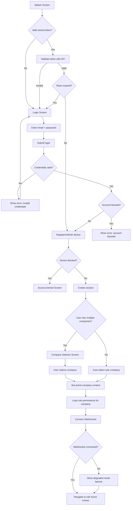

### 1.3 Step Detail

| Step | Action | Screen | System Behavior |
|------|--------|--------|-----------------|
| 1 | App launches | Splash | Check secure storage for refresh token |
| 2 | Token found | — | Silent validation request to `/auth/refresh` |
| 3 | No token / invalid | Login | Present email and password fields |
| 4 | User submits credentials | Login | POST `/auth/login`; rate limit applies |
| 5 | Success | — | Receive access + refresh tokens; store securely |
| 6 | Device registration | — | POST `/devices/register` with platform, name, fingerprint |
| 7 | Session creation | — | Server creates session record linked to device |
| 8 | Multi-company check | Company Selector | Query `user_companies`; show list with role badges |
| 9 | Company selected | — | JWT context updated with `company_id` |
| 10 | Permission load | — | Fetch effective permissions for role in company |
| 11 | WebSocket connect | — | Authenticate socket with access token; join `company:{id}` room |
| 12 | Navigate home | Role-based | Cashier → POS; Manager → Dashboard; Admin → Admin Overview |

### 1.4 Decision Points

| Decision | Condition | Outcome |
|----------|-----------|---------|
| Stored token valid? | Refresh succeeds | Skip login form |
| Account blocked? | `user.status = blocked` | Hard stop; contact admin message |
| Device blocked? | Device record `blocked = true` | Access Denied; no retry |
| Multiple companies? | `user_companies.count > 1` | Show selector |
| Remember last company? | Setting enabled | Pre-select last used; user can change |

### 1.5 Error Paths

| Error | HTTP / Code | User Message | Recovery |
|-------|-------------|--------------|----------|
| Invalid credentials | 401 | "Email or password incorrect" | Retry login |
| Account blocked | 403 `USER_BLOCKED` | "Your account has been blocked. Contact administrator." | None |
| Device blocked | 403 `DEVICE_BLOCKED` | "This device has been blocked." | None |
| Rate limited | 429 | "Too many attempts. Try again in X minutes." | Wait |
| Server unreachable | Network error | "Cannot connect to server. Check internet." | Retry button |
| Token refresh failed | 401 | Redirect to Login | Re-authenticate |
| Company access revoked | 403 | "You no longer have access to this company." | Company Selector |

### 1.6 Screens

| Screen | Elements |
|--------|----------|
| **Splash** | Logo, loading indicator, version number |
| **Login** | Email, password, show/hide password, submit, error banner |
| **Company Selector** | Company cards with name, role, last accessed timestamp |
| **Access Denied** | Icon, message, device ID (for admin reference), no actions |
| **Session Expired** | Message, "Login again" button |

### 1.7 Multi-Company Switch (Post-Login)

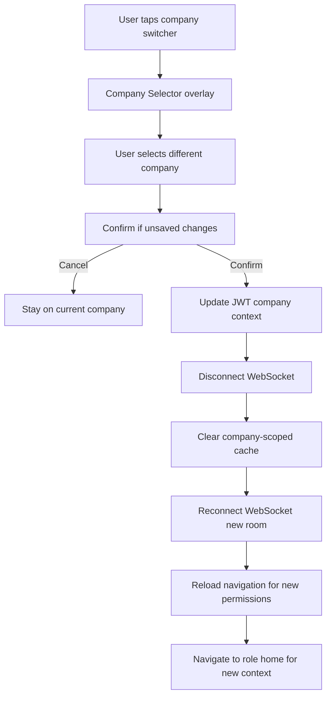

**Permissions**: Implicit — user must have `user_companies` entry for target company

---

## Flow 2: POS Sale (Cash, Credit, Partial Payment)

### 2.1 Overview

The POS sale flow covers product lookup, cart management, currency selection, payment type branching, FIFO allocation, and real-time stock broadcast.

**Permissions**: `sales.create`, `products.view`; `customers.create` for new customer; `debt.payment` implicit on partial pay at sale

### 2.2 Main Flow Diagram

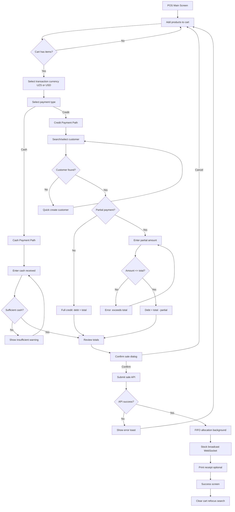

### 2.3 Step Detail — Cash Branch

| Step | Action | Screen | Notes |
|------|--------|--------|-------|
| 1 | Open POS | POS Main | Barcode field auto-focused |
| 2 | Scan/type barcode | POS Search | Product resolves or error |
| 3 | Product added | POS Cart | Quantity 1; increment if duplicate scan |
| 4 | Adjust quantities | POS Cart | Keyboard +/- or direct entry |
| 5 | Select currency | POS Cart Header | UZS or USD; prices recalculate display |
| 6 | Select Cash payment | POS Payment Panel | — |
| 7 | Click Complete / F9 | POS | Opens cash dialog |
| 8 | Enter amount received | Cash Dialog | Change auto-calculated |
| 9 | Confirm | Cash Dialog | — |
| 10 | Sale committed | Success | Receipt prints; cart clears |

### 2.4 Step Detail — Credit with Partial Payment

| Step | Action | Screen | Notes |
|------|--------|--------|-------|
| 1–5 | Same as cash | — | — |
| 6 | Select Credit payment | POS Payment Panel | Customer field required |
| 7 | Search customer phone | Customer Search | Minimum 9 digits |
| 8 | Select customer | — | Debt balance shown as info |
| 9 | Enter partial payment | Partial Payment Field | Same currency as transaction |
| 10 | Review summary | Payment Summary | Total, Paid, New Debt |
| 11 | Confirm sale | Confirm Dialog | Frozen exchange rate applied |
| 12 | Debt updated | — | `customer.total_debt_*` updated |

### 2.5 Decision Points

| Decision | Condition | Outcome |
|----------|-----------|---------|
| Product found? | Barcode/SKU match | Add to cart vs error toast |
| Stock available? | `qty <= available_stock` | Warn if insufficient; block if zero (configurable) |
| Customer required? | Payment = Credit | Block complete until customer set |
| Partial valid? | `0 < partial < total` | Accept; `partial = total` = cash sale |
| Module enabled? | Sales module on | 403 if disabled mid-flow |

### 2.6 Error Paths

| Error | Code | Message | Recovery |
|-------|------|---------|----------|
| Product not found | 404 | "Product not found" | Retry search |
| Insufficient stock | 422 `INSUFFICIENT_STOCK` | "Only X units available" | Reduce quantity |
| No customer on credit | Client validation | "Select a customer for credit sales" | Add customer |
| Partial exceeds total | Client validation | "Payment cannot exceed total" | Correct amount |
| Sale module disabled | 403 | Redirect to Dashboard + toast | Manager re-enables |
| Network failure | — | "Sale not completed. Check connection." | Retry; cart preserved |
| FIFO allocation failed | 500 | "Sale recorded but inventory pending" | Admin review queue |

### 2.7 Screens

| Screen | Key Elements |
|--------|--------------|
| **POS Main** | Search bar, product grid, cart panel, currency toggle, payment tabs |
| **Cash Dialog** | Total, received input, change display, confirm/cancel |
| **Customer Search** | Phone input, results list, quick-create link |
| **Confirm Dialog** | Line items summary, total, payment breakdown |
| **Success** | Sale number, print button, new sale button |

### 2.8 Permissions

| Step | Permission |
|------|------------|
| Open POS | `sales.create` |
| View products | `products.view` |
| Create customer inline | `customers.create` |
| Apply discount (if shown) | `sales.discount` (Manager+) |

---

## Flow 3: Return Processing

### 3.1 Overview

Returns reverse a portion or all of a completed sale, restore inventory via new FIFO batch at original COGS, and reduce customer debt if applicable.

**Permissions**: `sales.return`; view sale: `sales.view`

### 3.2 Flow Diagram

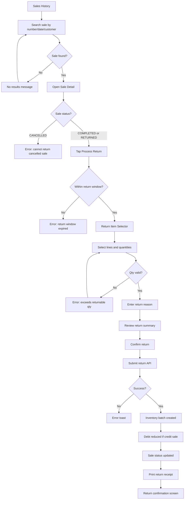

### 3.3 Step Detail

| Step | Action | Screen |
|------|--------|--------|
| 1 | Locate original sale | Sales History |
| 2 | Verify sale details | Sale Detail |
| 3 | Initiate return | Sale Detail — Actions |
| 4 | Select items/qty | Return Item Selector |
| 5 | Provide reason | Return Reason (dropdown + notes) |
| 6 | Review financial impact | Return Summary (subtotal, debt reversal) |
| 7 | Confirm | Confirm Dialog |
| 8 | System processes | — |
| 9 | Receipt | Print / Share |

### 3.4 Error Paths

| Error | Condition | Message |
|-------|-----------|---------|
| Sale not found | Invalid search | "Sale not found" |
| Return window expired | > 30 days default | "Return period has expired" |
| Qty exceeds returnable | Prior partial returns | "Maximum returnable: X units" |
| Permission denied | No `sales.return` | "You do not have permission" |

### 3.5 Screens

Sales History, Sale Detail, Return Item Selector, Return Summary, Return Confirmation

---

## Flow 4: Inventory Receipt

### 4.1 Overview

Warehouse keeper receives stock into a new FIFO batch with dual-currency cost, updating stock levels and dashboard inventory value in real time.

**Permissions**: `inventory.receive`, `products.view`; `products.create` for unknown products

### 4.2 Flow Diagram

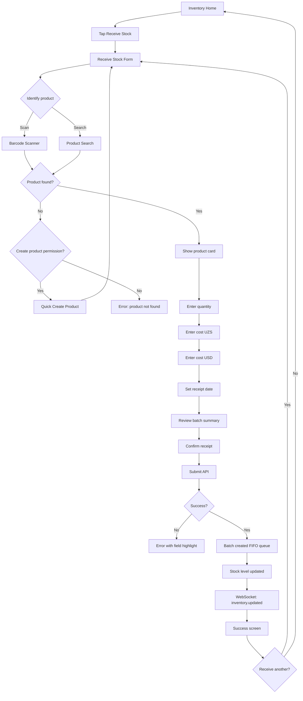

### 4.3 Error Paths

| Error | Message | Recovery |
|-------|---------|----------|
| Invalid quantity | "Quantity must be greater than zero" | Correct input |
| Missing cost | "Both UZS and USD costs required" | Complete fields |
| Backdate denied | "Backdating requires manager approval" | Use today's date |
| Duplicate receipt | Warning only (Phase 2) | Confirm intentional |

### 4.4 Screens

Inventory Home, Receive Stock Form, Barcode Scanner, Product Search, Batch Summary, Receive Success

---

## Flow 5: Debt Payment

### 5.1 Overview

Records a partial or full payment against customer debt in either UZS or USD independently.

**Permissions**: `debt.payment`, `customers.view`

### 5.2 Flow Diagram

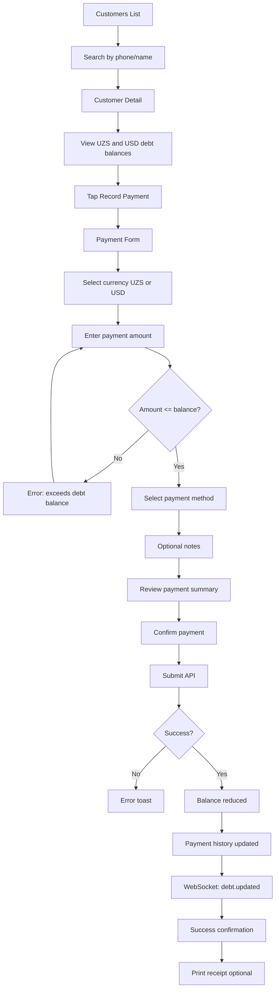

### 5.3 Decision Points

| Decision | Outcome |
|----------|---------|
| Currency selection | Only reduces balance in selected currency |
| Full payment | Amount = balance → balance becomes zero |
| Partial payment | Balance reduced; history preserved |
| Zero balance | "Record Payment" disabled or hidden |

### 5.4 Error Paths

| Error | Message |
|-------|---------|
| Exceeds balance | "Payment exceeds outstanding debt" |
| Zero amount | "Enter a payment amount" |
| Customer not found | "Customer not found" |
| Permission denied | "You do not have permission to record payments" |

---

## Flow 6: Admin Block User / Device

### 6.1 Overview

Admin blocks a user account or specific device, immediately revoking active sessions.

**Permissions**: `admin.users.block`, `admin.devices.block`

### 6.2 Block Device Flow

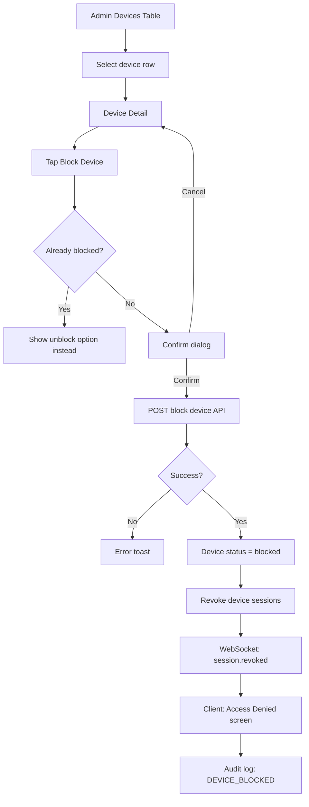

### 6.3 Block User Flow

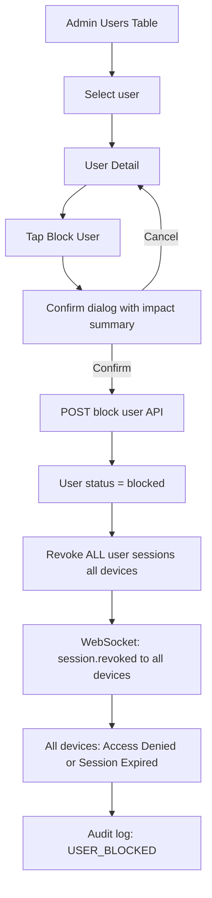

### 6.4 Error Paths

| Error | Message |
|-------|---------|
| Cannot block self | "You cannot block your own account" |
| Cannot block last admin | "At least one admin must remain active" |
| Device not found | "Device no longer registered" |

### 6.5 Screens

Admin Devices Table, Device Detail, Block Confirm Dialog, Access Denied (client), Admin Users Table, User Detail

---

## Flow 7: Module Disable Propagation

### 7.1 Overview

When admin disables a module for a company, all connected clients must hide navigation, redirect active pages, and reject API calls.

**Permissions**: `admin.modules.manage`

### 7.2 Flow Diagram

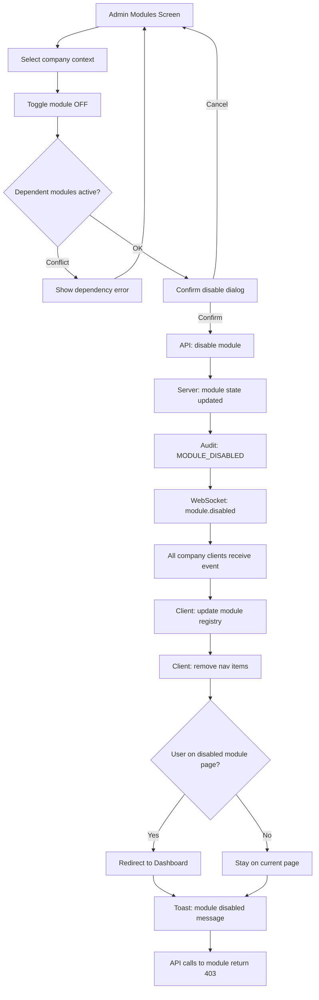

### 7.3 Client-Side Propagation Steps

| Order | Action |
|-------|--------|
| 1 | Receive `module.disabled` event with module code |
| 2 | Update local enabled-modules cache |
| 3 | Filter sidebar / bottom nav items |
| 4 | If current route belongs to disabled module → navigate to Dashboard |
| 5 | Show non-blocking toast with module name |
| 6 | Invalidate TanStack Query / Riverpod caches for module |
| 7 | Disable in-flight forms with save warning |

### 7.4 Error Paths

| Error | Message |
|-------|---------|
| Cannot disable platform module | "Core modules cannot be disabled" |
| Dependent module enabled | "Disable Reports before disabling Sales" |
| Permission denied | "Insufficient permissions" |

---

## Flow 8: Exchange Rate Update

### 8.1 Overview

Manager sets a new UZS-per-USD rate affecting future transactions only; historical records retain frozen rates.

**Permissions**: `currency.manage`

### 8.2 Flow Diagram

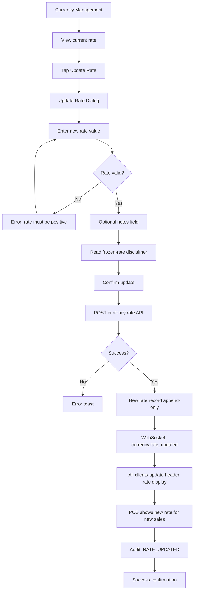

### 8.3 Decision Points

| Decision | Outcome |
|----------|---------|
| Rate decreased/increased | Both valid; logged in history |
| In-flight POS cart | Uses rate at sale completion time (latest) |
| Completed sales | Unaffected (frozen) |

### 8.4 Error Paths

| Error | Message |
|-------|---------|
| Invalid rate | "Enter a valid exchange rate" |
| Rate too extreme | Warning if change > 10% (confirm required) |
| Permission denied | "Only managers can update exchange rates" |

---

## Flow 9: Report Export

### 9.1 Overview

User generates a report in PDF, Excel, or CSV format for a selected date range and downloads the file.

**Permissions**: `reports.generate`; specific reports may need `sales.view`, `debt.view`, `inventory.view`

### 9.2 Flow Diagram

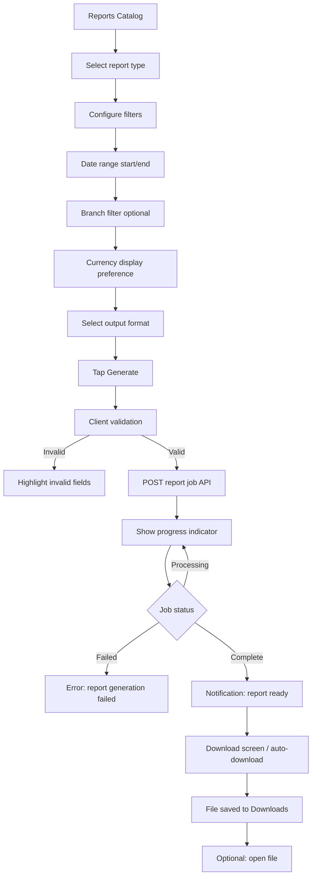

### 9.3 Report Types and Filters

| Report | Required Filters | Permissions |
|--------|------------------|-------------|
| Sales Summary | Date range, branch | `reports.generate`, `sales.view` |
| Debt Aging | As-of date | `reports.generate`, `debt.view` |
| Inventory Valuation | Branch | `reports.generate`, `inventory.view` |
| Profit Report | Date range | `reports.generate`, `sales.view` |

### 9.4 Error Paths

| Error | Message | Recovery |
|-------|---------|----------|
| Invalid date range | "End date must be after start date" | Fix dates |
| Range too large | "Maximum range is 366 days" | Narrow range |
| No data | "No data for selected period" | Adjust filters |
| Generation timeout | "Report timed out. Try smaller range." | Retry |
| Download failed | "Download failed. Tap to retry." | Retry download |

### 9.5 Screens

Reports Catalog, Report Configurator, Generation Progress, Download Ready, Notification Center

---

## Flow 10: Real-Time Sync on Reconnect

### 10.1 Overview

When a client loses WebSocket connectivity and reconnects, it must replay missed events, reconcile local cache with server state, and restore UI consistency.

**Permissions**: Valid session required; no additional permissions

### 10.2 Flow Diagram

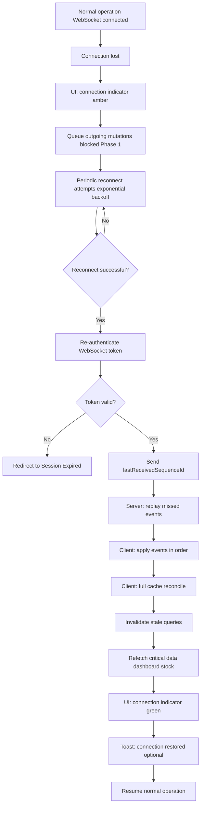

### 10.3 Reconnection Step Detail

| Step | Client Action | Server Action |
|------|---------------|---------------|
| 1 | Detect disconnect (heartbeat timeout) | — |
| 2 | Show amber connection bar | — |
| 3 | Block new sale submissions (Phase 1 online-only) | — |
| 4 | Attempt reconnect with backoff (1s, 2s, 4s, 8s, max 30s) | Accept connection |
| 5 | Send `sync.resume { lastSequenceId }` | Return events `sequenceId > last` |
| 6 | Apply each event to local state | — |
| 7 | POST `sync/check` for hash verification (optional) | Return current state hash |
| 8 | If hash mismatch → full refetch | — |
| 9 | Invalidate and refetch active screen data | — |
| 10 | Enable mutations; green indicator | — |

### 10.4 Event Application Rules

| Event Type | UI Impact |
|------------|-----------|
| `sale.completed` | Dashboard KPI++, stock--, activity feed |
| `inventory.received` | Stock++, inventory value++ |
| `debt.payment` | Customer debt--, dashboard debt-- |
| `product.updated` | Product list cache update |
| `module.disabled` | Navigation filter, possible redirect |
| `session.revoked` | Force logout immediately |
| `currency.rate_updated` | Header rate badge update |

### 10.5 Error Paths

| Scenario | Behavior |
|----------|----------|
| Token expired during disconnect | Session Expired screen; re-login |
| Session revoked during disconnect | Access Denied on reconnect |
| Replay gap too large | Full state refetch triggered |
| Server maintenance | Maintenance screen with retry timer |
| Partial event application failure | Full refetch; log error telemetry |

### 10.6 Screens / UI States

| State | Indicator | User Action |
|-------|-----------|-------------|
| Connected | Green dot in header | Normal use |
| Reconnecting | Amber pulsing dot | Wait; read-only mode |
| Disconnected (prolonged) | Red dot + banner | Check network; contact admin |
| Restored | Green + brief toast | Resume work |
| Session invalid | Full-screen overlay | Re-login |

---

## Permission Quick Reference

| Flow | Required Permissions |
|------|---------------------|
| Authentication | — (public) |
| POS Sale | `sales.create`, `products.view` |
| Return | `sales.return`, `sales.view` |
| Inventory Receipt | `inventory.receive`, `products.view` |
| Debt Payment | `debt.payment`, `customers.view` |
| Block User/Device | `admin.users.block`, `admin.devices.block` |
| Module Disable | `admin.modules.manage` |
| Exchange Rate | `currency.manage` |
| Report Export | `reports.generate` + domain view permissions |
| Real-Time Sync | Valid authenticated session |

---

## Related Documents

- [USER_JOURNEYS.md](./USER_JOURNEYS.md) — Persona journey maps with emotions and metrics
- [INFORMATION_ARCHITECTURE.md](./INFORMATION_ARCHITECTURE.md) — Screen hierarchy
- [../02-business/WORKFLOWS.md](../02-business/WORKFLOWS.md) — Business process workflows
- [../07-security/PERMISSIONS_MODEL.md](../07-security/PERMISSIONS_MODEL.md) — Full permission catalog
- [../09-realtime/REALTIME_SYNC.md](../09-realtime/REALTIME_SYNC.md) — Sync architecture
- [../09-realtime/CONFLICT_RESOLUTION.md](../09-realtime/CONFLICT_RESOLUTION.md) — Conflict handling
