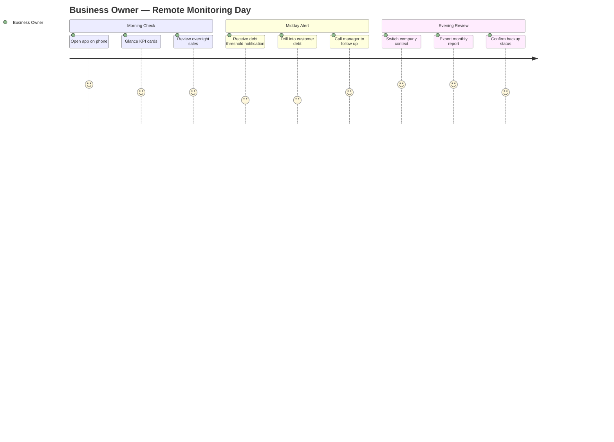
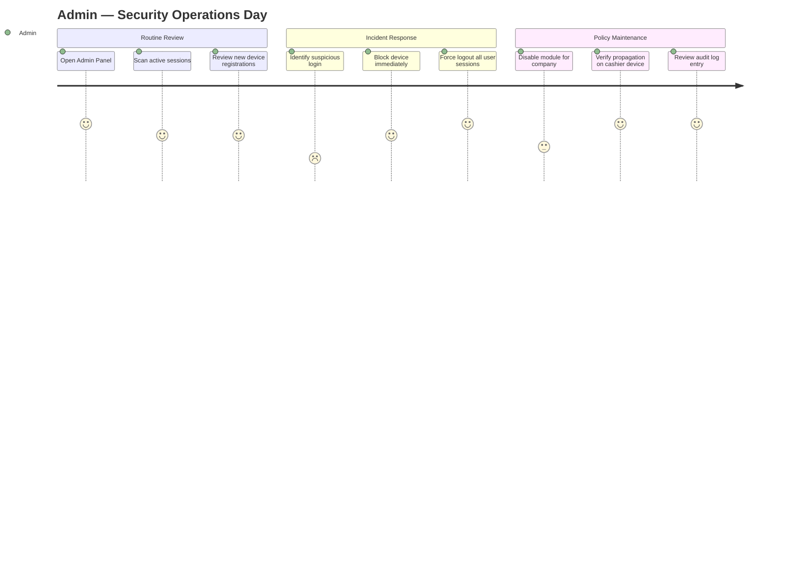
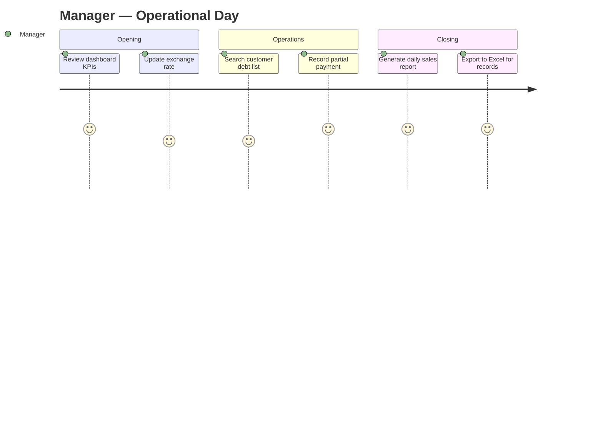
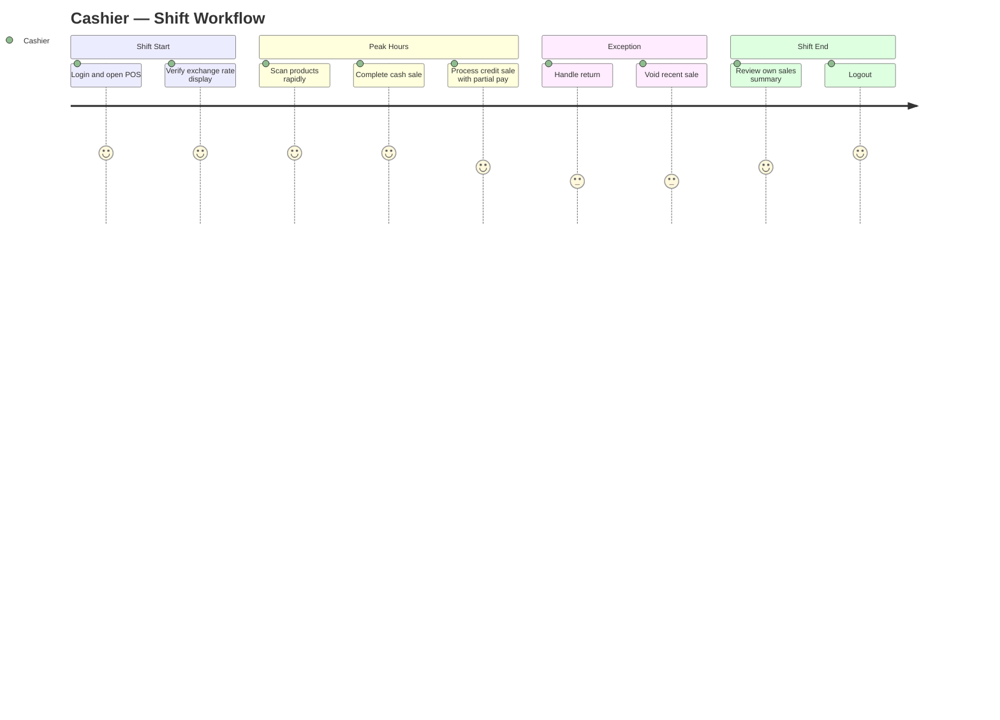
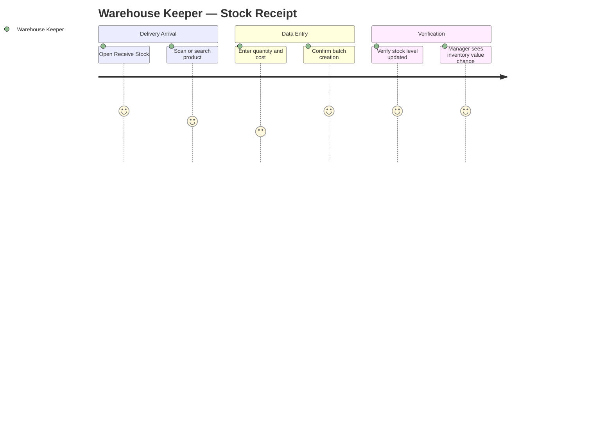
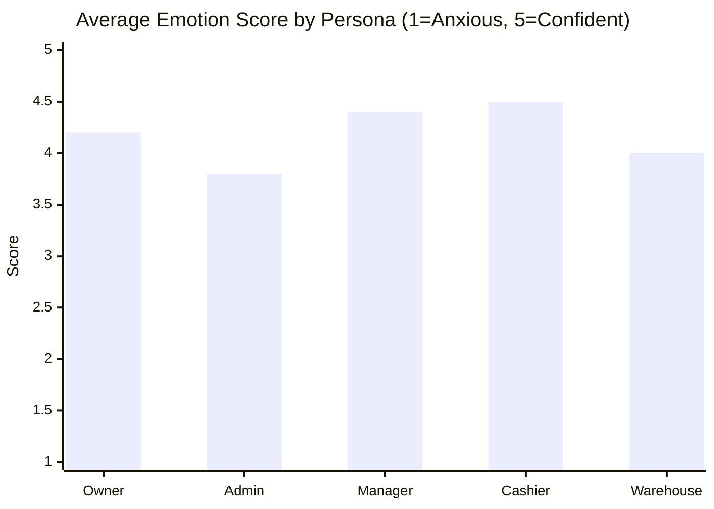

# User Journeys

## Document Control

| Field | Value |
|-------|-------|
| Version | 2.0.0 |
| Status | Approved |
| Last Updated | 2026-06-17 |
| Audience | Product, UX, Engineering, Stakeholders |

---

## Purpose

This document maps **end-to-end user journeys** for the five primary ERP personas. Each journey describes what the user is trying to accomplish, the stages they pass through, every meaningful touchpoint with the system, emotional highs and lows, known pain points, associated UI screens, and measurable success criteria.

Journeys are **cross-platform** unless noted. Desktop (Windows Electron) is the primary surface for Admin and Manager; mobile (Flutter) is emphasized for Business Owner remote monitoring and Warehouse Keeper floor work; Cashier uses desktop POS as primary with mobile as secondary.

**Related documents**: [USER_FLOWS.md](./USER_FLOWS.md), [INFORMATION_ARCHITECTURE.md](./INFORMATION_ARCHITECTURE.md), [STAKEHOLDER_REQUIREMENTS.md](../02-business/STAKEHOLDER_REQUIREMENTS.md)

---

## Journey Map Legend

| Element | Meaning |
|---------|---------|
| **Stage** | A phase of the journey with a distinct goal |
| **Touchpoint** | Any interaction with the ERP (screen, notification, tray icon, printout) |
| **Emotion** | User feeling on a scale: 😟 Anxious → 😐 Neutral → 😊 Confident |
| **Pain Point** | Friction, risk, or unmet expectation |
| **UI Screen** | Named screen from Information Architecture |
| **Success Metric** | Quantifiable outcome indicating journey success |

---

## Journey 1: Business Owner — Remote Monitoring

### Persona Summary

| Attribute | Detail |
|-----------|--------|
| Role | Business Owner (Egasi) |
| Primary goal | Stay informed about business health without being on-site |
| Devices | Mobile (primary remote), Desktop (occasional deep review) |
| Frequency | Multiple times daily; heavier use evenings and weekends |
| Permissions | `dashboard.view`, `reports.generate`, `admin.companies.view` (own companies) |
| Companies | Often manages 2+ companies (e.g., Market, Somafix) |

### Journey Overview

---

### Stage 1: Morning Awareness

**Goal**: Quickly confirm yesterday's performance and today's opening state.

| Step | Touchpoint | Emotion | Pain Point | UI Screen |
|------|------------|---------|------------|-----------|
| 1 | Tap ERP app icon; biometric or password login | 😐 | Slow login on weak network | Splash → Login |
| 2 | Auto-select last-used company or choose from list | 😊 | Forgetting which company was active | Company Selector (if multi-company) |
| 3 | Land on Dashboard; pull-to-refresh | 😊 | Stale data if WebSocket disconnected | Dashboard — Home |
| 4 | Scan four KPI cards: Sales, Profit, Debt, Inventory Value | 😊 | Dual-currency confusion if both not shown | Dashboard — Stat Cards |
| 5 | Toggle currency view: UZS / USD / Both | 😐 | Needing to mentally convert | Dashboard — Currency Toggle |
| 6 | Change period to "Yesterday" | 😊 | — | Dashboard — Period Selector |
| 7 | Glance sales trend chart | 😊 | Chart too small on phone | Dashboard — Sales Chart |
| 8 | Tap "Top Products" to see movers | 😊 | — | Dashboard — Top Products List |

**Success Metrics**

| Metric | Target |
|--------|--------|
| Time from app open to KPI visibility | ≤ 8 seconds on 4G |
| Owner can answer "How much did we sell yesterday?" without navigation | 100% of sessions |
| Currency clarity | Both UZS and USD visible within 1 tap |

---

### Stage 2: Proactive Alert Response

**Goal**: React to business anomalies surfaced by the system.

| Step | Touchpoint | Emotion | Pain Point | UI Screen |
|------|------------|---------|------------|-----------|
| 1 | Push/in-app notification: "Customer debt exceeded threshold" | 😟 | Notification without enough context | Notification Center |
| 2 | Tap notification; deep-link to Customer Detail | 😐 | Deep link lands on wrong company | Customer Detail |
| 3 | Review debt chips: UZS balance, USD balance (separate) | 😊 | Combined balance would mislead | Customer Detail — Debt Header |
| 4 | Scroll payment history tab | 😐 | Long history hard to scan on mobile | Customer Detail — Payments Tab |
| 5 | View linked sales for context | 😊 | — | Customer Detail — Purchases Tab |
| 6 | Optional: call manager (outside app) | 😊 | No in-app task assignment (Phase 2) | — |

**Success Metrics**

| Metric | Target |
|--------|--------|
| Notification tap-through to relevant record | ≤ 2 taps |
| Owner identifies total debt per currency | ≤ 10 seconds |
| False-positive alert rate | < 5% weekly |

---

### Stage 3: Multi-Company Comparison

**Goal**: Compare performance across owned businesses.

| Step | Touchpoint | Emotion | Pain Point | UI Screen |
|------|------------|---------|------------|-----------|
| 1 | Tap company name in AppBar / header | 😐 | Switcher buried in settings | Company Switcher |
| 2 | Select second company (e.g., Somafix) | 😊 | Full reload feels slow | Company Switcher → Dashboard |
| 3 | Dashboard reloads with new company KPIs | 😊 | Losing scroll position | Dashboard — Home |
| 4 | Mentally compare metrics across companies | 😐 | No side-by-side view (Phase 2) | Dashboard |
| 5 | Repeat switch back to primary company | 😊 | — | Company Switcher |

**Success Metrics**

| Metric | Target |
|--------|--------|
| Company switch completion | ≤ 3 seconds |
| Data isolation verified (no cross-company bleed) | Zero incidents |
| Owner switches companies per session | Tracked; baseline for Phase 2 unified view |

---

### Stage 4: Report Export for Accountant

**Goal**: Obtain formal reports for external stakeholders.

| Step | Touchpoint | Emotion | Pain Point | UI Screen |
|------|------------|---------|------------|-----------|
| 1 | Navigate to Reports via bottom nav or drawer | 😐 | Reports not in primary bottom tabs on mobile | Reports — Catalog |
| 2 | Select "Sales Summary" report type | 😊 | Too many report types without search | Reports — Type Selector |
| 3 | Set date range: current month | 😊 | Date picker awkward on small screens | Reports — Filters |
| 4 | Choose format: Excel | 😊 | — | Reports — Format Selector |
| 5 | Tap Generate; see progress indicator | 😐 | Uncertainty during long generation | Reports — Generation Progress |
| 6 | Receive notification: "Report ready" | 😊 | — | Notification Center |
| 7 | Download and share via OS share sheet | 😊 | File saved to obscure location | Reports — Download / Share |

**Success Metrics**

| Metric | Target |
|--------|--------|
| Report generation for 1-month sales | ≤ 30 seconds |
| Download success rate | > 99% |
| Owner completes export without support | > 95% |

---

### Stage 5: System Confidence Check

**Goal**: Verify backups, connectivity, and security posture.

| Step | Touchpoint | Emotion | Pain Point | UI Screen |
|------|------------|---------|------------|-----------|
| 1 | Open Settings or Admin (if permitted) | 😐 | Owner may lack admin permissions | Settings / Admin — Overview |
| 2 | View last backup timestamp | 😊 | Backup info not visible to non-admin | Admin — System Health (delegated view) |
| 3 | Check connection indicator (green) | 😊 | Amber state meaning unclear | Global — Connection Status |
| 4 | Review active device count (optional) | 😐 | Cannot distinguish legitimate vs suspicious | Admin — Devices (read-only) |
| 5 | Close app satisfied | 😊 | — | — |

**Success Metrics**

| Metric | Target |
|--------|--------|
| Owner can confirm "system is healthy" | ≤ 3 taps |
| Backup age visibility | Always shown if < 24h |

---

### Business Owner — Journey Summary

| Dimension | Summary |
|-----------|---------|
| **Critical path** | Login → Dashboard → KPI scan → (optional) drill-down |
| **Highest emotion** | 😊 Morning KPI confirmation, successful report export |
| **Lowest emotion** | 😟 Debt alerts without context, slow company switch |
| **Design priority** | Mobile-first dashboard, dual-currency clarity, fast company switcher |
| **North-star metric** | Owner answers "How is my business?" in under 30 seconds |

---

## Journey 2: Admin — User, Device, and Session Control

### Persona Summary

| Attribute | Detail |
|-----------|--------|
| Role | System Admin |
| Primary goal | Maintain secure, controlled access across users, devices, and sessions |
| Devices | Desktop (primary); mobile for emergency lockdown |
| Frequency | Daily monitoring; incident-driven actions |
| Permissions | `admin.*` full suite |
| Companies | All companies under tenant |

### Journey Overview

---

### Stage 1: Daily Security Posture Review

**Goal**: Establish baseline visibility into who is connected and from where.

| Step | Touchpoint | Emotion | Pain Point | UI Screen |
|------|------------|---------|------------|-----------|
| 1 | Login with admin credentials | 😐 | MFA not yet available (Phase 2) | Login |
| 2 | Navigate to Admin Panel via sidebar | 😊 | — | Admin — Overview |
| 3 | Review summary cards: Active Users, Sessions, Devices, Blocked | 😊 | Cards not clickable to filtered lists | Admin — Overview Stats |
| 4 | Open Sessions tab; sort by "Last Activity" | 😊 | Too many sessions without filter | Admin — Sessions Table |
| 5 | Filter by company: Market | 😊 | — | Admin — Sessions Filters |
| 6 | Scan IP addresses and platforms | 😐 | Unfamiliar IPs require cross-reference | Admin — Sessions Table |
| 7 | Open Devices tab; note new registrations | 😊 | "New" badge missing for unreviewed devices | Admin — Devices Table |

**Success Metrics**

| Metric | Target |
|--------|--------|
| Full security scan completion | ≤ 5 minutes |
| Sessions visible with platform, IP, last seen | 100% |
| Filter-to-result latency | ≤ 1 second |

---

### Stage 2: User Lifecycle Management

**Goal**: Onboard, modify, or restrict user accounts.

| Step | Touchpoint | Emotion | Pain Point | UI Screen |
|------|------------|---------|------------|-----------|
| 1 | Open Users section | 😊 | — | Admin — Users Table |
| 2 | Search user by name or email | 😊 | — | Admin — Users Search |
| 3 | Click user row → User Detail | 😊 | — | Admin — User Detail |
| 4 | Review role assignments per company | 😐 | Multi-company roles complex to parse | Admin — User Detail — Roles |
| 5 | Edit role: change Cashier to Manager for one company | 😊 | Accidental wrong-company assignment | Admin — User Edit Dialog |
| 6 | Save; confirmation toast | 😊 | — | Admin — User Detail |
| 7 | New user path: Create User wizard | 😐 | Password policy errors late in flow | Admin — Create User Wizard |
| 8 | Assign company + role + branch | 😊 | Branch required but not obvious | Admin — Create User — Step 2 |
| 9 | User receives credentials (out of band) | 😐 | No in-app invite email (Phase 2) | — |

**Success Metrics**

| Metric | Target |
|--------|--------|
| New user creation | ≤ 3 minutes |
| Role change propagates to active session | ≤ 30 seconds (permission refresh) |
| Zero wrong-company role assignments | Audit-reviewed monthly |

---

### Stage 3: Device Block — Incident Response

**Goal**: Immediately revoke access from a compromised or unauthorized device.

| Step | Touchpoint | Emotion | Pain Point | UI Screen |
|------|------------|---------|------------|-----------|
| 1 | Identify suspicious device in Devices table | 😟 | Device name generic ("Windows PC") | Admin — Devices Table |
| 2 | Click device → Device Detail | 😟 | — | Admin — Device Detail |
| 3 | Review: user, platform, IP, first seen, last seen | 😟 | Geo-IP not available (Phase 2) | Admin — Device Detail |
| 4 | Click "Block Device" | 😟 | Fear of blocking wrong device | Admin — Device Detail — Actions |
| 5 | Confirm dialog with device name and user | 😐 | — | Admin — Block Confirm Dialog |
| 6 | Device status → Blocked; session revoked | 😊 | — | Admin — Device Detail |
| 7 | Affected device shows "Access Denied" full screen | 😊 | — | Client — Access Denied Screen |
| 8 | Other devices for same user remain active | 😊 | — | — |
| 9 | Audit log entry created automatically | 😊 | — | Admin — Audit Logs |

**Success Metrics**

| Metric | Target |
|--------|--------|
| Block-to-revoke latency | ≤ 2 seconds |
| Collateral impact (wrong device blocked) | Zero |
| Audit trail completeness | 100% |

---

### Stage 4: Session Termination

**Goal**: Force logout without blocking the device permanently.

| Step | Touchpoint | Emotion | Pain Point | UI Screen |
|------|------------|---------|------------|-----------|
| 1 | From Sessions table, select active session | 😐 | — | Admin — Sessions Table |
| 2 | Click "Force Logout" | 😐 | — | Admin — Session Actions |
| 3 | Confirm dialog | 😐 | — | Admin — Force Logout Dialog |
| 4 | Session terminated; WebSocket disconnected | 😊 | — | — |
| 5 | User sees session expired screen; can re-login | 😊 | — | Client — Session Expired |
| 6 | Bulk action: "Logout all sessions for user" | 😊 | — | Admin — User Detail — Force Logout All |

**Success Metrics**

| Metric | Target |
|--------|--------|
| Force logout latency | ≤ 2 seconds |
| User can re-authenticate immediately | Yes, unless user also blocked |

---

### Stage 5: Module Disable Propagation Verification

**Goal**: Disable a module and confirm all clients reflect the change.

| Step | Touchpoint | Emotion | Pain Point | UI Screen |
|------|------------|---------|------------|-----------|
| 1 | Navigate to Modules management | 😐 | Dependency warnings easy to miss | Admin — Modules |
| 2 | Select company; toggle Sales OFF | 😟 | Disabling mid-sale could disrupt cashier | Admin — Module Toggle |
| 3 | Read dependency warning dialog | 😐 | — | Admin — Module Disable Confirm |
| 4 | Confirm disable | 😐 | — | Admin — Modules |
| 5 | WebSocket broadcasts to all company clients | 😊 | — | — |
| 6 | Verify on test cashier device: Sales menu gone | 😊 | — | Client — Sidebar (updated) |
| 7 | Cashier on Sales page redirected to Dashboard | 😊 | Unsaved cart lost (expected) | Client — Dashboard + Toast |
| 8 | Review audit log: MODULE_DISABLED | 😊 | — | Admin — Audit Logs |

**Success Metrics**

| Metric | Target |
|--------|--------|
| Propagation to all connected clients | ≤ 1 second |
| Stranded user on disabled module page | Zero (auto-redirect) |
| API returns 403 for disabled module | 100% |

---

### Admin — Journey Summary

| Dimension | Summary |
|-----------|---------|
| **Critical path** | Admin Overview → Sessions/Devices scan → Action → Audit verify |
| **Highest emotion** | 😊 Successful block with no collateral damage |
| **Lowest emotion** | 😟 Incident discovery, module disable during operations |
| **Design priority** | Clear confirm dialogs, real-time propagation feedback, dense data tables |
| **North-star metric** | Security incident contained in under 60 seconds |

---

## Journey 3: Manager — Dashboard, Reports, Debt Follow-Up

### Persona Summary

| Attribute | Detail |
|-----------|--------|
| Role | Manager (Menejer) |
| Primary goal | Operate the business day-to-day: monitor KPIs, manage debt, update rates, export reports |
| Devices | Desktop (primary); mobile for floor checks |
| Frequency | Continuous during business hours |
| Permissions | `dashboard.view`, `reports.generate`, `currency.manage`, `debt.*`, `products.*` |
| Companies | Typically one primary company per shift |

### Journey Overview

---

### Stage 1: Opening Dashboard Review

**Goal**: Understand current business state at start of shift.

| Step | Touchpoint | Emotion | Pain Point | UI Screen |
|------|------------|---------|------------|-----------|
| 1 | Login; land on Dashboard (default home for role) | 😊 | — | Dashboard — Home |
| 2 | Set period to "Today" | 😊 | — | Dashboard — Period Selector |
| 3 | Review Sales, Profit, Debt, Inventory Value cards | 😊 | Profit calculation opaque | Dashboard — Stat Cards |
| 4 | Hover/tap card for breakdown tooltip | 😐 | Tooltip insufficient detail | Dashboard — Card Detail Popover |
| 5 | Review sales chart for hourly trend | 😊 | — | Dashboard — Sales Chart |
| 6 | Check "Recent Activity" feed for anomalies | 😊 | Feed too noisy | Dashboard — Activity Feed |
| 7 | Note connection status indicator | 😐 | Amber = stale data risk | Global — Connection Bar |

**Success Metrics**

| Metric | Target |
|--------|--------|
| Manager orients to daily state | ≤ 2 minutes |
| KPI refresh after any sale (real-time) | ≤ 500ms p95 |
| Dual-currency metrics accurate | Validated against ledger |

---

### Stage 2: Exchange Rate Update

**Goal**: Set today's UZS/USD rate for new transactions.

| Step | Touchpoint | Emotion | Pain Point | UI Screen |
|------|------------|---------|------------|-----------|
| 1 | Navigate to Currency / Settings | 😐 | Buried in settings vs prominent | Currency — Rate Management |
| 2 | View current rate and effective date | 😊 | — | Currency — Current Rate Card |
| 3 | View rate history (append-only) | 😊 | — | Currency — Rate History Table |
| 4 | Click "Update Rate" | 😐 | Fear of affecting historical data | Currency — Update Rate Dialog |
| 5 | Enter new rate: 12,850; optional note | 😊 | — | Currency — Update Rate Form |
| 6 | Read confirmation: "Affects future transactions only" | 😊 | — | Currency — Update Confirm |
| 7 | Save; rate broadcasts to all POS screens | 😊 | — | Global — Rate Display (header) |
| 8 | Cashier sees new rate on POS without refresh | 😊 | — | POS — Header Rate |

**Success Metrics**

| Metric | Target |
|--------|--------|
| Rate update propagation | ≤ 1 second all clients |
| Historical transaction integrity | Zero recalculations |
| Manager understands frozen-rate policy | Onboarding quiz 100% |

---

### Stage 3: Debt Follow-Up Workflow

**Goal**: Identify overdue customers and record incoming payments.

| Step | Touchpoint | Emotion | Pain Point | UI Screen |
|------|------------|---------|------------|-----------|
| 1 | Navigate to Customers or Debt module | 😊 | — | Customers — List |
| 2 | Sort by debt balance descending | 😊 | — | Customers — Sort Controls |
| 3 | Filter: "Has UZS debt" | 😊 | — | Customers — Filters |
| 4 | Click customer → Customer Detail | 😊 | — | Customer Detail |
| 5 | Review UZS and USD debt chips independently | 😊 | — | Customer Detail — Debt Header |
| 6 | Review aging (if available) or payment history | 😐 | No aging buckets in Phase 1 | Customer Detail — Payments Tab |
| 7 | Customer arrives to pay 2,000,000 UZS | 😊 | — | — |
| 8 | Click "Record Payment" | 😊 | — | Customer Detail — Payment Dialog |
| 9 | Enter amount, currency UZS, method Cash | 😊 | — | Payment — Form |
| 10 | Confirm; balance updates in real time | 😊 | — | Customer Detail — Updated Debt |
| 11 | All devices show new balance | 😊 | — | — |

**Success Metrics**

| Metric | Target |
|--------|--------|
| Debt list to payment recorded | ≤ 90 seconds |
| Partial payment accuracy | 100% ledger match |
| Real-time balance sync | ≤ 500ms p95 |

---

### Stage 4: Product and Pricing Adjustment

**Goal**: Update product pricing based on supplier cost changes.

| Step | Touchpoint | Emotion | Pain Point | UI Screen |
|------|------------|---------|------------|-----------|
| 1 | Navigate to Products | 😊 | — | Products — List |
| 2 | Search product by name or SKU | 😊 | — | Products — Search |
| 3 | Open Product Detail | 😊 | — | Product Detail |
| 4 | Edit UZS and USD prices | 😐 | Must update both currencies | Product Detail — Edit Form |
| 5 | Save; WebSocket broadcasts price change | 😊 | — | — |
| 6 | Cashier POS reflects new price on next search | 😊 | In-flight cart retains old price (correct) | POS — Product Search |

**Success Metrics**

| Metric | Target |
|--------|--------|
| Price change visible on POS | ≤ 1 second |
| In-cart price stability | Frozen at add-to-cart time |

---

### Stage 5: End-of-Day Reporting

**Goal**: Produce and archive daily business reports.

| Step | Touchpoint | Emotion | Pain Point | UI Screen |
|------|------------|---------|------------|-----------|
| 1 | Navigate to Reports | 😊 | — | Reports — Catalog |
| 2 | Select "Daily Sales Report" | 😊 | — | Reports — Type Selector |
| 3 | Date: today; branch: all | 😊 | — | Reports — Filters |
| 4 | Format: PDF for archive, Excel for analysis | 😊 | — | Reports — Format |
| 5 | Generate; await completion | 😐 | — | Reports — Progress |
| 6 | Download both files | 😊 | — | Reports — Download |
| 7 | Optional: print PDF | 😊 | Print dialog inconsistent | OS Print Dialog |

**Success Metrics**

| Metric | Target |
|--------|--------|
| Daily report generation | ≤ 45 seconds |
| Report figures match dashboard | 100% reconciliation |
| Manager completes EOD without IT support | > 98% |

---

### Manager — Journey Summary

| Dimension | Summary |
|-----------|---------|
| **Critical path** | Dashboard → Debt follow-up → Payment → Report export |
| **Highest emotion** | 😊 Payment recorded, report matches dashboard |
| **Lowest emotion** | 😐 Rate update anxiety, profit opacity |
| **Design priority** | Dual-currency everywhere, real-time KPIs, efficient data tables |
| **North-star metric** | Manager closes day with exported report in under 10 minutes |

---

## Journey 4: Cashier — POS Daily Workflow

### Persona Summary

| Attribute | Detail |
|-----------|--------|
| Role | Cashier (Kassir) |
| Primary goal | Process sales quickly and accurately at the point of sale |
| Devices | Desktop POS (primary); mobile POS (backup) |
| Frequency | 50–200+ transactions per day |
| Permissions | `sales.create`, `sales.cancel` (own), `debt.payment`, `customers.create`, `products.view` |
| Environment | Noisy, fast-paced, barcode scanner, receipt printer |

### Journey Overview

---

### Stage 1: Shift Opening

**Goal**: Reach ready-to-sell state within seconds of arrival.

| Step | Touchpoint | Emotion | Pain Point | UI Screen |
|------|------------|---------|------------|-----------|
| 1 | Login on dedicated POS terminal | 😐 | Previous user left cart open | Login |
| 2 | Auto-redirect to POS (cashier home) | 😊 | — | POS — Main |
| 3 | Barcode input auto-focused | 😊 | Focus stolen by other window | POS — Search Bar |
| 4 | Verify company and branch in header | 😊 | Wrong branch = wrong stock | POS — Header |
| 5 | Verify exchange rate displayed | 😊 | — | POS — Rate Badge |
| 6 | Select default currency: UZS | 😊 | — | POS — Currency Toggle |
| 7 | Connection indicator green | 😊 | Red = cannot complete sales (Phase 1 online-only) | Global — Connection |

**Success Metrics**

| Metric | Target |
|--------|--------|
| Login to first scan ready | ≤ 15 seconds |
| Barcode field focused on POS load | 100% |
| Wrong-branch incidents | Zero |

---

### Stage 2: High-Volume Cash Sales

**Goal**: Complete cash transactions with minimal keystrokes.

| Step | Touchpoint | Emotion | Pain Point | UI Screen |
|------|------------|---------|------------|-----------|
| 1 | Scan barcode; product added to cart | 😊 | Unknown barcode stops flow | POS — Cart |
| 2 | Scan next item; quantity auto-increments if duplicate | 😊 | — | POS — Cart |
| 3 | Adjust quantity via keyboard (+/-) | 😊 | Mouse-only adjustment too slow | POS — Cart Line Actions |
| 4 | Customer pays exact cash | 😊 | — | POS — Payment Panel |
| 5 | Press F9 or click Complete Sale | 😊 | — | POS — Complete Button |
| 6 | Enter cash received; change calculated | 😊 | — | POS — Cash Dialog |
| 7 | Receipt prints automatically | 😊 | Printer offline | POS — Success + Print |
| 8 | Cart clears; search refocused | 😊 | — | POS — Main |
| 9 | Stock decrements on all devices | 😊 | — | — |

**Success Metrics**

| Metric | Target |
|--------|--------|
| Average cash sale completion | ≤ 45 seconds (5 items) |
| Barcode-to-cart latency | ≤ 200ms |
| Receipt print success | > 99% |

---

### Stage 3: Credit Sale with Partial Payment

**Goal**: Associate customer, sell on credit, collect partial payment at counter.

| Step | Touchpoint | Emotion | Pain Point | UI Screen |
|------|------------|---------|------------|-----------|
| 1 | Build cart as normal | 😊 | — | POS — Cart |
| 2 | Search customer by phone in cart panel | 😐 | Customer not found | POS — Customer Search |
| 3 | Quick-create customer if new | 😐 | Extra steps slow queue | POS — Quick Customer Form |
| 4 | Select payment type: Credit | 😊 | — | POS — Payment Tabs |
| 5 | Partial payment field appears | 😊 | — | POS — Partial Payment Input |
| 6 | Enter 500,000 UZS partial payment | 😊 | — | POS — Partial Payment |
| 7 | Review: Total 2,000,000; Paid 500,000; Debt 1,500,000 | 😊 | Customer disputes amount | POS — Payment Summary |
| 8 | Confirm sale | 😊 | — | POS — Confirm |
| 9 | Customer debt updated in real time | 😊 | — | — |
| 10 | Receipt shows debt portion | 😊 | — | Printed Receipt |

**Success Metrics**

| Metric | Target |
|--------|--------|
| Credit sale with customer lookup | ≤ 90 seconds |
| Debt ledger accuracy | 100% |
| Customer creation inline | ≤ 30 seconds |

---

### Stage 4: Return Processing

**Goal**: Accept returned goods and restore correct stock and debt.

| Step | Touchpoint | Emotion | Pain Point | UI Screen |
|------|------------|---------|------------|-----------|
| 1 | Navigate to Sales History or scan receipt | 😐 | Finding original sale slow | Sales — History |
| 2 | Search by sale number or date | 😐 | — | Sales — Search |
| 3 | Open Sale Detail | 😐 | — | Sale Detail |
| 4 | Click "Process Return" | 😟 | Customer waiting impatiently | Sale Detail — Return Action |
| 5 | Select line items and quantities | 😐 | Partial return math confusing | Return — Item Selector |
| 6 | Enter return reason | 😐 | — | Return — Reason Form |
| 7 | Confirm; stock restored via new batch | 😊 | — | Return — Confirm |
| 8 | Debt reduced if credit sale | 😊 | — | Customer Detail (side effect) |
| 9 | Return receipt printed | 😊 | — | Print |

**Success Metrics**

| Metric | Target |
|--------|--------|
| Return processing time | ≤ 3 minutes |
| Stock restoration accuracy | 100% FIFO compliance |
| Debt reversal currency match | 100% |

---

### Stage 5: Shift Closing

**Goal**: Reconcile personal activity and hand off.

| Step | Touchpoint | Emotion | Pain Point | UI Screen |
|------|------------|---------|------------|-----------|
| 1 | View "My Sales Today" summary | 😊 | — | Sales — My Summary |
| 2 | Compare cash total to physical drawer | 😐 | No built-in cash drawer reconciliation (Phase 2) | — |
| 3 | Report discrepancy to manager | 😐 | — | — |
| 4 | Logout or lock screen | 😊 | — | User Menu — Logout |

**Success Metrics**

| Metric | Target |
|--------|--------|
| Cashier can view own daily totals | ≤ 3 taps |
| Logout clears session and cart | 100% |

---

### Cashier — Journey Summary

| Dimension | Summary |
|-----------|---------|
| **Critical path** | POS open → Scan → Pay → Receipt → Repeat |
| **Highest emotion** | 😊 Rapid fire cash sales, keyboard-driven flow |
| **Lowest emotion** | 😟 Returns, unknown barcodes, printer failures |
| **Design priority** | Speed, keyboard shortcuts, large touch targets, always-focused search |
| **North-star metric** | ≤ 45 seconds average cash sale; zero ledger errors |

---

## Journey 5: Warehouse Keeper — Receiving Stock

### Persona Summary

| Attribute | Detail |
|-----------|--------|
| Role | Warehouse Keeper (Omborchi) |
| Primary goal | Receive incoming stock accurately into inventory batches |
| Devices | Mobile (primary on warehouse floor); desktop for bulk entry |
| Frequency | Multiple receipts daily; seasonal spikes |
| Permissions | `products.view`, `products.create`, `products.update`, `inventory.receive` |
| Environment | Warehouse floor, barcode labels, supplier delivery notes |

### Journey Overview

---

### Stage 1: Receipt Preparation

**Goal**: Start a stock receipt session with correct context.

| Step | Touchpoint | Emotion | Pain Point | UI Screen |
|------|------------|---------|------------|-----------|
| 1 | Login on mobile device | 😐 | Gloves make touch hard | Login |
| 2 | Navigate to Inventory via bottom nav | 😊 | — | Inventory — Home |
| 3 | Tap "Receive Stock" FAB | 😊 | — | Inventory — Receive Entry |
| 4 | Confirm company and warehouse/branch | 😊 | Wrong warehouse = wrong stock pool | Receive — Header Context |
| 5 | Optional: scan supplier delivery note barcode (Phase 2) | 😐 | Manual process only in Phase 1 | — |

**Success Metrics**

| Metric | Target |
|--------|--------|
| Navigate to receive form | ≤ 4 taps |
| Branch/warehouse context visible | Always |

---

### Stage 2: Product Identification

**Goal**: Match physical goods to system product record.

| Step | Touchpoint | Emotion | Pain Point | UI Screen |
|------|------------|---------|------------|-----------|
| 1 | Tap barcode scan icon | 😊 | Camera permission denied | Receive — Scanner |
| 2 | Scan product barcode on box | 😊 | Damaged barcode unreadable | Scanner — Camera View |
| 3 | Product resolved; name and SKU shown | 😊 | — | Receive — Product Card |
| 4 | Fallback: type product name in search | 😐 | Slow on mobile keyboard | Receive — Product Search |
| 5 | Select correct variant if multiple matches | 😐 | Similar product names | Receive — Search Results |
| 6 | Product not found → Quick Create Product | 😟 | Creates incomplete records | Products — Quick Create |

**Success Metrics**

| Metric | Target |
|--------|--------|
| Barcode scan success rate | > 95% |
| Scan to product resolved | ≤ 2 seconds |
| Wrong product selection rate | < 1% |

---

### Stage 3: Batch Data Entry

**Goal**: Record quantity, cost, and receipt date for FIFO batch.

| Step | Touchpoint | Emotion | Pain Point | UI Screen |
|------|------------|---------|------------|-----------|
| 1 | Enter quantity: 500 units | 😊 | — | Receive — Quantity Field |
| 2 | Enter cost per unit UZS: 15,000 | 😐 | Must also enter USD cost | Receive — Cost UZS |
| 3 | Enter cost per unit USD: $1.20 | 😐 | Dual entry tedious | Receive — Cost USD |
| 4 | Set receipt date (default today) | 😊 | Backdating requires permission | Receive — Date Picker |
| 5 | Optional: supplier reference number | 😐 | — | Receive — Reference Field |
| 6 | Review summary: 500 × 15,000 = 7,500,000 UZS | 😊 | — | Receive — Summary Card |
| 7 | Tap Confirm Receipt | 😊 | — | Receive — Confirm Button |
| 8 | Haptic success feedback (mobile) | 😊 | — | — |

**Success Metrics**

| Metric | Target |
|--------|--------|
| Single-SKU receipt completion | ≤ 2 minutes |
| Dual-currency cost captured | 100% |
| FIFO batch created with correct cost | 100% |

---

### Stage 4: Multi-SKU Delivery Session

**Goal**: Receive multiple products from one delivery without restarting.

| Step | Touchpoint | Emotion | Pain Point | UI Screen |
|------|------------|---------|------------|-----------|
| 1 | After first confirm, "Receive Another" presented | 😊 | — | Receive — Success |
| 2 | Tap "Receive Another" | 😊 | — | Receive — Entry (cleared) |
| 3 | Scan next product; repeat entry | 😊 | — | Receive — Form |
| 4 | View session summary: 3 items received | 😊 | — | Receive — Session Summary |
| 5 | Complete session | 😊 | — | Inventory — Home |

**Success Metrics**

| Metric | Target |
|--------|--------|
| Items per session without navigation away | Unlimited |
| Session summary accuracy | 100% |

---

### Stage 5: Verification and Handoff

**Goal**: Confirm stock visible to sales floor and management.

| Step | Touchpoint | Emotion | Pain Point | UI Screen |
|------|------------|---------|------------|-----------|
| 1 | View product stock level on Product Detail | 😊 | — | Product Detail — Stock |
| 2 | View batch list sorted by FIFO order | 😊 | — | Inventory — Batches |
| 3 | Cashier POS shows updated stock on search | 😊 | — | POS — Stock Badge |
| 4 | Manager dashboard inventory value increases | 😊 | — | Dashboard — Inventory Card |
| 5 | Real-time sync confirmed | 😊 | Delay causes double-ordering | Global — Connection |

**Success Metrics**

| Metric | Target |
|--------|--------|
| Stock visible on POS after receipt | ≤ 1 second |
| Dashboard inventory value update | ≤ 1 second |
| Batch FIFO ordering correct | 100% |

---

### Warehouse Keeper — Journey Summary

| Dimension | Summary |
|-----------|---------|
| **Critical path** | Receive Stock → Scan → Enter qty/cost → Confirm → Verify |
| **Highest emotion** | 😊 Fast scan-and-confirm, real-time stock update |
| **Lowest emotion** | 😟 Unknown products, dual-currency data entry, damaged barcodes |
| **Design priority** | Mobile scanner UX, large numeric inputs, session continuity, haptic feedback |
| **North-star metric** | ≤ 2 minutes per SKU; 100% batch accuracy |

---

## Cross-Journey Touchpoint Matrix

| Touchpoint | Owner | Admin | Manager | Cashier | Warehouse |
|------------|-------|-------|---------|---------|-----------|
| Login / Company Select | ✓ | ✓ | ✓ | ✓ | ✓ |
| Dashboard | ✓ | — | ✓ | — | — |
| POS | — | — | — | ✓ | — |
| Customer / Debt | ✓ | — | ✓ | ✓ | — |
| Inventory Receive | — | — | — | — | ✓ |
| Admin Panel | ✓ (limited) | ✓ | — | — | — |
| Reports | ✓ | — | ✓ | — | — |
| Notifications | ✓ | ✓ | ✓ | — | — |
| Real-time sync indicator | ✓ | ✓ | ✓ | ✓ | ✓ |

---

## Emotional Journey Aggregate

*Scores represent design targets after Phase 1 UX optimization, not measured baselines.*

---

## Related Documents

- [USER_FLOWS.md](./USER_FLOWS.md) — Step-by-step interaction flows with decision trees
- [DESKTOP_UX.md](./DESKTOP_UX.md) — Windows Electron UX specification
- [MOBILE_UX.md](./MOBILE_UX.md) — Flutter MD3 UX specification
- [INFORMATION_ARCHITECTURE.md](./INFORMATION_ARCHITECTURE.md) — Screen hierarchy and naming
- [../02-business/STAKEHOLDER_REQUIREMENTS.md](../02-business/STAKEHOLDER_REQUIREMENTS.md) — Role requirements
- [../07-security/RBAC_DESIGN.md](../07-security/RBAC_DESIGN.md) — Role permissions
